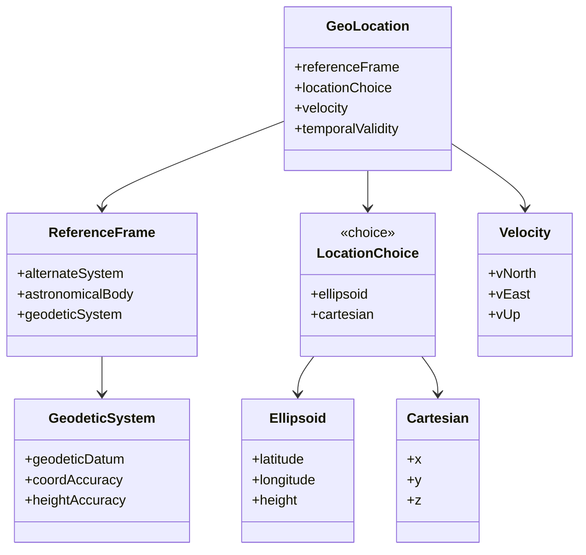
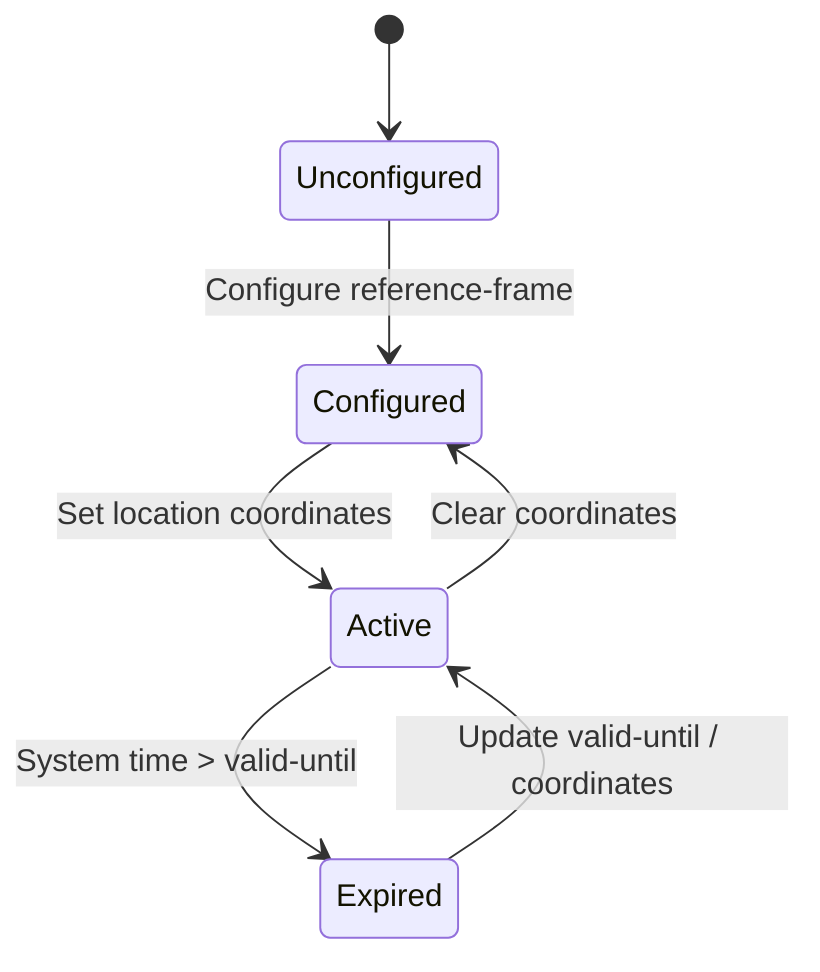

# Epic: Epic 1: Geographic Location (Issue #6)

## 1. Context
This Epic covers the digital engineering reverse-engineering of RFC 9179 (Geographic Location). It defines a standard YANG grouping for specifying location data on or around astronomical bodies, supporting ellipsoidal coordinates, Cartesian coordinates, motion velocity vectors, and temporal validity constraints.

## 2. Requirements & Checklist
- [x] #1 - [Feature 1: Geographic Reference Frame](https://github.com/gintatkinson/cogctl-ux-09/blob/feat/1-reference-frame/docs/features/feat-01-reference-frame.md)
- [x] #2 - [Feature 2: Ellipsoidal Location Coordinates](https://github.com/gintatkinson/cogctl-ux-09/blob/feat/1-reference-frame/docs/features/feat-02-ellipsoid-location.md)
- [x] #3 - [Feature 3: Cartesian Location Coordinates](https://github.com/gintatkinson/cogctl-ux-09/blob/feat/1-reference-frame/docs/features/feat-03-cartesian-location.md)
- [x] #4 - [Feature 4: Motion Velocity Vector](https://github.com/gintatkinson/cogctl-ux-09/blob/feat/1-reference-frame/docs/features/feat-04-velocity-vector.md)
- [x] #5 - [Feature 5: Temporal Validity & Expiry](https://github.com/gintatkinson/cogctl-ux-09/blob/feat/1-reference-frame/docs/features/feat-05-temporal-validity.md)

## 3. Architecture and System Interaction Diagrams

## 4. State Machine Definitions

## 5. Specification Context
> This document defines a generic geographical location YANG grouping. The geographical location grouping is intended to be used in YANG data models for specifying a location on or in reference to Earth or any other astronomical object.

## 6. Source References
YANG Schema: [ietf-geo-location.yang](https://github.com/YangModels/yang/blob/main/standard/ietf/RFC/ietf-geo-location%402022-02-11.yang)
Normative Specification: [RFC 9179 Geographic Location](https://datatracker.ietf.org/doc/rfc9179/)
