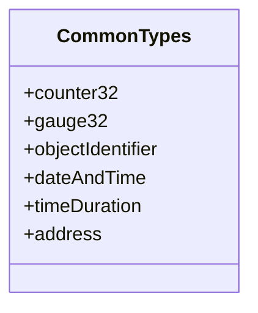
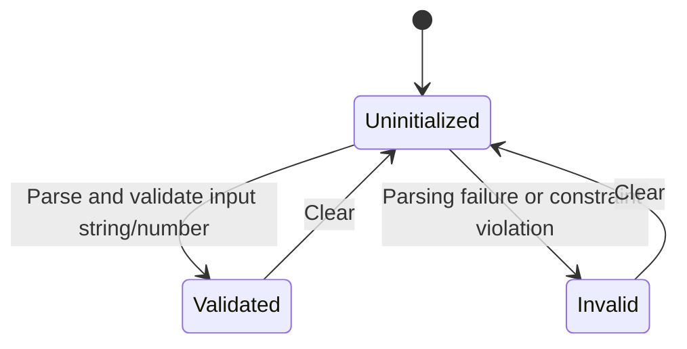

# Epic: Epic 2: Common YANG Data Types (Issue #22)

## 1. Context
This Epic covers the standard common data types defined in RFC 9911 (`ietf-yang-types`), which obsoletes RFC 6991. These types provide foundational modeling structures for counters, gauges, object identifiers, dates, times, durations, and addresses across IETF network models.

## 2. Requirements & Checklist
- [ ] #17 - [Feature 6: Numeric Counters and Gauges](https://github.com/gintatkinson/cogctl-ux-09/blob/feat/epic-2-common-types/docs/features/feat-06-counters-gauges.md)
- [ ] #18 - [Feature 7: Identifiers and Object References](https://github.com/gintatkinson/cogctl-ux-09/blob/feat/epic-2-common-types/docs/features/feat-07-identifiers-references.md)
- [ ] #19 - [Feature 8: Date and Time Types](https://github.com/gintatkinson/cogctl-ux-09/blob/feat/epic-2-common-types/docs/features/feat-08-date-time.md)
- [ ] #20 - [Feature 9: Time Durations](https://github.com/gintatkinson/cogctl-ux-09/blob/feat/epic-2-common-types/docs/features/feat-09-time-durations.md)
- [ ] #21 - [Feature 10: General Address, Identity, and Language Tags](https://github.com/gintatkinson/cogctl-ux-09/blob/feat/epic-2-common-types/docs/features/feat-10-addresses-tags.md)

## Associated Use Cases & User Stories

### Associated Use Cases
- [ ] #28 - [Use Case 4: Validate Common YANG Types (Issue #28)](https://github.com/gintatkinson/cogctl-ux-09/blob/feat/6-counters-gauges/docs/use-cases/uc-04-validate-common-types.md)

### Associated User Stories
- [ ] #23 - [User Story 6: Numeric Counters and Gauges (Issue #23)](https://github.com/gintatkinson/cogctl-ux-09/blob/feat/6-counters-gauges/docs/user-stories/us-06-counters-gauges.md)
- [ ] #24 - [User Story 7: Identifiers and Object References (Issue #24)](https://github.com/gintatkinson/cogctl-ux-09/blob/feat/6-counters-gauges/docs/user-stories/us-07-identifiers-references.md)
- [ ] #25 - [User Story 8: Date and Time Types (Issue #25)](https://github.com/gintatkinson/cogctl-ux-09/blob/feat/6-counters-gauges/docs/user-stories/us-08-date-time.md)
- [ ] #26 - [User Story 9: Time Durations (Issue #26)](https://github.com/gintatkinson/cogctl-ux-09/blob/feat/6-counters-gauges/docs/user-stories/us-09-time-durations.md)
- [ ] #27 - [User Story 10: General Address, Identity, and Language Tags (Issue #27)](https://github.com/gintatkinson/cogctl-ux-09/blob/feat/6-counters-gauges/docs/user-stories/us-10-addresses-tags.md)

## 3. Architecture and System Interaction Diagrams

## 4. State Machine Definitions

## 5. Specification Context
> This document defines a collection of common data types for use with the YANG data modeling language. It obsoletes RFC 6991 by introducing new date/time representation types and time durations, along with updates to patterns and alignment with YANG 1.1.

## 6. Source References
YANG Schema: [ietf-yang-types.yang](https://github.com/YangModels/yang/blob/main/standard/ietf/RFC/ietf-yang-types%402025-12-22.yang)
Normative Specification: [RFC 9911 Common YANG Data Types](https://datatracker.ietf.org/doc/rfc9911/)
