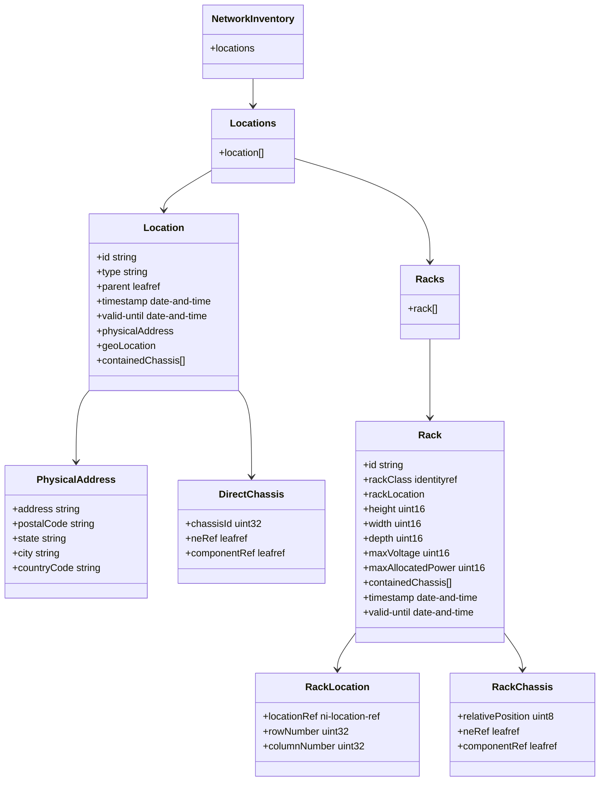
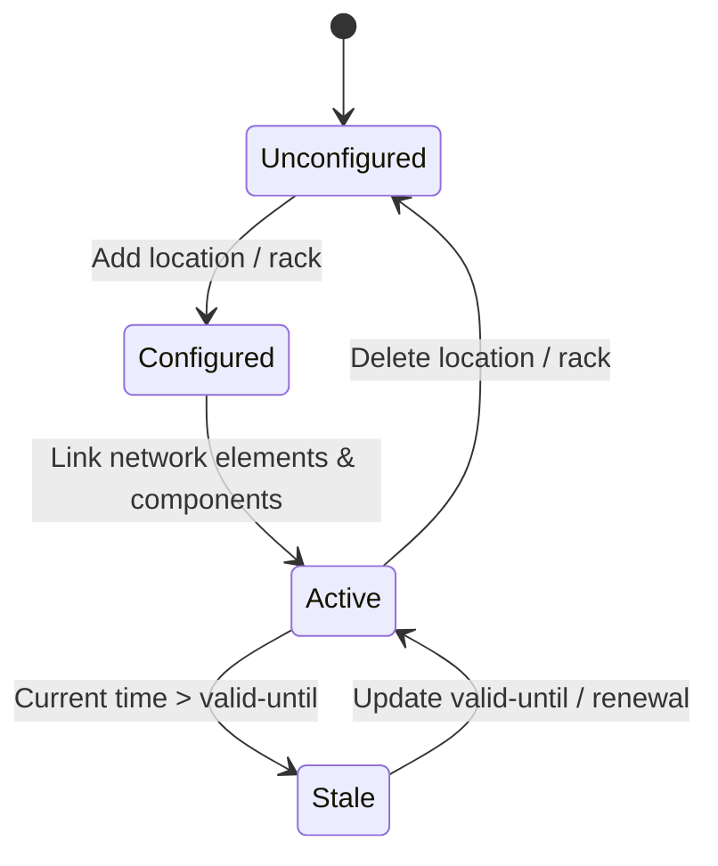

# Epic: Epic 3: Network Inventory Location (Issue #35)

## 1. Context
This Epic covers the digital engineering reverse-engineering of the IETF draft "A YANG Data Model for Network Inventory Location" (`ietf-ni-location`). It defines a location model that extends the base network inventory by adding hierarchical locations (sites, buildings, rooms, corridors, floors), physical mailing addresses, geolocations, direct chassis installations, server racks with physical bounds, grid coordinates, and rack-contained chassis.

## 2. Requirements & Checklist
- [x] #29 - [Feature 11: Hierarchical Inventory Locations](https://github.com/gintatkinson/cogctl-ux-09/blob/main/docs/features/feat-11-hierarchical-locations.md)
- [x] #30 - [Feature 12: Location Physical Addresses](https://github.com/gintatkinson/cogctl-ux-09/blob/main/docs/features/feat-12-physical-addresses.md)
- [x] #31 - [Feature 13: Direct Location-contained Chassis](https://github.com/gintatkinson/cogctl-ux-09/blob/main/docs/features/feat-13-direct-contained-chassis.md)
- [x] #32 - [Feature 14: Equipment Racks Classification & Physical Bounds](https://github.com/gintatkinson/cogctl-ux-09/blob/main/docs/features/feat-14-racks-physical-bounds.md)
- [x] #33 - [Feature 15: Rack Locations & Grid Coordinates](https://github.com/gintatkinson/cogctl-ux-09/blob/main/docs/features/feat-15-rack-locations-grid.md)
- [x] #34 - [Feature 16: Rack-contained Chassis & Electricity Attributes](https://github.com/gintatkinson/cogctl-ux-09/blob/main/docs/features/feat-16-rack-contained-chassis-electricity.md)

## Associated Use Cases & User Stories

### Associated Use Cases
- [x] #42 - [Use Case 5: Validate Hierarchical Locations (Issue #42)](https://github.com/gintatkinson/cogctl-ux-09/blob/main/docs/use-cases/uc-05-validate-hierarchical-locations.md)
- [x] #43 - [Use Case 6: Validate Racks and Contained Chassis (Issue #43)](https://github.com/gintatkinson/cogctl-ux-09/blob/main/docs/use-cases/uc-06-validate-racks-contained-chassis.md)
- [ ] #87 - [Use Case 15: Validate Internet Address and Protocol Types](https://github.com/gintatkinson/cogctl-ux-09/blob/main/docs/use-cases/uc-15-validate-internet-address.md)

### Associated User Stories
- [x] #36 - [User Story 11: Hierarchical Inventory Locations (Issue #36)](https://github.com/gintatkinson/cogctl-ux-09/blob/main/docs/user-stories/us-11-hierarchical-locations.md)
- [x] #37 - [User Story 12: Location Physical Addresses (Issue #37)](https://github.com/gintatkinson/cogctl-ux-09/blob/main/docs/user-stories/us-12-physical-addresses.md)
- [x] #38 - [User Story 13: Direct Location-contained Chassis (Issue #38)](https://github.com/gintatkinson/cogctl-ux-09/blob/main/docs/user-stories/us-13-direct-contained-chassis.md)
- [x] #39 - [User Story 14: Equipment Racks Classification & Physical Bounds (Issue #39)](https://github.com/gintatkinson/cogctl-ux-09/blob/main/docs/user-stories/us-14-racks-physical-bounds.md)
- [x] #40 - [User Story 15: Rack Locations & Grid Coordinates (Issue #40)](https://github.com/gintatkinson/cogctl-ux-09/blob/main/docs/user-stories/us-15-rack-locations-grid.md)
- [x] #41 - [User Story 16: Rack-contained Chassis & Electricity Attributes (Issue #41)](https://github.com/gintatkinson/cogctl-ux-09/blob/main/docs/user-stories/us-16-rack-contained-chassis-electricity.md)
- [ ] #84 - [User Story 28: IP Address and Prefix Types](https://github.com/gintatkinson/cogctl-ux-09/blob/main/docs/user-stories/us-28-ip-address-prefix.md)
- [ ] #85 - [User Story 29: Internet Domain Names and URIs](https://github.com/gintatkinson/cogctl-ux-09/blob/main/docs/user-stories/us-29-domain-names-uri.md)
- [ ] #86 - [User Story 30: IP Protocol Fields and Autonomous Systems](https://github.com/gintatkinson/cogctl-ux-09/blob/main/docs/user-stories/us-30-protocol-fields-as.md)
## 3. Architecture and System Interaction Diagrams

## 4. State Machine Definitions

## 5. Specification Context
> This document defines a YANG data model for Network Inventory location (e.g., site, room, rack, geo-location data), which provides location information with different granularity levels for inventoried network elements. Accurate location information is useful for network planning, deployment, and maintenance. However, such information cannot be obtained or verified from the Network Elements themselves. This document defines a location model for network inventory that extends the base inventory with comprehensive location data.

## 6. Source References
YANG Schema: [ietf-ni-location.yang](https://github.com/ietf-ivy-wg/network-inventory-location/blob/main/ietf-ni-location.yang)
Normative Specification: [draft-ietf-ivy-network-inventory-location](https://datatracker.ietf.org/doc/html/draft-ietf-ivy-network-inventory-location)
