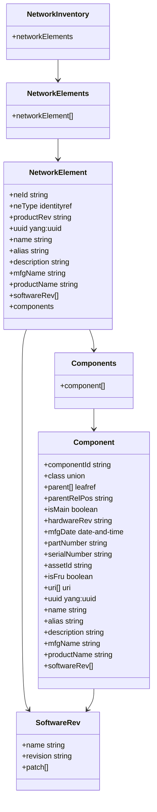
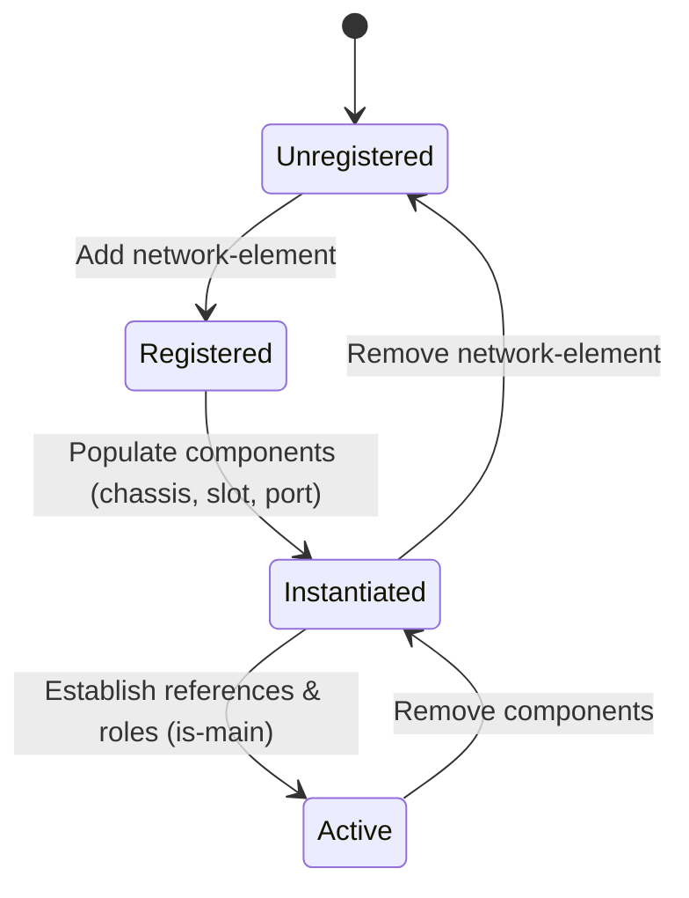

# Epic: Epic 4: Network Inventory (Issue #49)

## 1. Context
This Epic covers the digital engineering reverse-engineering of the IETF YANG module "A YANG Data Model for Network Inventory" (`ietf-network-inventory`). It defines the core model for retrieving network inventory, conforming to NMDA. This includes registering network elements, describing component attributes (such as serials, manufacturers, part numbers, and field replaceable status), modeling software/hardware revisions, and nesting component containment hierarchies.

## 2. Requirements & Checklist
- [x] #44 - [Feature 17: Inventory Type Definitions & References](https://github.com/gintatkinson/cogctl-ux-09/blob/main/docs/features/feat-17-types-references.md)
- [x] #45 - [Feature 18: Common Entity Software & Manufacturer Attributes](https://github.com/gintatkinson/cogctl-ux-09/blob/main/docs/features/feat-18-software-manufacturer.md)
- [x] #46 - [Feature 19: Network Element Management](https://github.com/gintatkinson/cogctl-ux-09/blob/main/docs/features/feat-19-ne-management.md)
- [x] #47 - [Feature 20: Component Identification & Hardware Attributes](https://github.com/gintatkinson/cogctl-ux-09/blob/main/docs/features/feat-20-component-hardware.md)
- [x] #48 - [Feature 21: Component Containment & Roles](https://github.com/gintatkinson/cogctl-ux-09/blob/main/docs/features/feat-21-component-containment-roles.md)

## Associated Use Cases & User Stories

### Associated Use Cases
- [x] #55 - [Use Case 7: Validate Network Element and Component Inventory (Issue #55)](https://github.com/gintatkinson/cogctl-ux-09/blob/feat/16-rack-contained-chassis-electricity/docs/use-cases/uc-07-validate-inventory-elements.md)
- [x] #56 - [Use Case 8: Validate Component Containment Hierarchy and Roles (Issue #56)](https://github.com/gintatkinson/cogctl-ux-09/blob/feat/16-rack-contained-chassis-electricity/docs/use-cases/uc-08-validate-component-hierarchy.md)

### Associated User Stories
- [x] #50 - [User Story 17: Inventory Type Definitions & References (Issue #50)](https://github.com/gintatkinson/cogctl-ux-09/blob/feat/16-rack-contained-chassis-electricity/docs/user-stories/us-17-types-references.md)
- [x] #51 - [User Story 18: Common Entity Software & Manufacturer Attributes (Issue #51)](https://github.com/gintatkinson/cogctl-ux-09/blob/feat/16-rack-contained-chassis-electricity/docs/user-stories/us-18-software-manufacturer.md)
- [x] #52 - [User Story 19: Network Element Management (Issue #52)](https://github.com/gintatkinson/cogctl-ux-09/blob/feat/16-rack-contained-chassis-electricity/docs/user-stories/us-19-ne-management.md)
- [x] #53 - [User Story 20: Component Identification & Hardware Attributes (Issue #53)](https://github.com/gintatkinson/cogctl-ux-09/blob/feat/16-rack-contained-chassis-electricity/docs/user-stories/us-20-component-hardware.md)
- [x] #54 - [User Story 21: Component Containment & Roles (Issue #54)](https://github.com/gintatkinson/cogctl-ux-09/blob/feat/16-rack-contained-chassis-electricity/docs/user-stories/us-21-component-containment-roles.md)
## 3. Architecture and System Interaction Diagrams

## 4. State Machine Definitions

## 5. Specification Context
> This document defines a YANG data model for retrieving network inventory. Accurate inventory data is necessary for managing large-scale networks. Conforming to the Network Management Datastore Architecture (NMDA), the base model represents the core inventory resources of a network including elements, sub-components, part numbers, serials, and containment mapping.

## 6. Source References
YANG Schema: [ietf-network-inventory.yang](https://github.com/ietf-ivy-wg/network-inventory-yang/blob/main/yang/ietf-network-inventory.yang)
Normative Specification: [draft-ietf-ivy-network-inventory-yang](https://datatracker.ietf.org/doc/html/draft-ietf-ivy-network-inventory-yang)
