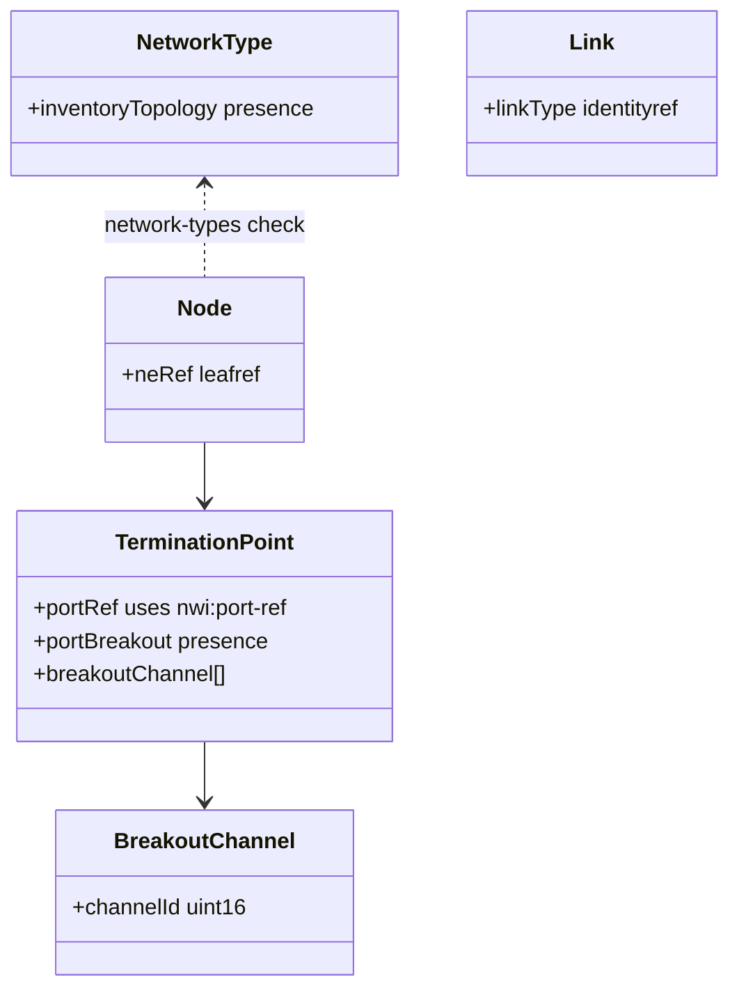
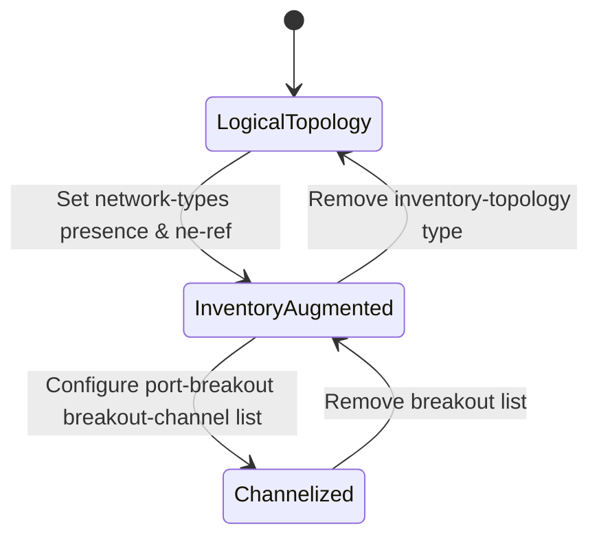

# Epic: Epic 5: Network Inventory Topology (Issue #60)

## 1. Context
This Epic covers the digital engineering reverse-engineering of the IETF YANG module "A Network Data Model for Inventory Topology Mapping" (`ietf-network-inventory-topology`). It defines the schema to bridge physical-layer inventory attributes (like ports, breakout channels, and link media types) to logical topologies defined under RFC 8345. This module augments RFC 8345 networks, nodes, links, and termination points with references to physical network inventory elements and components.

## 2. Requirements & Checklist
- [x] #57 - [Feature 22: Network Inventory Topology Network Type](https://github.com/gintatkinson/cogctl-ux-09/blob/main/docs/features/feat-22-topology-network-type.md)
- [x] #58 - [Feature 23: Topology Inventory Mapping & Link Classification](https://github.com/gintatkinson/cogctl-ux-09/blob/main/docs/features/feat-23-topology-inventory-mapping.md)
- [x] #59 - [Feature 24: Port Breakout & Channelization Capabilities](https://github.com/gintatkinson/cogctl-ux-09/blob/main/docs/features/feat-24-port-breakout-channels.md)

## Associated Use Cases & User Stories

### Associated Use Cases
- [x] #63 - [Use Case 9: Ingest Inventory Underlay Topology (Issue #63)](https://github.com/gintatkinson/cogctl-ux-09/blob/main/docs/use-cases/uc-09-ingest-underlay-topology.md)
- [x] #64 - [Use Case 10: Query Port Breakout Channels (Issue #64)](https://github.com/gintatkinson/cogctl-ux-09/blob/main/docs/use-cases/uc-10-query-port-breakouts.md)

### Associated User Stories
- [x] #61 - [User Story 22: Underlay Network Topology Mapping (Issue #61)](https://github.com/gintatkinson/cogctl-ux-09/blob/main/docs/user-stories/us-22-underlay-topology-mapping.md)
- [x] #62 - [User Story 23: Topology Mapping of Port Breakouts (Issue #62)](https://github.com/gintatkinson/cogctl-ux-09/blob/main/docs/user-stories/us-23-port-breakout-topology.md)
## 3. Architecture and System Interaction Diagrams

## 4. State Machine Definitions

## 5. Specification Context
> This document defines a YANG data model for mapping network topology to network inventory. This model enables correlating logical nodes and links with their corresponding physical network elements, components, and media types. It also provides lightweight capabilities to describe physical port breakouts.

## 6. Source References
YANG Schema: [ietf-network-inventory-topology.yang](https://github.com/ietf-ivy-wg/network-inventory-topology/blob/main/yang/ietf-network-inventory-topology.yang)
Normative Specification: [draft-ietf-ivy-network-inventory-topology](https://datatracker.ietf.org/doc/html/draft-ietf-ivy-network-inventory-topology)
