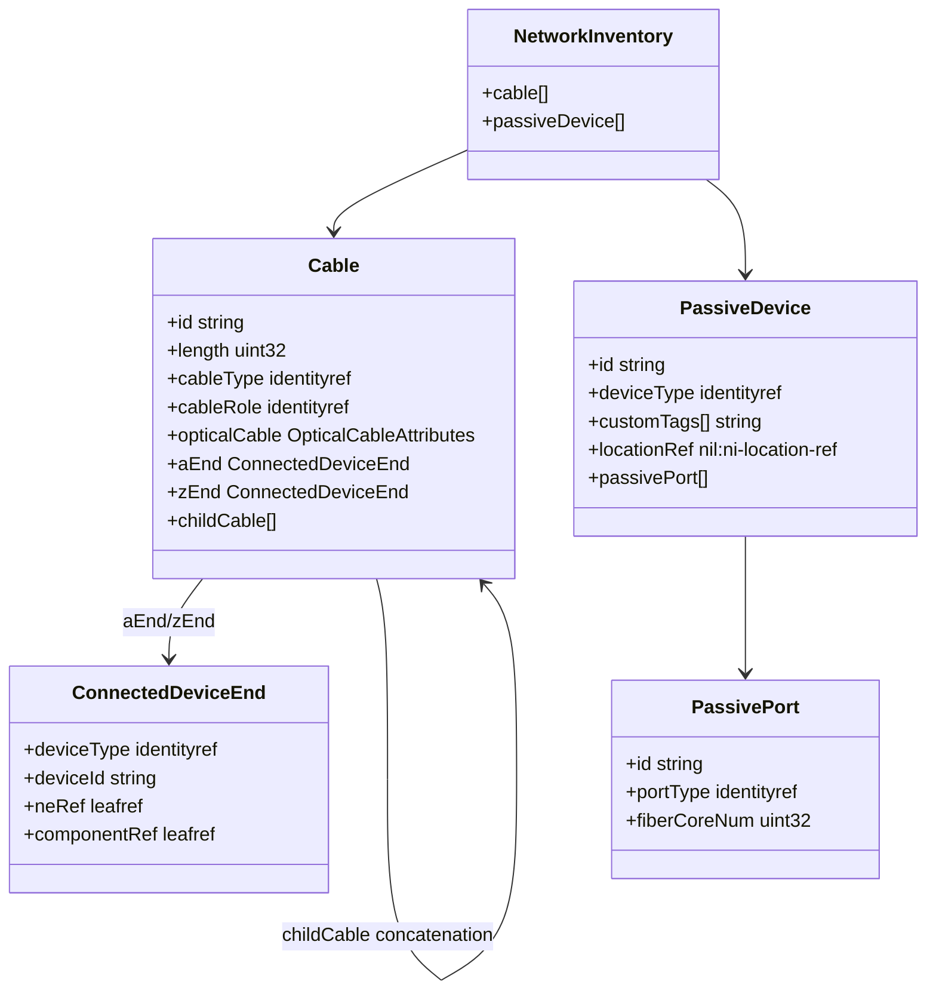
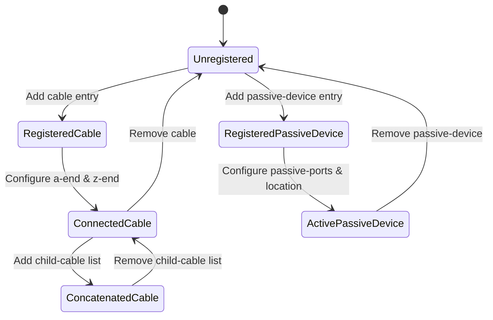

# Epic: Epic 6: Passive Network Inventory (Issue #68)

## 1. Context
This Epic covers the digital engineering reverse-engineering of the IETF YANG module "A YANG Data Model for Passive Device Info in Network Inventory" (`ietf-nwi-passive-inventory`). It defines the schema for tracking passive network assets (which manipulate signals without external power), including optical cables, physical fibers, child cable concatenation order, and passive device ports (e.g. ODFs, splitters, terminal boxes).

## 2. Requirements & Checklist
- [ ] #65 - [Feature 25: Passive Cable Inventory & Types](https://github.com/gintatkinson/cogctl-ux-09/blob/main/docs/features/feat-25-passive-cables.md)
- [ ] #66 - [Feature 26: Connected Device Ends & Cable Concatenation](https://github.com/gintatkinson/cogctl-ux-09/blob/main/docs/features/feat-26-cable-connections-concatenation.md)
- [ ] #67 - [Feature 27: Passive Device Management & Ports](https://github.com/gintatkinson/cogctl-ux-09/blob/main/docs/features/feat-27-passive-devices-ports.md)

## Associated Use Cases & User Stories

### Associated Use Cases
- [ ] #71 - [Use Case 11: Document Cable Concatenation Splicing (Issue #71)](https://github.com/gintatkinson/cogctl-ux-09/blob/feat/16-rack-contained-chassis-electricity/docs/use-cases/uc-11-document-cable-concatenation.md)
- [ ] #72 - [Use Case 12: Track Passive Port Mappings (Issue #72)](https://github.com/gintatkinson/cogctl-ux-09/blob/feat/16-rack-contained-chassis-electricity/docs/use-cases/uc-12-track-passive-ports.md)

### Associated User Stories
- [ ] #69 - [User Story 24: Optical Fiber Cable Asset Ingestion (Issue #69)](https://github.com/gintatkinson/cogctl-ux-09/blob/feat/16-rack-contained-chassis-electricity/docs/user-stories/us-24-fiber-optic-cables.md)
- [ ] #70 - [User Story 25: Passive ODF and Splitter Inventory Registry (Issue #70)](https://github.com/gintatkinson/cogctl-ux-09/blob/feat/16-rack-contained-chassis-electricity/docs/user-stories/us-25-odf-splitter-inventory.md)
## 3. Architecture and System Interaction Diagrams

## 4. State Machine Definitions

## 5. Specification Context
> This YANG module specifies a data model for passive devices, such as fibers, cables, and passive sites, deployed within and between network elements. Unlike active devices managed via management interfaces, passive devices do not require external power and operate purely on physical media signals.

## 6. Source References
YANG Schema: [ietf-nwi-passive-inventory.yang](https://github.com/aguoietf/draft-ygb-ivy-passive-network-inventory/blob/main/yang/ietf-nwi-passive-inventory.yang)
Normative Specification: [draft-ygb-ivy-passive-network-inventory](https://datatracker.ietf.org/doc/draft-ygb-ivy-passive-network-inventory/)
