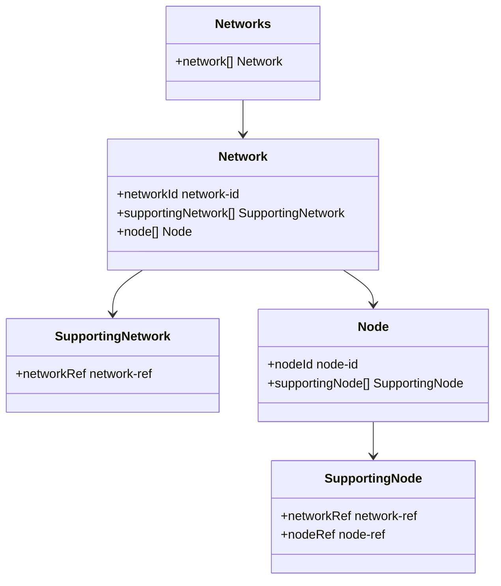
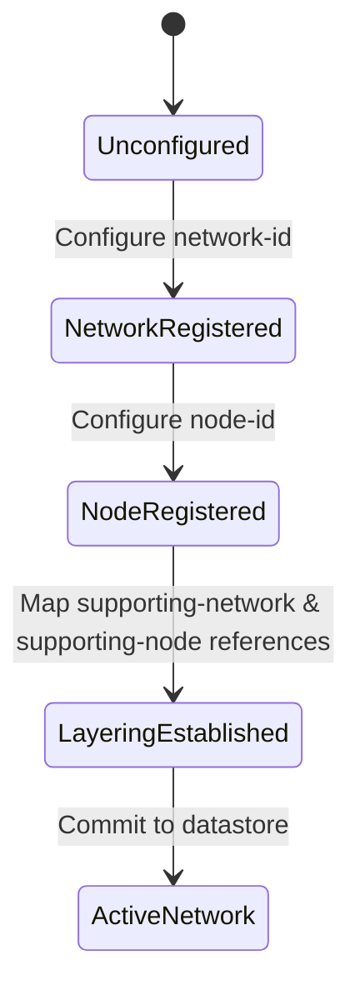

# Epic: Epic 7: Network Base Model (Issue #79)

## 1. Context
This Epic covers the digital engineering reverse-engineering of the IETF YANG module "A YANG Data Model for networks" (`ietf-network`). It defines the base schema for describing networks, nodes, and layering relationships (supporting networks and supporting nodes), serving as the foundation for multi-layer topology modeling.

## 2. Requirements & Checklist
- [ ] #73 - [Feature 28: Network and Node Base Models](https://github.com/gintatkinson/cogctl-ux-09/blob/main/docs/features/feat-28-network-base-model.md)

## Associated Use Cases & User Stories

### Associated Use Cases
- [ ] #77 - [Use Case 13: Ingest Base Network Topology (Issue #77)](https://github.com/gintatkinson/cogctl-ux-09/blob/feat/16-rack-contained-chassis-electricity/docs/use-cases/uc-13-ingest-base-network.md)

### Associated User Stories
- [ ] #75 - [User Story 26: Multi-Layer Network Mapping (Issue #75)](https://github.com/gintatkinson/cogctl-ux-09/blob/feat/16-rack-contained-chassis-electricity/docs/user-stories/us-26-multi-layer-network-topology.md)
## 3. Architecture and System Interaction Diagrams

## 4. State Machine Definitions

## 5. Specification Context
> This YANG module defines a common base data model for a collection of nodes in a network. Node definitions are further used in network topologies and inventories.

## 6. Source References
YANG Schema: [ietf-network.yang](https://github.com/YangModels/yang/blob/main/standard/ietf/RFC/ietf-network%402018-02-26.yang)
Normative Specification: [RFC 8345](https://datatracker.ietf.org/doc/rfc8345/)
