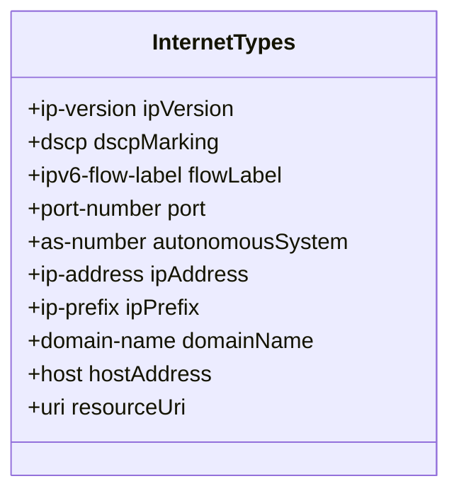
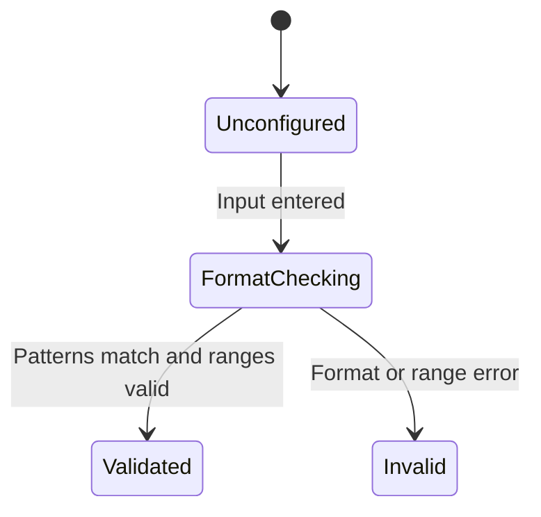

# Epic: Epic 8: Common Internet Address YANG Data Types

## 1. Context
This Epic covers the digital engineering reverse-engineering of the IETF YANG module "Common Internet Address YANG Data Types" (`ietf-inet-types`). It defines the core types used for IP versions, DSCP values, ports, IPv4/IPv6 addresses and prefixes, domains, hosts, and URIs.

## 2. Requirements & Checklist
- [ ] #81 - [Feature 30: IP Address and Prefix Types](https://github.com/gintatkinson/cogctl-ux-09/blob/main/docs/features/feat-30-ip-address-prefix.md)
- [ ] #82 - [Feature 31: Internet Domain Names and URIs](https://github.com/gintatkinson/cogctl-ux-09/blob/main/docs/features/feat-31-domain-names-uri.md)
- [ ] #83 - [Feature 32: IP Protocol Fields and Autonomous Systems](https://github.com/gintatkinson/cogctl-ux-09/blob/main/docs/features/feat-32-protocol-fields-as.md)

## Associated Use Cases & User Stories

### Associated Use Cases
- [x] #87 - [Use Case 15: Validate Internet Address and Protocol Types](https://github.com/gintatkinson/cogctl-ux-09/blob/main/docs/use-cases/uc-15-validate-internet-address.md)

### Associated User Stories
- [x] #84 - [User Story 28: IP Address and Prefix Types](https://github.com/gintatkinson/cogctl-ux-09/blob/main/docs/user-stories/us-28-ip-address-prefix.md)
- [x] #85 - [User Story 29: Internet Domain Names and URIs](https://github.com/gintatkinson/cogctl-ux-09/blob/main/docs/user-stories/us-29-domain-names-uri.md)
- [x] #86 - [User Story 30: IP Protocol Fields and Autonomous Systems](https://github.com/gintatkinson/cogctl-ux-09/blob/main/docs/user-stories/us-30-protocol-fields-as.md)
## 3. Architecture and System Interaction Diagrams

## 4. State Machine Definitions

## 5. Specification Context
> This module contains a collection of generally useful derived YANG data types for Internet addresses and related things.

## 6. Source References
YANG Schema: [ietf-inet-types.yang](https://github.com/YangModels/yang/blob/main/standard/ietf/RFC/ietf-inet-types%402013-07-15.yang)
Normative Specification: [RFC 6021 Common YANG Data Types](https://datatracker.ietf.org/doc/rfc6021/)
