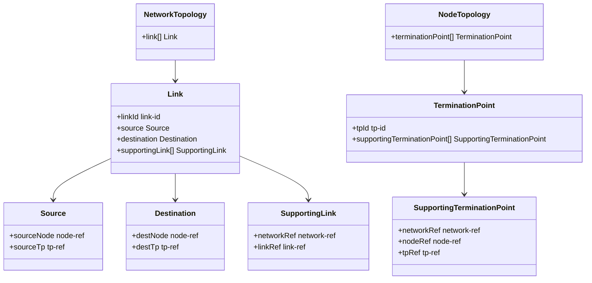
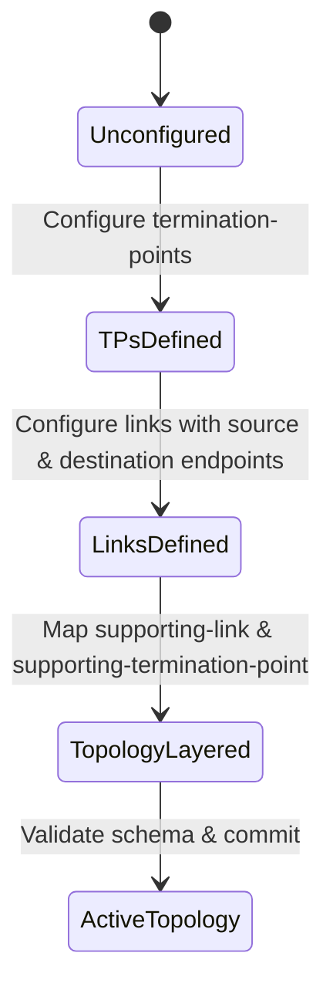

# Epic: Epic 9: Network Topology Model (Issue #80)

## 1. Context
This Epic covers the digital engineering reverse-engineering of the IETF YANG module "A YANG Data Model for Network Topologies" (`ietf-network-topology`). It defines the schema for link and termination point connections, including underlay mapping rules.

## 2. Requirements & Checklist
- [ ] #74 - [Feature 29: Network Topology Model](https://github.com/gintatkinson/cogctl-ux-09/blob/main/docs/features/feat-29-network-topology-model.md)

## Associated Use Cases & User Stories

### Associated Use Cases
- [ ] #78 - [Use Case 14: Map Network Topology Connectivity (Issue #78)](https://github.com/gintatkinson/cogctl-ux-09/blob/main/docs/use-cases/uc-14-map-network-topology.md)
- [ ] #90 - [Use Case 16: Configure and Layer Termination Points](https://github.com/gintatkinson/cogctl-ux-09/blob/main/docs/use-cases/uc-16-termination-points.md)

### Associated User Stories
- [ ] #76 - [User Story 27: Network Link and TP Connectivity (Issue #76)](https://github.com/gintatkinson/cogctl-ux-09/blob/main/docs/user-stories/us-27-network-link-tp-connectivity.md)
- [ ] #89 - [User Story 31: Node Termination Point Configuration](https://github.com/gintatkinson/cogctl-ux-09/blob/main/docs/user-stories/us-31-termination-points.md)
- [ ] #91 - [User Story 32: Linking Source and Destination Node Interfaces](https://github.com/gintatkinson/cogctl-ux-09/blob/main/docs/user-stories/us-32-link-endpoints.md)
- [ ] #92 - [User Story 33: Mapping Layered Network Links to Underlays](https://github.com/gintatkinson/cogctl-ux-09/blob/main/docs/user-stories/us-33-link-underlays.md)
- [ ] #93 - [User Story 34: Auditing Link Loop Recursions and Integrity](https://github.com/gintatkinson/cogctl-ux-09/blob/main/docs/user-stories/us-34-link-loops.md)
## 3. Architecture and System Interaction Diagrams

## 4. State Machine Definitions

## 5. Specification Context
> This YANG module defines a common base data model for network topology, augmenting the ietf-network model with links and termination points.

## 6. Source References
YANG Schema: [ietf-network-topology.yang](https://github.com/YangModels/yang/blob/main/standard/ietf/RFC/ietf-network-topology%402018-02-26.yang)
Normative Specification: [RFC 8345](https://datatracker.ietf.org/doc/rfc8345/)
