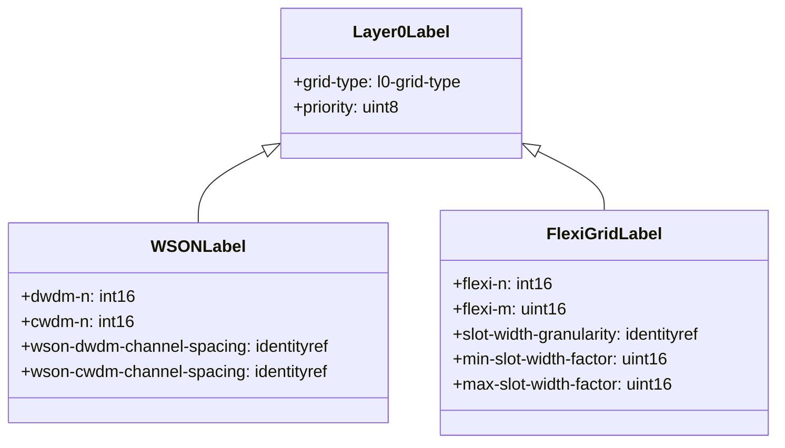

# Epic: Epic 10: Optical Layer 0 Type Definitions (Issue #101)

## 1. Context
This Epic covers the reverse-engineering of RFC 9093 (A YANG Data Model for Layer 0 Types). It defines standard Layer 0 Fixed Grid (CWDM/DWDM) and Flexi-Grid identities, central frequency/wavelength formulas, and slot configurations to model optical link characteristics.

## 2. Requirements & Checklist
- [ ] #94 - [Feature 33: Layer 0 Grid Type and Label Range Information](https://github.com/gintatkinson/cogctl-ux-09/blob/main/docs/features/feat-33-layer0-grid-type-label.md)
- [ ] #95 - [Feature 34: WSON Grid Channel and Label Configuration](https://github.com/gintatkinson/cogctl-ux-09/blob/main/docs/features/feat-34-wson-grid-channel-label.md)
- [ ] #96 - [Feature 35: Flexi-Grid Channel and Slot Configuration](https://github.com/gintatkinson/cogctl-ux-09/blob/main/docs/features/feat-35-flexi-grid-channel-slot.md)

## Associated Use Cases & User Stories

### Associated Use Cases
- [ ] #100 - [Use Case 17: Layer 0 Optical Frequency Slot Validation (Issue #100)](https://github.com/gintatkinson/cogctl-ux-09/blob/feat/16-rack-contained-chassis-electricity/docs/use-cases/uc-17-layer0-optical-frequency-slot.md)

### Associated User Stories
- [ ] #97 - [User Story 35: WSON Grid Provisioning (Issue #97)](https://github.com/gintatkinson/cogctl-ux-09/blob/feat/16-rack-contained-chassis-electricity/docs/user-stories/us-35-wson-grid-provisioning.md)
- [ ] #98 - [User Story 36: Flexi-Grid Frequency Slots (Issue #98)](https://github.com/gintatkinson/cogctl-ux-09/blob/feat/16-rack-contained-chassis-electricity/docs/user-stories/us-36-flexi-grid-frequency-slots.md)
- [ ] #99 - [User Story 37: Optical Label Ranges (Issue #99)](https://github.com/gintatkinson/cogctl-ux-09/blob/feat/16-rack-contained-chassis-electricity/docs/user-stories/us-37-optical-label-ranges.md)
## 3. Architecture and System Interaction Diagrams

## 4. Verification and Validation Plan
- Execute automated Python test parsing to verify that model coverage check returns 100% parity.
- Execute the reconciliation tool to verify that checklists synchronize seamlessly with GitHub Issue states.
