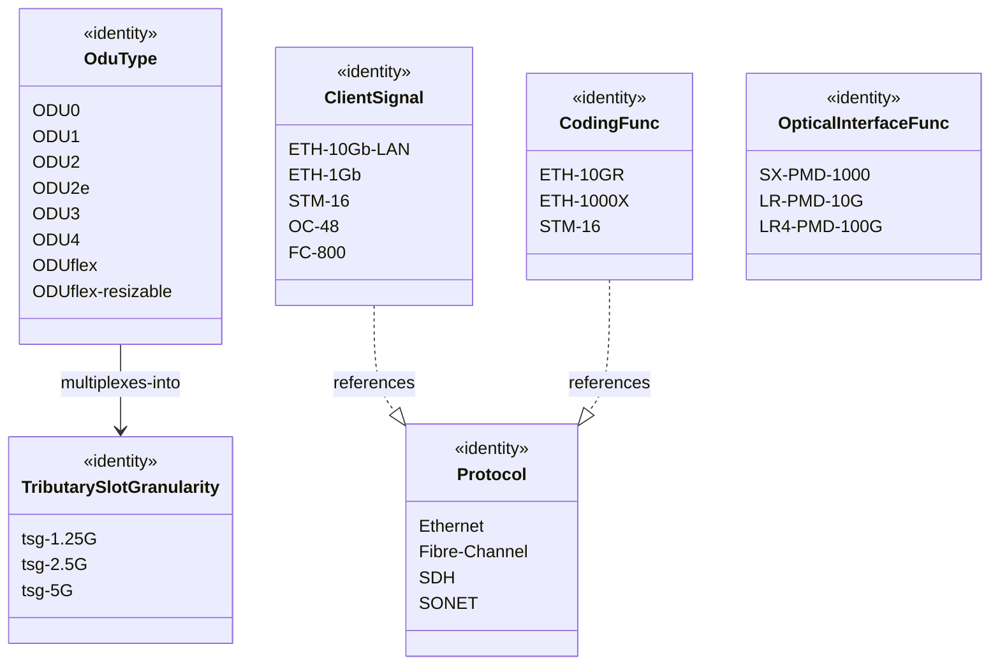

# Epic: Epic 11: Optical Layer 1 Type Definitions (Issue #131)

## 1. Context
This Epic covers the reverse-engineering of draft-ietf-ccamp-layer1-types (A YANG Data Model for Layer 1 Types). It defines standard Layer 1 client signal protocols, physical interface transceivers, PMD functions, and Optical Data Unit (ODU) multiplexing structures to model optical path capacities and constraints.

## 2. Requirements & Checklist
- [ ] #124 - [Feature 36: Layer 1 ODU Type and Granularity Definitions](https://github.com/gintatkinson/cogctl-ux-09/blob/main/docs/features/feat-36-layer1-odu-granularity.md)
- [ ] #125 - [Feature 37: Layer 1 Client Protocol and Coding Identities](https://github.com/gintatkinson/cogctl-ux-09/blob/main/docs/features/feat-37-layer1-client-protocol.md)
- [ ] #126 - [Feature 38: Layer 1 Optical Interface and PMD Functions](https://github.com/gintatkinson/cogctl-ux-09/blob/main/docs/features/feat-38-layer1-optical-pmd.md)
- [ ] #127 - [Feature 39: OTN Tributary Slot and Label Structure](https://github.com/gintatkinson/cogctl-ux-09/blob/main/docs/features/feat-39-otn-tributary-slot-label.md)
- [ ] #128 - [Feature 40: OTN Bandwidth and GFP Payload Capabilities](https://github.com/gintatkinson/cogctl-ux-09/blob/main/docs/features/feat-40-otn-bandwidth-payload.md)

## Associated Use Cases & User Stories

### Associated Use Cases
- [ ] #130 - [Use Case 18: Provision Layer 1 Client Signal (Issue #130)](https://github.com/gintatkinson/cogctl-ux-09/blob/main/docs/use-cases/uc-18-provision-layer1-client-signal.md)

### Associated User Stories
- [ ] #116 - [User Story 40: OTN Bandwidth Allocation (Issue #116)](https://github.com/gintatkinson/cogctl-ux-09/blob/main/docs/user-stories/us-40-otn-bandwidth-allocation.md)
- [ ] #129 - [User Story 38: Layer 1 Client Protocol Configuration (Issue #129)](https://github.com/gintatkinson/cogctl-ux-09/blob/main/docs/user-stories/us-38-layer1-client-protocol.md)
## 3. Architecture and System Interaction Diagrams

## 4. Verification and Validation Plan
- Execute automated Python test parsing to verify that model coverage check returns 100% parity.
- Execute the reconciliation tool to verify that checklists synchronize seamlessly with GitHub Issue states.

## 5. Specification Context
> This YANG module defines standard Layer 1 client signal protocols, physical interface transceivers, PMD functions, and Optical Data Unit (ODU) multiplexing structures to model optical path capacities and constraints.

## 6. Source References
YANG Schema: [ietf-layer1-types.yang](https://github.com/YangModels/yang/blob/954277fad0534e9b0b495774255b0c4ce854f8b2/experimental/ietf-extracted-YANG-modules/ietf-layer1-types%402024-02-22.yang)
Normative Specification: [draft-ietf-ccamp-layer1-types](https://datatracker.ietf.org/doc/draft-ietf-ccamp-layer1-types/)
