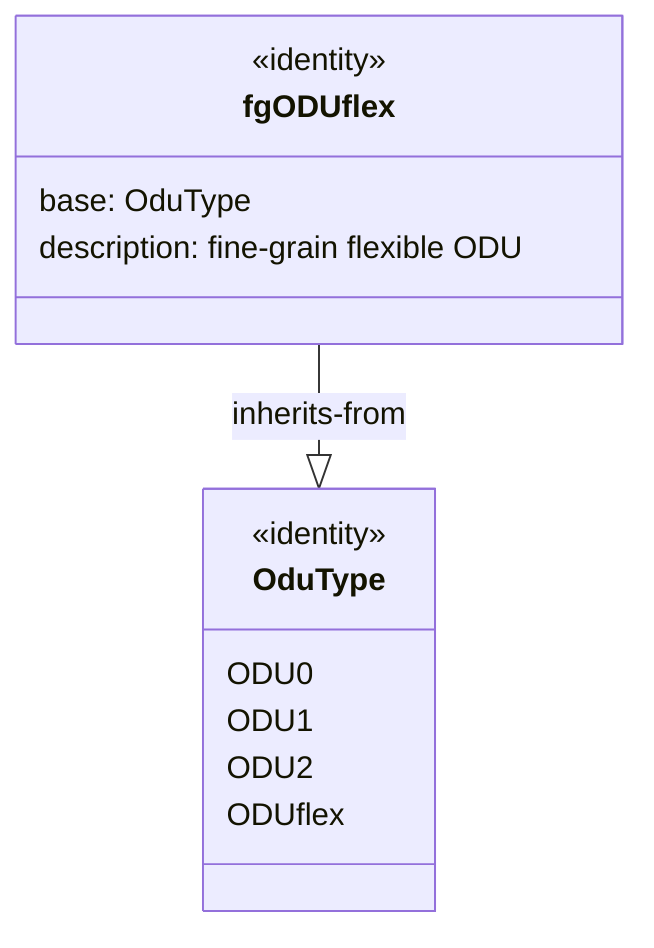

# Epic: Epic 12: Fine-Grain Optical Transport Network Types (Issue #135)

## 1. Context
This Epic covers the reverse-engineering of `ietf-fgotn-types@2026-02-27.yang`. It defines standard Fine-Grain Optical Transport Network (fgOTN) identities—specifically the `fgODUflex` identity—to support modeling, validating, and provisioning of sub-1Gbit/s flexible rate optical client containers.

## 2. Requirements & Checklist
- [ ] #132 - [Feature 41: Fine-Grain ODUflex Type Definition](https://github.com/gintatkinson/cogctl-ux-09/blob/feat/16-rack-contained-chassis-electricity/docs/features/feat-41-fgotn-oduflex-identity.md)

## Associated Use Cases & User Stories

### Associated Use Cases
- [ ] #134 - [Use Case 19: Provision Fine-Grain ODUflex Client Signal (Issue #134)](https://github.com/gintatkinson/cogctl-ux-09/blob/feat/16-rack-contained-chassis-electricity/docs/use-cases/uc-19-provision-fgotn-client-signal.md)

### Associated User Stories
- [ ] #133 - [User Story 39: Fine-Grain ODUflex Protocol Integration (Issue #133)](https://github.com/gintatkinson/cogctl-ux-09/blob/feat/16-rack-contained-chassis-electricity/docs/user-stories/us-39-fgotn-oduflex-integration.md)
## 3. Architecture and System Interaction Diagrams

## 4. Verification and Validation Plan
- Execute automated Python test parsing to verify that model coverage check returns 100% parity.
- Execute the reconciliation tool to verify that checklists synchronize seamlessly with GitHub Issue states.
