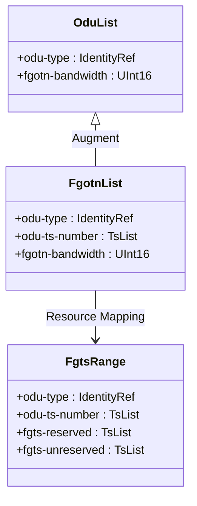

# Epic: Epic 13: OTN and fg-OTN Network Topology (Issue #122)

## 1. Context
This Epic covers the network topology model extensions for Optical Transport Networks (OTN) and fine-grain OTN (fg-OTN). It reverse-engineers the model defined in `ietf-fgotn-topology@2026-02-27.yang` and the base `ietf-otn-topology@2024-06-21.yang` which augment standard Traffic Engineering (TE) topology models to represent client/server layer mappings, link bandwidth allocations, and disjoint timeslot resources.

## 2. Requirements & Checklist
- [x] #110 - [Feature 43: fg-OTN Network Topology and Bandwidth Allocation](https://github.com/gintatkinson/cogctl-ux-09/blob/main/docs/features/feat-43-fgotn-topology-bandwidth.md)
- [x] #111 - [Feature 44: OTN Topology Node and Link Attributes](https://github.com/gintatkinson/cogctl-ux-09/blob/main/docs/features/feat-44-otn-topology-node-link.md)

## Associated Use Cases & User Stories

### Associated User Stories
- [x] #116 - [User Story 40: OTN Bandwidth Allocation (Issue #116)](https://github.com/gintatkinson/cogctl-ux-09/blob/main/docs/user-stories/us-40-otn-bandwidth-allocation.md)
## 3. Architecture and System Interaction Diagrams

## 4. Verification and Validation Plan
- Verify that `ts-list` formats (e.g. `1-20,25,50-1000`) adhere to the strict ascending order and disjoint range criteria.
- Validate that the `fgotn-bandwidth` is only active when `odu-type` is set to `fgotn-types:fgODUflex`.
- Perform schema validation of network and TE topology instances containing fg-OTN extensions.

## 5. Specification Context
> This module defines a YANG data model for fgOTN-specific extension based on existing network topology models.
>
> The model fully conforms to the Network Management Datastore Architecture (NMDA).

## 6. Source References
- **YANG Schema:** [ietf-fgotn-topology.yang](https://github.com/gintatkinson/cogctl-ux-09/blob/main/yang/ietf-fgotn-topology.yang)
- **Normative Specification:** [draft-ietf-ccamp-otn-topo-yang](https://datatracker.ietf.org/doc/draft-ietf-ccamp-otn-topo-yang/)
