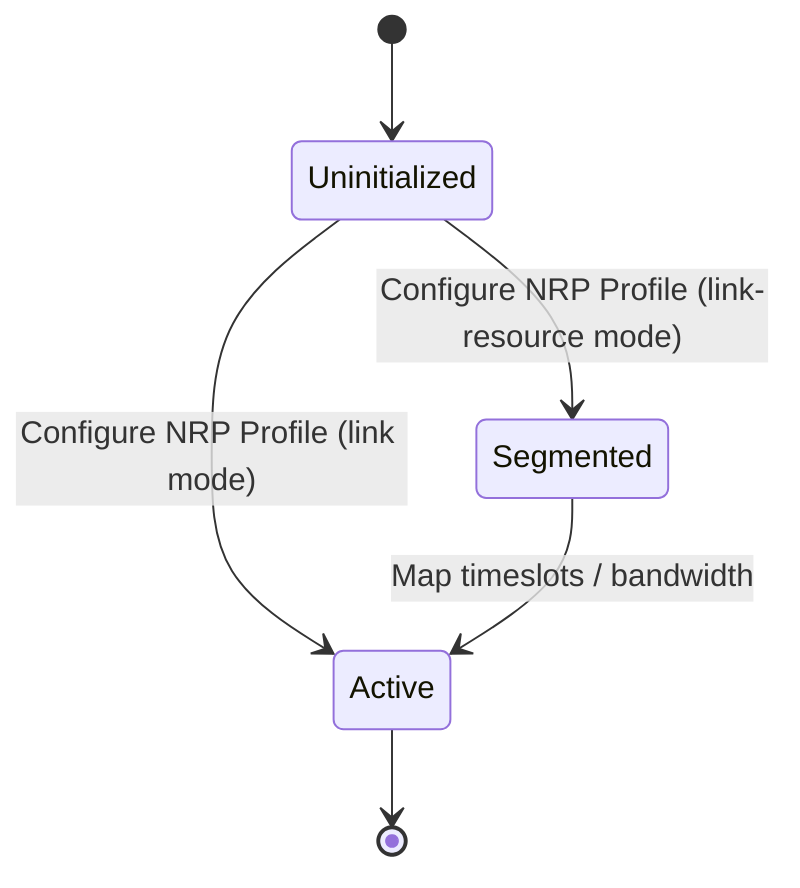

# Epic: Epic 14: OTN Network Slice (Issue #123)

## 1. Context
This Epic covers the reverse-engineering of `ietf-otn-slice-mpi@2025-07-03.yang`. It defines a standard Optical Transport Network (OTN) slicing Multi-Point Interface (MPI) framework to support modeling, validating, and provisioning of Network Resource Partitions (NRPs) and their slice realization over OTN TE links.

## 2. Requirements & Checklist
- [ ] #113 - [Feature 46: OTN Network Resource Partition MPI Mapping](https://github.com/gintatkinson/cogctl-ux-09/blob/main/docs/features/feat-46-otn-slice-mpi-mapping.md)

## Associated Use Cases & User Stories

### Associated Use Cases
- [ ] #119 - [Use Case 19: Manage OTN Slice Resources (Issue #119)](https://github.com/gintatkinson/cogctl-ux-09/blob/main/docs/use-cases/uc-19-manage-otn-slice-resources.md)

### Associated User Stories
- [ ] #117 - [User Story 41: OTN Slice Lifecycle (Issue #117)](https://github.com/gintatkinson/cogctl-ux-09/blob/main/docs/user-stories/us-41-otn-slice-lifecycle.md)
## 3. Architecture and System Interaction Diagrams
```mermaid
classDiagram
    class otn-nrp-profile {
        <<grouping>>
        otn-nrp-granularity choice
    }
    class otn-nrp-granularity {
        <<choice>>
        link
        link-resource
    }
    class link {
        <<case>>
        nrp-id uint32
    }
    class link-resource {
        <<case>>
        nrps list
    }
    otn-nrp-profile --> otn-nrp-granularity
    otn-nrp-granularity --> link
    otn-nrp-granularity --> link-resource
```



## 4. Verification and Validation Plan
- Execute automated Python test parsing to verify that model coverage check returns 100% parity.
- Execute the reconciliation tool to verify that checklists synchronize seamlessly with GitHub Issue states.

## 5. Specification Context
> This YANG module defines a YANG data model for network slice realization in Optical Transport Networks (OTN). It provides a mechanism to partition and map link resources into specific Network Resource Partitions (NRPs) at the Multi-Point Interface (MPI).

## 6. Source References
YANG Schema: [ietf-otn-slice-mpi.yang](https://github.com/YangModels/yang/blob/954277fad0534e9b0b495774255b0c4ce854f8b2/experimental/ietf-extracted-YANG-modules/ietf-otn-slice-mpi%402025-07-03.yang)
Normative Specification: [draft-ietf-ccamp-otn-topo-yang](https://datatracker.ietf.org/doc/draft-ietf-ccamp-otn-topo-yang/)
