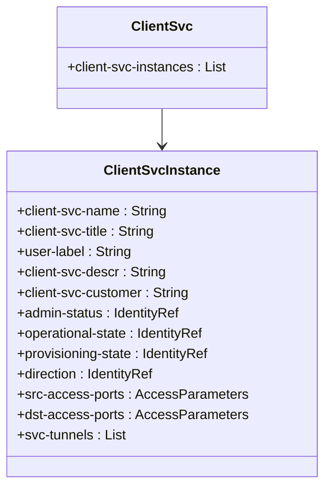
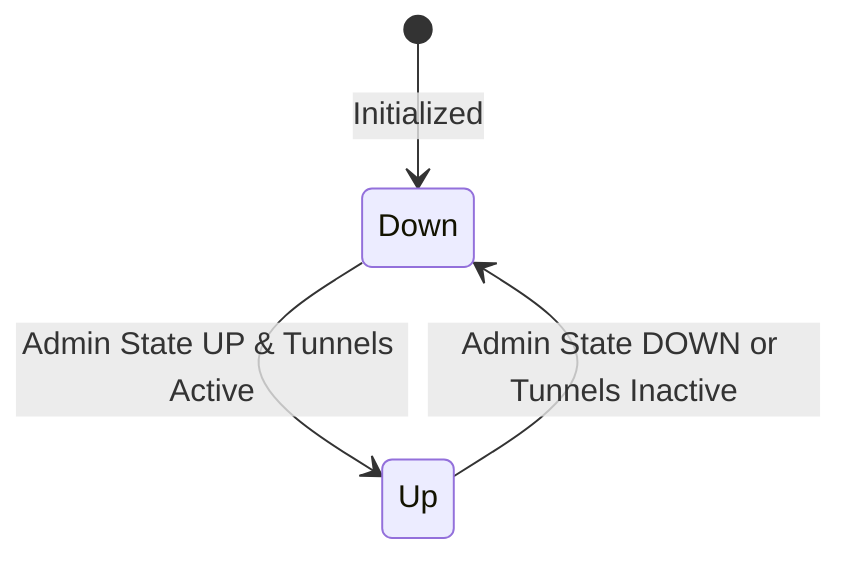

# Epic: Epic 15: Transport Client Service (Issue #121)

## 1. Context
This Epic covers the administrative configuration, operational state management, logical port mapping, and tunnel assignments for Transport Client Services. It reverse-engineers the model defined in `ietf-trans-client-service@2024-01-11.yang` which enables client signals (e.g. Ethernet rates) to map dynamically into TE service tunnels across an Optical Transport Network (OTN).

## 2. Requirements & Checklist
- [ ] #108 - [Feature 41: Transport Client Service Core Attributes](https://github.com/gintatkinson/cogctl-ux-09/blob/main/docs/features/feat-41-trans-client-service-core.md)
- [ ] #109 - [Feature 42: Transport Client Service Port Mapping and Tunnels](https://github.com/gintatkinson/cogctl-ux-09/blob/main/docs/features/feat-42-trans-client-service-ports.md)

## Associated Use Cases & User Stories

### Associated Use Cases
- [ ] #118 - [Use Case 18: Provision Layer 1 Client Signal (Issue #118)](https://github.com/gintatkinson/cogctl-ux-09/blob/main/docs/use-cases/uc-18-provision-layer1-client-signal-legacy.md)

### Associated User Stories
- [ ] #115 - [User Story 39: Transport Client Service Provisioning (Issue #115)](https://github.com/gintatkinson/cogctl-ux-09/blob/main/docs/user-stories/us-39-transport-client-service-provisioning.md)
## 3. Architecture and System Interaction Diagrams

## 4. State Machine Definitions

## 5. Specification Context
> This module defines a YANG data model for describing transport network client services.
>
> The model fully conforms to the Network Management Datastore Architecture (NMDA).

## 6. Source References
- **YANG Schema:** [ietf-trans-client-service.yang](https://github.com/gintatkinson/cogctl-ux-09/blob/main/yang/ietf-trans-client-service.yang)
- **Normative Specification:** [draft-ietf-ccamp-otn-topo-yang](https://datatracker.ietf.org/doc/draft-ietf-ccamp-otn-topo-yang/)
