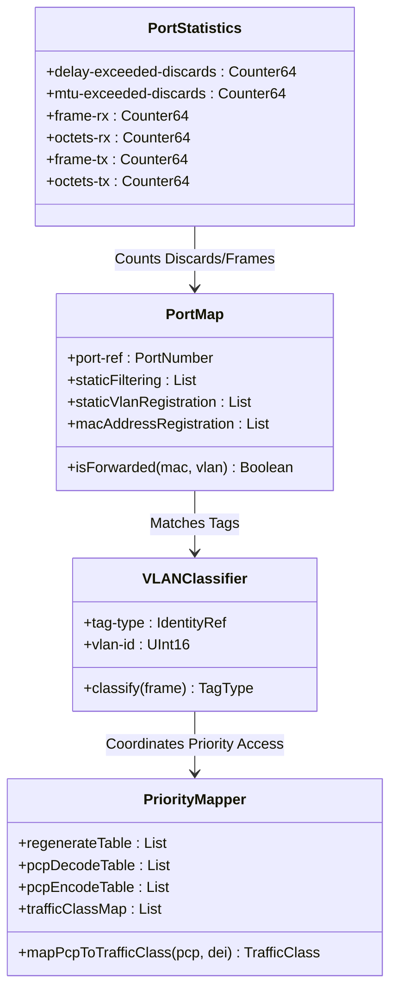

# Epic: Epic 16: IEEE 802.1Q Common Types (Issue #TBD)

## 1. Context
This Epic covers the reverse-engineering of the `ieee802-dot1q-types@2022-10-29.yang` schema and its associated normative specifications from IEEE Std 802.1Q-2014. It models the core data types, priority maps, classification policies, and statistics definitions used to build, configure, and monitor standard Bridges and Bridged Networks.

## 2. Requirements & Checklist
- [ ] #TBD - [Feature 47: IEEE 802.1Q Bridge Port VLAN Tag and Type Definitions](https://github.com/gintatkinson/cogctl-ux-09/blob/main/docs/features/feat-47-dot1q-tag-classifier.md)
- [ ] #TBD - [Feature 48: IEEE 802.1Q Priority and Traffic Class Mapping](https://github.com/gintatkinson/cogctl-ux-09/blob/main/docs/features/feat-48-dot1q-priority-mapping.md)
- [ ] #TBD - [Feature 49: IEEE 802.1Q Port Maps and Forwarding Filtering Policies](https://github.com/gintatkinson/cogctl-ux-09/blob/main/docs/features/feat-49-dot1q-port-filtering.md)
- [ ] #TBD - [Feature 50: IEEE 802.1Q Bridge Port Performance and Error Statistics](https://github.com/gintatkinson/cogctl-ux-09/blob/main/docs/features/feat-50-dot1q-port-statistics.md)

## Associated Use Cases & User Stories

### Associated Use Cases
- [ ] #TBD - [Use Case 22: Provision VLAN Interface Classifier](https://github.com/gintatkinson/cogctl-ux-09/blob/main/docs/use-cases/uc-22-provision-vlan-classifier.md)
- [ ] #TBD - [Use Case 23: Process Bridge Port Ingress Traffic](https://github.com/gintatkinson/cogctl-ux-09/blob/main/docs/use-cases/uc-23-process-ingress-traffic.md)

### Associated User Stories
- [ ] #TBD - [User Story 43: IEEE 802.1Q VLAN Tag Classification](https://github.com/gintatkinson/cogctl-ux-09/blob/main/docs/user-stories/us-43-vlan-tag-classification.md)
- [ ] #TBD - [User Story 44: Traffic Class Priority Mapping](https://github.com/gintatkinson/cogctl-ux-09/blob/main/docs/user-stories/us-44-priority-traffic-mapping.md)
- [ ] #TBD - [User Story 45: Spanning Tree Instance Mapping](https://github.com/gintatkinson/cogctl-ux-09/blob/main/docs/user-stories/us-45-spanning-tree-mapping.md)
- [ ] #TBD - [User Story 46: Static and Dynamic Filtering Policies](https://github.com/gintatkinson/cogctl-ux-09/blob/main/docs/user-stories/us-46-filtering-forwarding-policies.md)
- [ ] #TBD - [User Story 47: Port Stats Accumulation](https://github.com/gintatkinson/cogctl-ux-09/blob/main/docs/user-stories/us-47-port-stats-accumulation.md)

## 3. Architecture and System Interaction Diagrams

## 4. Verification and Validation Plan
- Run `verify_model_coverage.py` to ensure that 100% of the 69 nodes/typedefs/identities defined in the `ieee802-dot1q-types` YANG schema are covered.
- Run `reconcile_backlog.py` to auto-link all dependency issues and synchronize local checklists with GitHub.
- Validate that VLAN ranges conform to the vid-range-type regex rules and ascending order checks.

## 5. Specification Context
> This YANG module defines common data types, identities, and groupings considered generally useful for dot1Q-bridge modules. It supports representing Customer VLAN (C-VLAN) tags, Service VLAN (S-VLAN) tags, priority regeneration tables, priority decoding/encoding tables, traffic class mappings, and bridge port statistics counters.

## 6. Source References
- **YANG Schema:** [ieee802-dot1q-types.yang](https://github.com/gintatkinson/cogctl-ux-09/blob/main/yang/ieee802-dot1q-types.yang)
- **Normative Specification:** IEEE Std 802.1Q-2014, Bridges and Bridged Networks.
