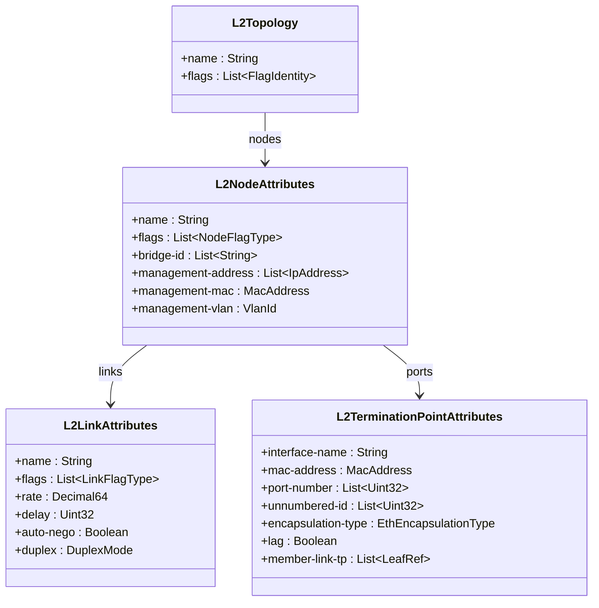
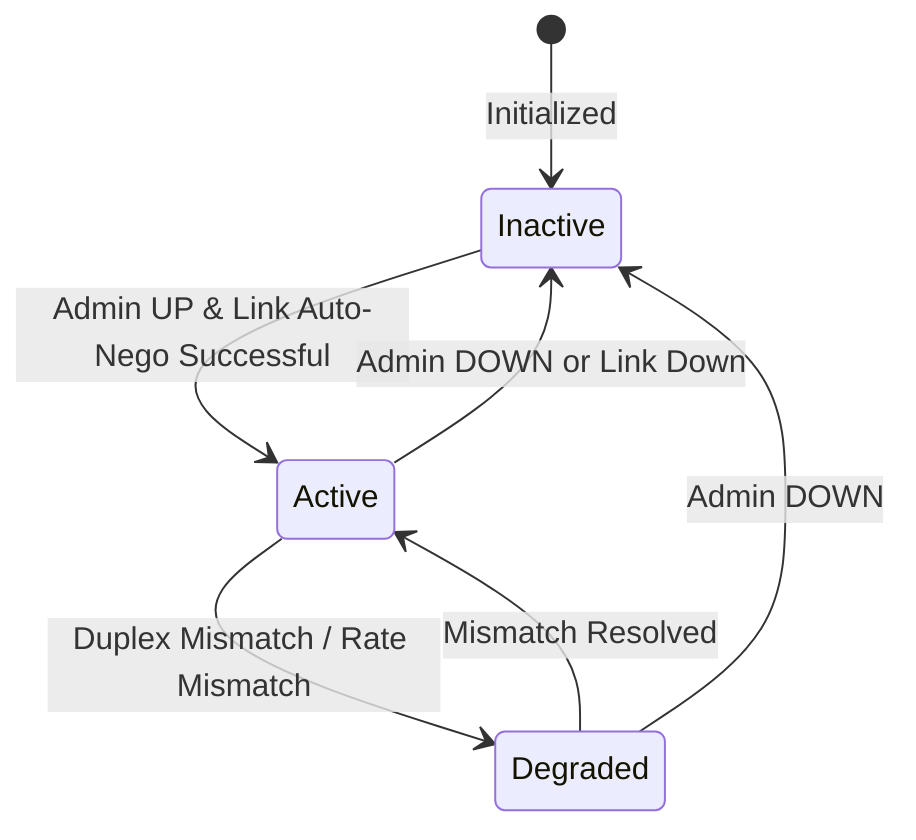

# Epic: Epic 17: IETF Layer 2 Network Topologies (Issue #159)

## 1. Context
This Epic covers the network topology modeling, nodes, links, and termination points specifically for Layer 2 technologies (such as VLAN, QinQ, VXLAN, TRILL, PBB, and VPLS). It reverse-engineers the model defined in `ietf-l2-topology@2020-11-15.yang` which defines Layer 2 parameters and augments the generic RFC 8345 network topology model to represent physical and logical L2 network topologies, allowing discovery and virtual network provisioning.

## 2. Requirements & Checklist
- [ ] #151 - [Feature 51: IETF Layer 2 Network Topology and Node Attributes](https://github.com/gintatkinson/cogctl-ux-09/blob/main/docs/features/feat-51-l2-topology-nodes.md)
- [ ] #152 - [Feature 52: IETF Layer 2 Link Attributes](https://github.com/gintatkinson/cogctl-ux-09/blob/main/docs/features/feat-52-l2-topology-links.md)
- [ ] #153 - [Feature 53: IETF Layer 2 Termination Point Encapsulation and Virtualization](https://github.com/gintatkinson/cogctl-ux-09/blob/main/docs/features/feat-53-l2-topology-ports.md)

## Associated Use Cases & User Stories

### Associated Use Cases
- [ ] #157 - [Use Case 24: Discover and Audit Layer 2 Topology (Issue #157)](https://github.com/gintatkinson/cogctl-ux-09/blob/main/docs/use-cases/uc-24-discover-l2-topology.md)
- [ ] #158 - [Use Case 25: Provision Layer 2 Virtual Overlay (Issue #158)](https://github.com/gintatkinson/cogctl-ux-09/blob/main/docs/use-cases/uc-25-provision-l2-overlay.md)

### Associated User Stories
- [ ] #154 - [User Story 48: Layer 2 Network Topology Discovery and Auditing (Issue #154)](https://github.com/gintatkinson/cogctl-ux-09/blob/main/docs/user-stories/us-48-l2-topology-discovery.md)
- [ ] #155 - [User Story 49: Layer 2 Link Connectivity and Performance Tuning (Issue #155)](https://github.com/gintatkinson/cogctl-ux-09/blob/main/docs/user-stories/us-49-l2-link-connectivity.md)
- [ ] #156 - [User Story 50: Layer 2 Interface Encapsulation and Logical Partitioning (Issue #156)](https://github.com/gintatkinson/cogctl-ux-09/blob/main/docs/user-stories/us-50-l2-port-encapsulation.md)
## 3. Architecture and System Interaction Diagrams

## 4. State Machine Definitions

## 5. Specification Context
> This document defines a YANG data model for Layer 2 network topologies.
> 
> The model fully conforms to the Network Management Datastore Architecture (NMDA).

## 6. Source References
- **YANG Schema:** [ietf-l2-topology.yang](https://github.com/gintatkinson/cogctl-ux-09/blob/main/yang/ietf-l2-topology.yang)
- **Normative Specification:** [RFC 8944: A YANG Data Model for Layer 2 Network Topologies](https://datatracker.ietf.org/doc/rfc8944/)
