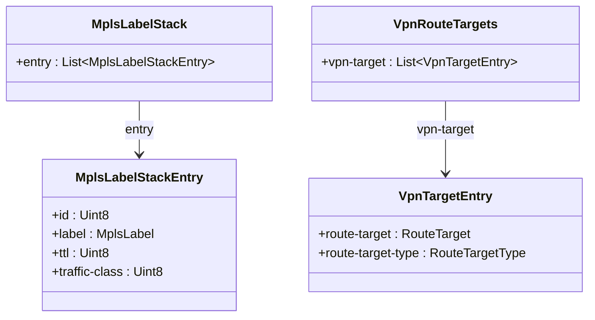
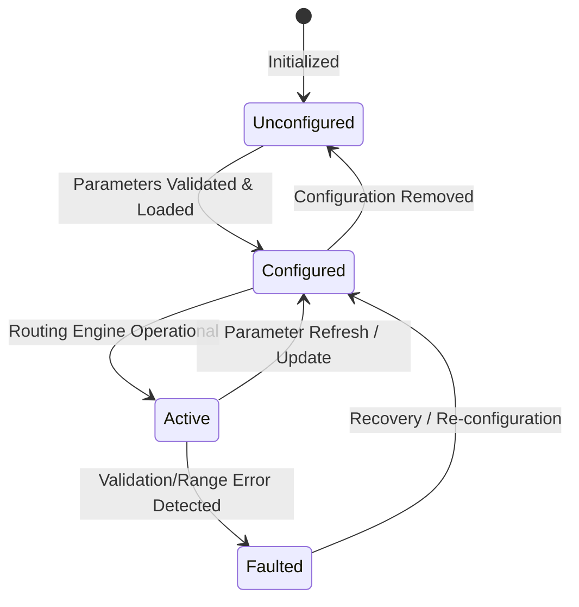

# Epic: Epic 18: IETF Routing Common YANG Data Types (Issue #168)

## 1. Context
This Epic covers the common identities, typedefs, and groupings used across IETF Routing Area working group schemas. It reverse-engineers the model defined in `ietf-routing-types@2017-12-04.yang` (from RFC 8294), which defines common parameters such as MPLS labels, BGP Route Targets/Distinguishers, IP multicast groups, bandwidth metrics, and protocol timers. This allows generic routing protocols and VPNs to leverage standard type definitions for configuration and state representations.

## 2. Requirements & Checklist
- [ ] #160 - [Feature 54: IETF Routing Type Identities and MPLS Labels](https://github.com/gintatkinson/cogctl-ux-09/blob/main/docs/features/feat-54-routing-types-mpls.md)
- [ ] #161 - [Feature 55: IETF Routing VPN Route Targets and Distinguishers](https://github.com/gintatkinson/cogctl-ux-09/blob/main/docs/features/feat-55-routing-types-vpn.md)
- [ ] #162 - [Feature 56: IETF Routing Multicast and Protocol Common Types](https://github.com/gintatkinson/cogctl-ux-09/blob/main/docs/features/feat-56-routing-types-common.md)

## Associated Use Cases & User Stories

### Associated Use Cases
- [ ] #166 - [Use Case 26: Ingest Routing Area YANG Common Data Types (Issue #166)](https://github.com/gintatkinson/cogctl-ux-09/blob/main/docs/use-cases/uc-26-ingest-routing-data-types.md)
- [ ] #167 - [Use Case 27: Provision BGP/MPLS VPN Routing Segment (Issue #167)](https://github.com/gintatkinson/cogctl-ux-09/blob/main/docs/use-cases/uc-27-provision-vpn-routing.md)

### Associated User Stories
- [ ] #163 - [User Story 51: IETF Routing MPLS Label Provisioning (Issue #163)](https://github.com/gintatkinson/cogctl-ux-09/blob/main/docs/user-stories/us-51-mpls-label-provisioning.md)
- [ ] #164 - [User Story 52: IETF Routing VPN Parameter Mapping (Issue #164)](https://github.com/gintatkinson/cogctl-ux-09/blob/main/docs/user-stories/us-52-vpn-parameter-mapping.md)
- [ ] #165 - [User Story 53: IETF Routing Common Multicast and Protocol Configuration (Issue #165)](https://github.com/gintatkinson/cogctl-ux-09/blob/main/docs/user-stories/us-53-multicast-protocol-config.md)
## 3. Architecture and System Interaction Diagrams

## 4. State Machine Definitions

## 5. Specification Context
> This document defines common YANG data types for the Routing Area.
> 
> The model complies with the routing-type guidelines outlined in RFC 8294.

## 6. Source References
- **YANG Schema:** [ietf-routing-types.yang](https://github.com/gintatkinson/cogctl-ux-09/blob/main/yang/ietf-routing-types.yang)
- **Normative Specification:** [RFC 8294: Common YANG Data Types for the Routing Area](https://datatracker.ietf.org/doc/rfc8294/)
