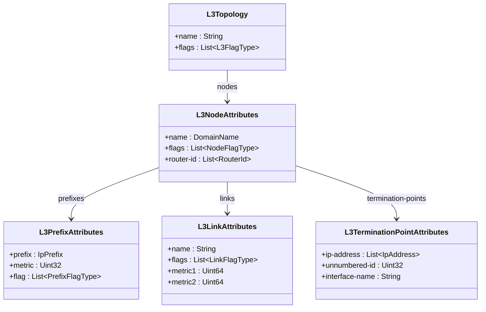
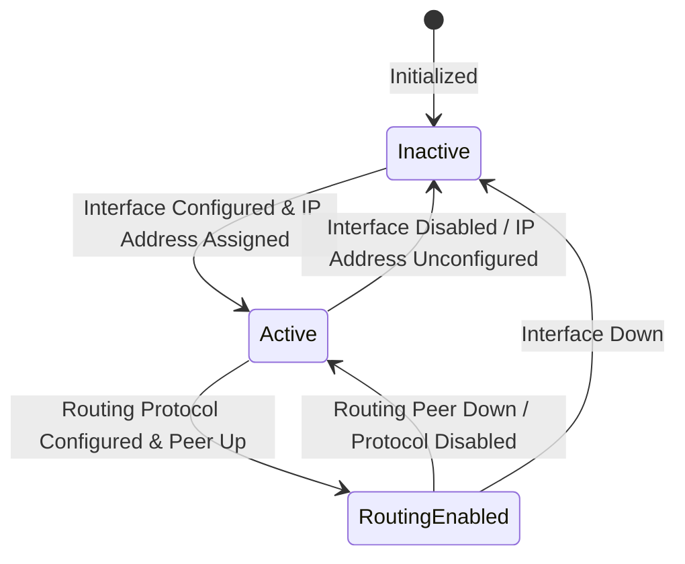

# Epic: Epic 19: IETF Layer 3 Unicast Network Topologies (Issue #175)

## 1. Context
This Epic covers the network topology modeling, nodes, links, prefixes, and termination points specifically for Layer 3 unicast routing networks. It reverse-engineers the model defined in `ietf-l3-unicast-topology@2018-02-26.yang` which defines Layer 3 parameters and augments the generic RFC 8345 network topology model to represent logical Layer 3 routing networks, allowing automatic discovery, routing protocol audits, and IP endpoint provisioning.

## 2. Requirements & Checklist
- [ ] #169 - [Feature 57: IETF Layer 3 Unicast Network and Node Attributes](https://github.com/gintatkinson/cogctl-ux-09/blob/main/docs/features/feat-57-l3-topology-nodes.md)
- [ ] #170 - [Feature 58: IETF Layer 3 Unicast Links and Termination Points](https://github.com/gintatkinson/cogctl-ux-09/blob/main/docs/features/feat-58-l3-topology-links.md)

## Associated Use Cases & User Stories

### Associated Use Cases
- [ ] #173 - [Use Case 28: Discover and Audit Layer 3 Unicast Topology (Issue #173)](https://github.com/gintatkinson/cogctl-ux-09/blob/main/docs/use-cases/uc-28-discover-l3-topology.md)
- [ ] #174 - [Use Case 29: Provision Layer 3 Unicast Topology Parameters (Issue #174)](https://github.com/gintatkinson/cogctl-ux-09/blob/main/docs/use-cases/uc-29-provision-l3-endpoints.md)

### Associated User Stories
- [ ] #171 - [User Story 54: Layer 3 Unicast Topology Discovery (Issue #171)](https://github.com/gintatkinson/cogctl-ux-09/blob/main/docs/user-stories/us-54-l3-topology-discovery.md)
- [ ] #172 - [User Story 55: Layer 3 Route Prefix and Endpoint Configuration (Issue #172)](https://github.com/gintatkinson/cogctl-ux-09/blob/main/docs/user-stories/us-55-l3-endpoint-configuration.md)
## 3. Architecture and System Interaction Diagrams

## 4. State Machine Definitions

## 5. Specification Context
> This document defines a YANG data model for Layer 3 unicast network topologies.
> 
> The model fully conforms to the Network Management Datastore Architecture (NMDA).

## 6. Source References
- **YANG Schema:** [ietf-l3-unicast-topology.yang](https://github.com/gintatkinson/cogctl-ux-09/blob/main/yang/ietf-l3-unicast-topology.yang)
- **Normative Specification:** [RFC 8346: A YANG Data Model for Layer 3 Topologies](https://datatracker.ietf.org/doc/rfc8346/)
