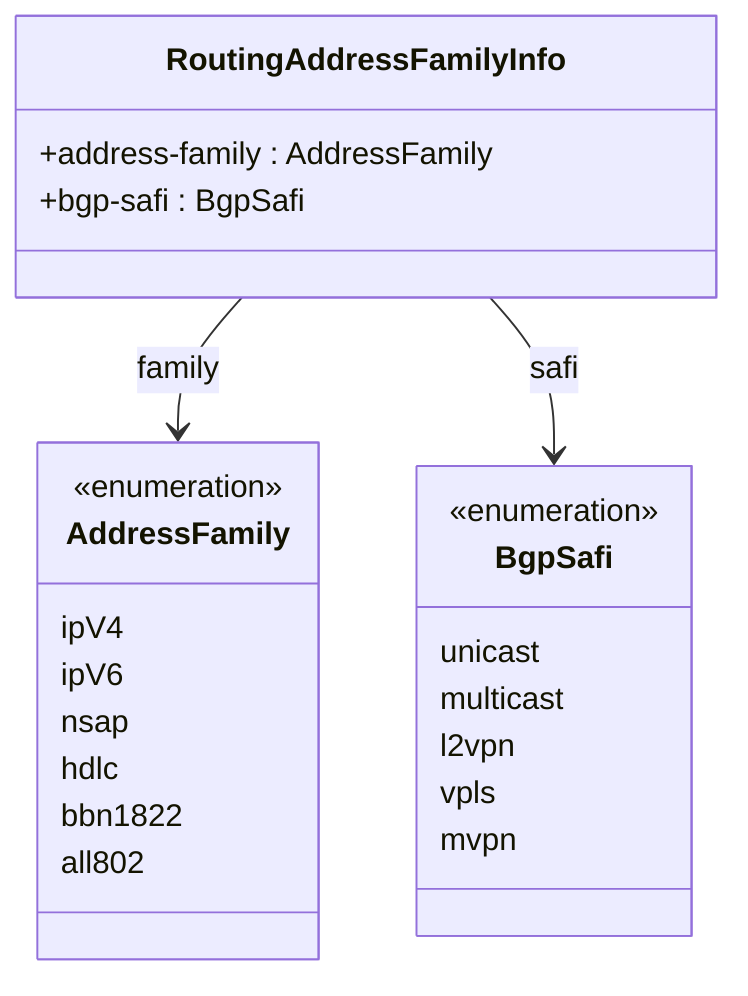
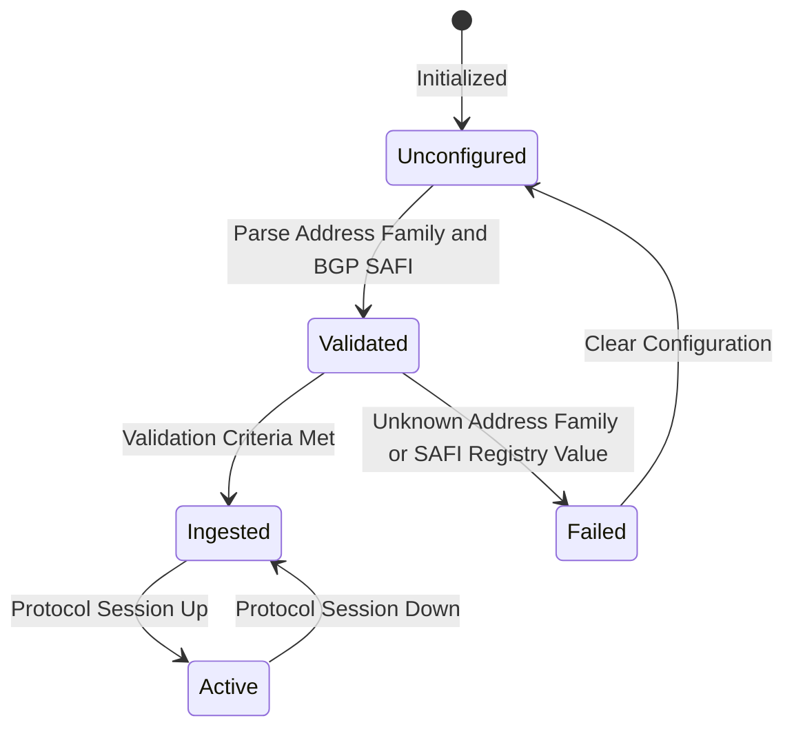

# Epic: Epic 20: IANA Routing Common Data Types (Issue #179)

## 1. Context
This Epic covers the common routing data types and registries maintained by IANA, specifically Address Family Numbers and BGP Subsequent Address Family Identifier (SAFI) values. It reverse-engineers the model defined in `iana-routing-types.yang` (from RFC 8294), which defines standard type registries for Address Families and BGP SAFIs. This allows routing area protocols to leverage standard, uniform, and up-to-date IANA registries for BGP multiprotocol extensions, route exchange configurations, and dynamic topology routing discovery.

## 2. Requirements & Checklist
- [ ] #176 - [Feature 59: IANA Routing Address Family and BGP SAFI Data Types](https://github.com/gintatkinson/cogctl-ux-09/blob/main/docs/features/feat-59-iana-routing-types.md)

## Associated Use Cases & User Stories

### Associated Use Cases
- [ ] #178 - [Use Case 30: Ingest IANA Routing Area Data Types (Issue #178)](https://github.com/gintatkinson/cogctl-ux-09/blob/main/docs/use-cases/uc-30-ingest-iana-types.md)

### Associated User Stories
- [ ] #177 - [User Story 56: IANA Routing Family and SAFI Ingestion (Issue #177)](https://github.com/gintatkinson/cogctl-ux-09/blob/main/docs/user-stories/us-56-iana-routing-ingestion.md)
## 3. Architecture and System Interaction Diagrams

## 4. State Machine Definitions

## 5. Specification Context
> This document defines common IANA data types for the Routing Area.
> 
> The model complies with the routing-type guidelines outlined in RFC 8294.

## 6. Source References
- **YANG Schema:** [iana-routing-types.yang](https://github.com/gintatkinson/cogctl-ux-09/blob/main/yang/iana-routing-types.yang)
- **Normative Specification:** [RFC 8294: Common YANG Data Types for the Routing Area](https://datatracker.ietf.org/doc/rfc8294/)
