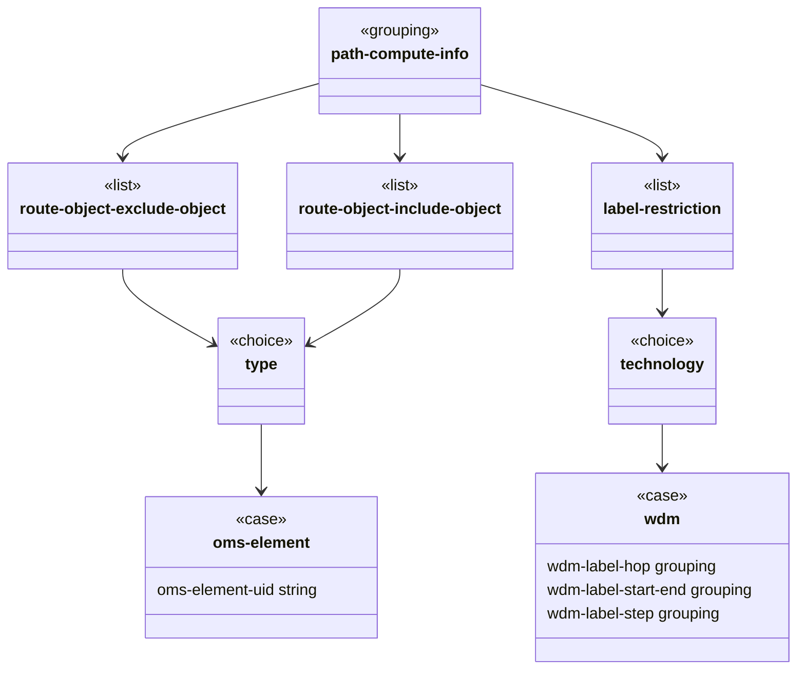
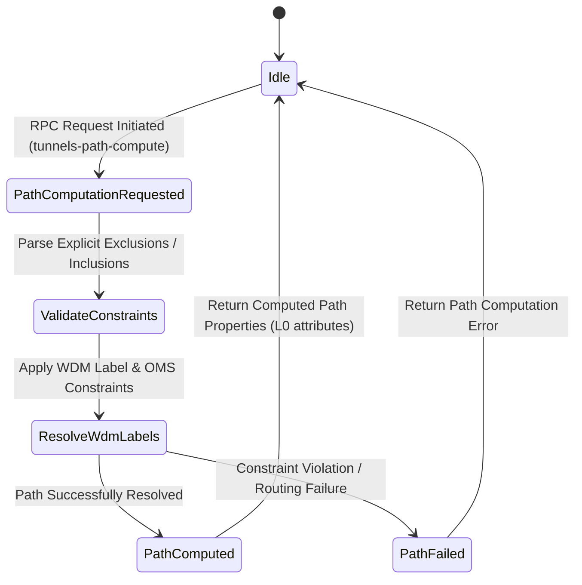

# Epic: Epic 21: WDM Path Computation (Issue #183)

## 1. Context
This Epic covers the reverse-engineering of `ietf-wdm-path-computation@2026-02-27.yang`. It defines the YANG data model for requesting path computation in Wavelength-Division Multiplexing (WDM) optical networks, supporting both Wavelength Switched Optical Networks (WSON) and Flexi-Grid Dense Wavelength Division Multiplexing (DWDM) switching technologies.

## 2. Requirements & Checklist
- [ ] #180 - [Feature 60: WDM Path Computation Objects](https://github.com/gintatkinson/cogctl-ux-09/blob/main/docs/features/feat-60-wdm-path-computation-objects.md)

## Associated Use Cases & User Stories

### Associated Use Cases
- [ ] #182 - [Use Case 31: Request WDM Path Computation (Issue #182)](https://github.com/gintatkinson/cogctl-ux-09/blob/main/docs/use-cases/uc-31-request-wdm-path-computation.md)

### Associated User Stories
- [ ] #181 - [User Story 57: WDM Optical Route Computation Request (Issue #181)](https://github.com/gintatkinson/cogctl-ux-09/blob/main/docs/user-stories/us-57-wdm-path-computation-request.md)
## 3. Architecture and System Interaction Diagrams

## 4. Verification and Validation Plan
- Run the model coverage check tool (`verify_model_coverage.py`) to verify 100% schema model coverage.
- Run the backlog reconciliation script (`reconcile_backlog.py`) to verify database integrity and link synchronization.

## 5. Specification Context
> This document provides a mechanism to request path computation in Wavelength-Division Multiplexing (WDM) optical networks. These networks are composed of Wavelength Switched Optical Networks (WSON) and Flexi-Grid Dense Wavelength Division Multiplexing (DWDM) switched technologies. The YANG data model defined in the document is designed to augment Remote Procedure Calls (RPCs) to facilitate these path computation requests.

## 6. Source References
YANG Schema: [ietf-wdm-path-computation.yang](https://github.com/YangModels/yang/blob/954277fad0534e9b0b495774255b0c4ce854f8b2/experimental/ietf-extracted-YANG-modules/ietf-wdm-path-computation%402026-02-27.yang)
Normative Specification: [draft-ietf-ccamp-optical-path-computation-yang](https://datatracker.ietf.org/doc/draft-ietf-ccamp-optical-path-computation-yang/)
