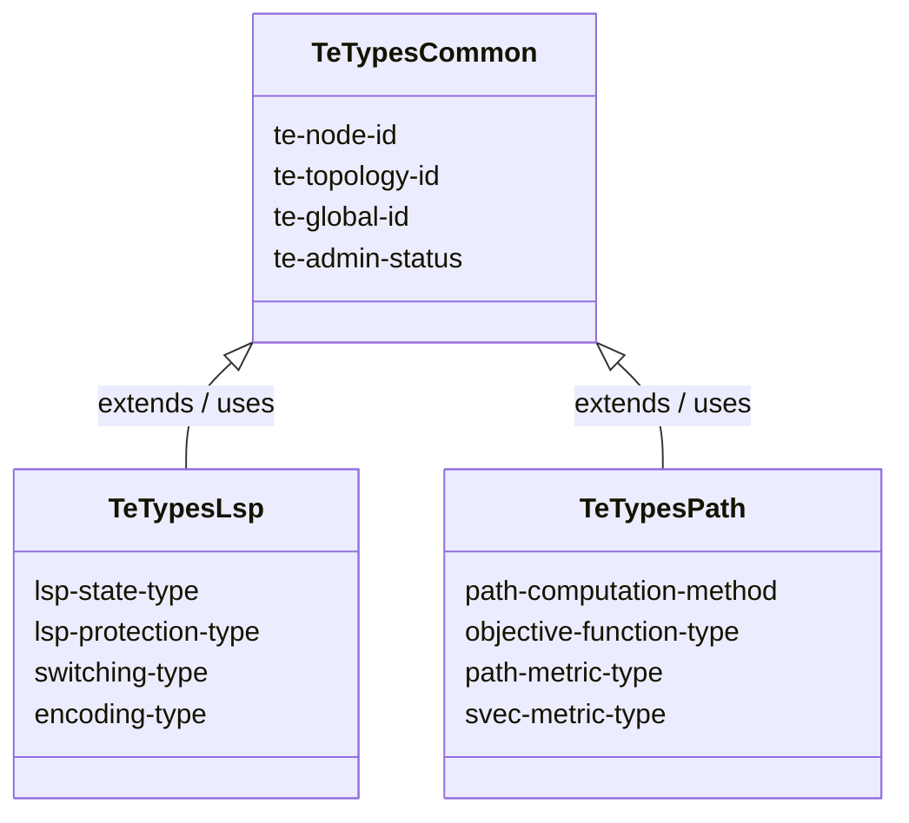
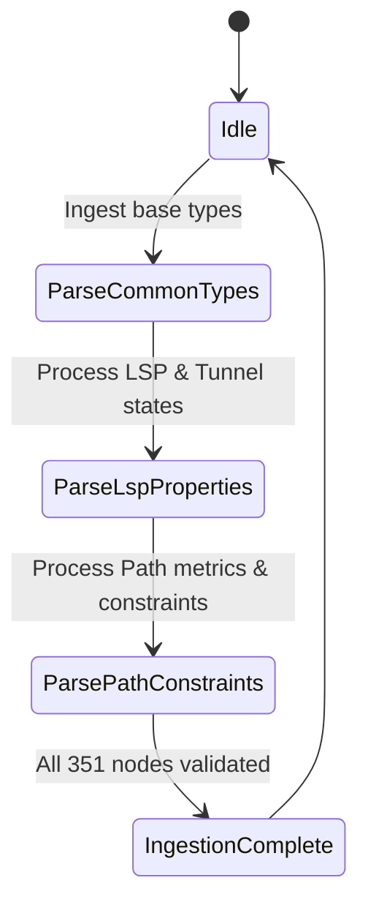

# Epic: Epic 22: Traffic Engineering Common Data Types (Issue #189)

## 1. Context
This Epic covers the reverse-engineering of `ietf-te-types@2026-05-08.yang` as specified in `draft-ietf-teas-rfc8776-update-23`. The model defines common Traffic Engineering identities, typedefs, and groupings utilized across multiple TE network topologies and path computation models.

## 2. Requirements & Checklist
- [ ] #184 - [Feature 61: Common Traffic Engineering Base Types](https://github.com/gintatkinson/cogctl-ux-09/blob/main/docs/features/feat-61-te-types-common.md)
- [ ] #185 - [Feature 62: Traffic Engineering LSP and Tunnel Properties](https://github.com/gintatkinson/cogctl-ux-09/blob/main/docs/features/feat-62-te-types-lsp.md)
- [ ] #186 - [Feature 63: Traffic Engineering Path Computation and Metrics](https://github.com/gintatkinson/cogctl-ux-09/blob/main/docs/features/feat-63-te-types-path.md)

## Associated Use Cases & User Stories

### Associated Use Cases
- [ ] #188 - [Use Case 32: Ingest Traffic Engineering Common Area Data Types (Issue #188)](https://github.com/gintatkinson/cogctl-ux-09/blob/main/docs/use-cases/uc-32-te-types-ingest.md)

### Associated User Stories
- [ ] #187 - [User Story 58: Ingest Common Traffic Engineering Types (Issue #187)](https://github.com/gintatkinson/cogctl-ux-09/blob/main/docs/user-stories/us-58-te-types-common.md)
## 3. Architecture and System Interaction Diagrams

## 4. Verification and Validation Plan
- Verify that overall project model coverage is at 100% via `./skills/spec-orchestrator/verify_model_coverage.py`.
- Synchronize all specifications to GitHub issues using `./skills/spec-orchestrator/reconcile_backlog.py`.

## 5. Specification Context
> This YANG module contains a collection of generally useful YANG data type definitions specific to Traffic Engineering.

## 6. Source References
YANG Schema: [ietf-te-types.yang](https://github.com/YangModels/yang/blob/954277fad0534e9b0b495774255b0c4ce854f8b2/experimental/ietf-extracted-YANG-modules/ietf-te-types%402026-05-08.yang)
Normative Specification: [draft-ietf-teas-rfc8776-update](https://datatracker.ietf.org/doc/draft-ietf-teas-rfc8776-update/)
