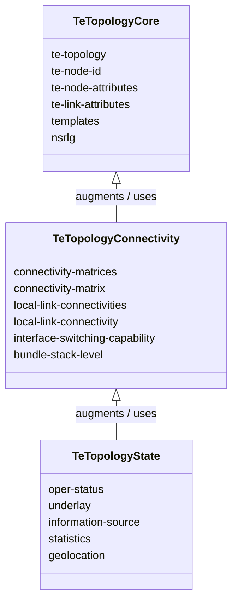
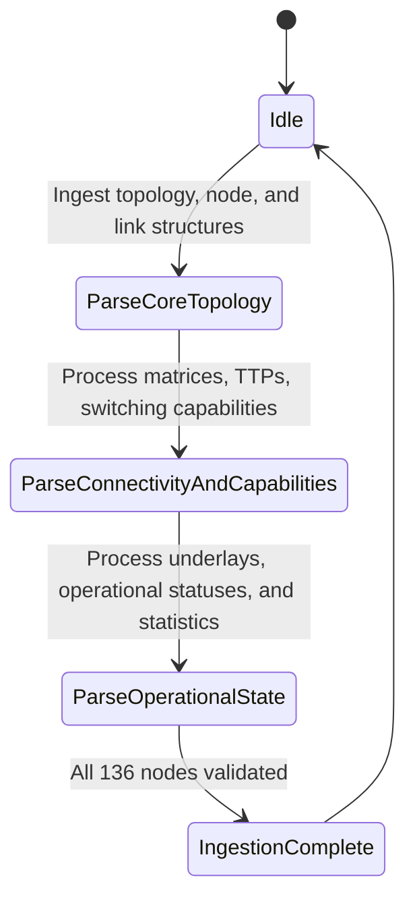

# Epic: Epic 23: Traffic Engineering Topologies Model (Issue #195)

## 1. Context
This Epic covers the reverse-engineering of `ietf-te-topology@2020-08-06.yang` as specified in `RFC 8795`. The model defines a technology-agnostic Traffic Engineering topology data model, which augments the base network topology model (RFC 8345) to represent Traffic Engineering nodes, links, termination points, connectivity matrices, underlays, and switching capabilities.

## 2. Requirements & Checklist
- [ ] #190 - [Feature 64: Traffic Engineering Topologies Core](https://github.com/gintatkinson/cogctl-ux-09/blob/main/docs/features/feat-64-te-topology-core.md)
- [ ] #191 - [Feature 65: Traffic Engineering Topologies Connectivity and Capabilities](https://github.com/gintatkinson/cogctl-ux-09/blob/main/docs/features/feat-65-te-topology-connectivity.md)
- [ ] #192 - [Feature 66: Traffic Engineering Topologies Operational State and Statistics](https://github.com/gintatkinson/cogctl-ux-09/blob/main/docs/features/feat-66-te-topology-state.md)

## Associated Use Cases & User Stories

### Associated Use Cases
- [ ] #194 - [Use Case 33: Retrieve Traffic Engineering Topologies (Issue #194)](https://github.com/gintatkinson/cogctl-ux-09/blob/main/docs/use-cases/uc-33-te-topology-retrieval.md)

### Associated User Stories
- [ ] #193 - [User Story 59: Query Traffic Engineering Topologies (Issue #193)](https://github.com/gintatkinson/cogctl-ux-09/blob/main/docs/user-stories/us-59-te-topology.md)
## 3. Architecture and System Interaction Diagrams

## 4. Verification and Validation Plan
- Verify that overall project model coverage is at 100% via `./skills/spec-orchestrator/verify_model_coverage.py`.
- Synchronize all specifications to GitHub issues using `./skills/spec-orchestrator/reconcile_backlog.py`.

## 5. Specification Context
> This YANG module defines a technology-agnostic TE topology model that can be used to monitor and configure TE topologies, including nodes, links, and termination points.

## 6. Source References
YANG Schema: [ietf-te-topology.yang](https://github.com/YangModels/yang/blob/954277fad0534e9b0b495774255b0c4ce854f8b2/standard/ietf/RFC/ietf-te-topology%402020-08-06.yang)
Normative Specification: [RFC 8795](https://datatracker.ietf.org/doc/rfc8795/)
