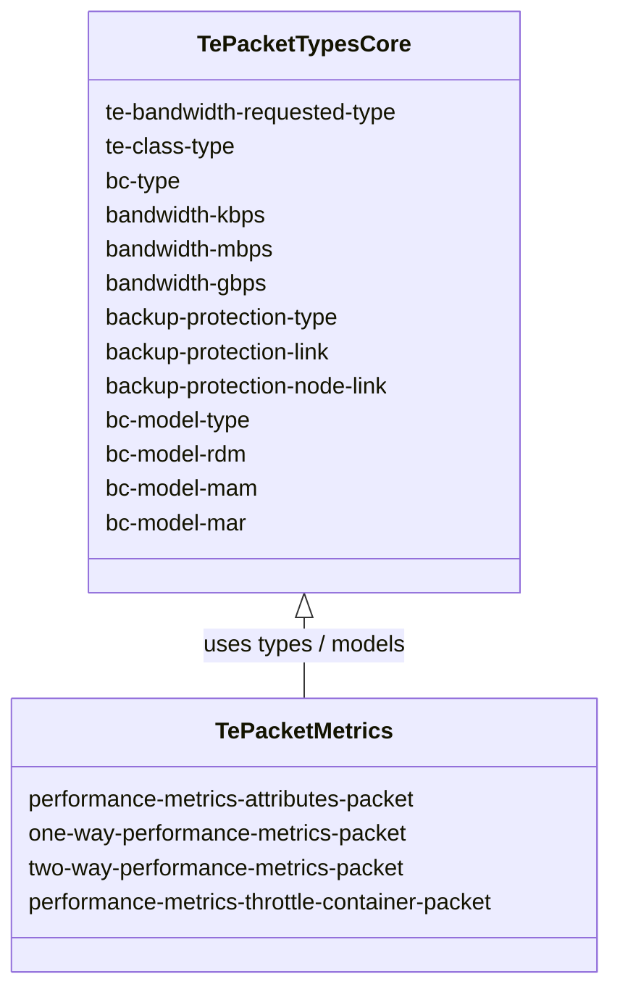
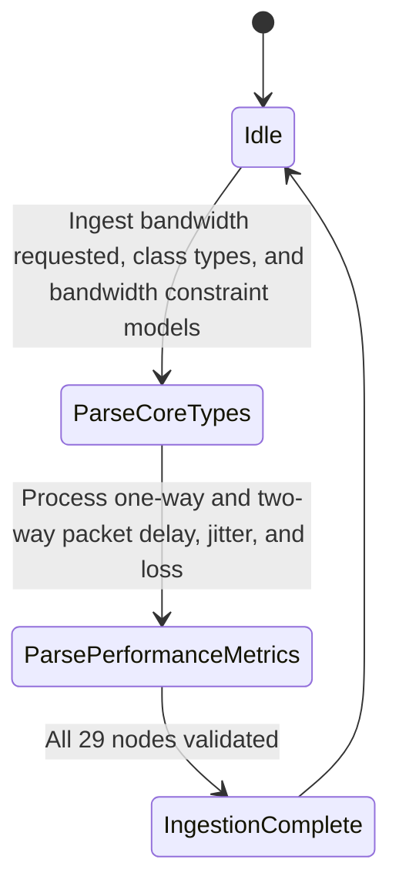

# Epic: Epic 24: Packet Traffic Engineering Types Model (Issue #199)

## 1. Context
This Epic covers the reverse-engineering of `ietf-te-packet-types@2020-06-10.yang` as specified in `RFC 8776`. The model defines common YANG data types, identities, and groupings specific to Packet Switching Capable (PSC) Traffic Engineering (TE). These types represent Diffserv-aware TE (Diffserv-TE) bandwidth constraints, backup protection types, bandwidth constraint models, and packet-specific performance metrics (one-way and two-way latency, variation, packet loss).

## 2. Requirements & Checklist
- [ ] #196 - [Feature 67: Packet Traffic Engineering Core Types](https://github.com/gintatkinson/cogctl-ux-09/blob/main/docs/features/feat-67-te-packet-types-core.md)
- [ ] #200 - [Feature 68: Packet Performance Metrics Groupings](https://github.com/gintatkinson/cogctl-ux-09/blob/main/docs/features/feat-68-te-packet-types-metrics.md)

## Associated Use Cases & User Stories

### Associated Use Cases
- [ ] #198 - [Use Case 34: Ingest and Validate Packet Traffic Engineering Types (Issue #198)](https://github.com/gintatkinson/cogctl-ux-09/blob/main/docs/use-cases/uc-34-te-packet-types-ingest.md)

### Associated User Stories
- [ ] #197 - [User Story 60: Manage Packet Traffic Engineering Types (Issue #197)](https://github.com/gintatkinson/cogctl-ux-09/blob/main/docs/user-stories/us-60-te-packet-types.md)
## 3. Architecture and System Interaction Diagrams

## 4. Verification and Validation Plan
- Verify that overall project model coverage is at 100% via `./skills/spec-orchestrator/verify_model_coverage.py`.
- Synchronize all specifications to GitHub issues using `./skills/spec-orchestrator/reconcile_backlog.py`.

## 5. Specification Context
> This YANG module contains a collection of generally useful YANG data type definitions specific to MPLS TE.

## 6. Source References
YANG Schema: [ietf-te-packet-types.yang](https://github.com/gintatkinson/cogctl-ux-09/blob/main/yang/ietf-te-packet-types.yang)
Normative Specification: [draft-ietf-teas-rfc8776-update](https://datatracker.ietf.org/doc/draft-ietf-teas-rfc8776-update/)
