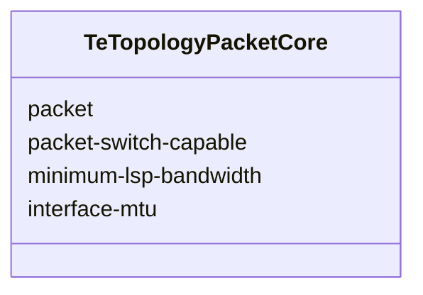
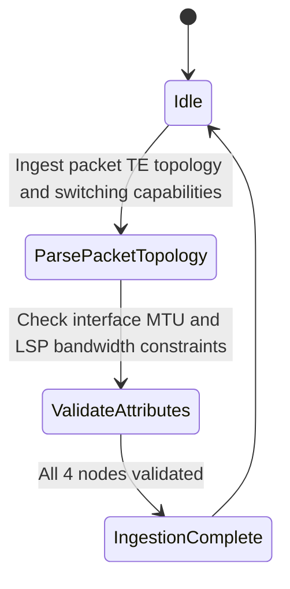

# Epic: Epic 25: Packet Traffic Engineering Topologies Model (Issue #204)

## 1. Context
This Epic covers the reverse-engineering of `ietf-te-topology-packet@2024-06-08.yang` as specified in `RFC 8795`. The model defines a YANG data model for representing and manipulating PSC (Packet Switching Capable) Traffic Engineering (TE) topologies. It augments the base TE topology model (RFC 8795) with packet-specific attributes like interface MTU and minimum LSP bandwidth.

## 2. Requirements & Checklist
- [ ] #201 - [Feature 69: Packet Traffic Engineering Topologies Core](https://github.com/gintatkinson/cogctl-ux-09/blob/main/docs/features/feat-69-te-topology-packet-core.md)

## Associated Use Cases & User Stories

### Associated Use Cases
- [ ] #203 - [Use Case 35: Ingest and Validate Packet Traffic Engineering Topologies (Issue #203)](https://github.com/gintatkinson/cogctl-ux-09/blob/main/docs/use-cases/uc-35-te-topology-packet-ingest.md)

### Associated User Stories
- [ ] #202 - [User Story 61: Manage Packet Traffic Engineering Topologies (Issue #202)](https://github.com/gintatkinson/cogctl-ux-09/blob/main/docs/user-stories/us-61-te-topology-packet.md)
## 3. Architecture and System Interaction Diagrams

## 4. Verification and Validation Plan
- Verify that overall project model coverage is at 100% via `./skills/spec-orchestrator/verify_model_coverage.py`.
- Synchronize all specifications to GitHub issues using `./skills/spec-orchestrator/reconcile_backlog.py`.

## 5. Specification Context
> This YANG module defines a technology-specific TE topology model for Packet Switching Capable (PSC) networks.

## 6. Source References
YANG Schema: [ietf-te-topology-packet.yang](https://github.com/gintatkinson/cogctl-ux-09/blob/main/yang/ietf-te-topology-packet.yang)
Normative Specification: [RFC 8795](https://datatracker.ietf.org/doc/rfc8795/)
