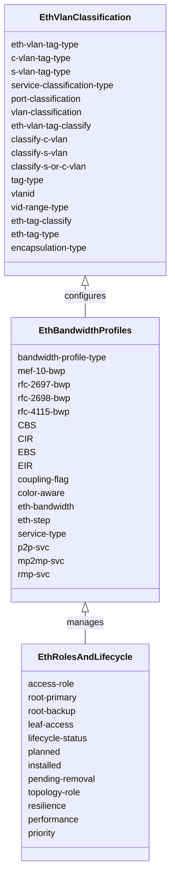
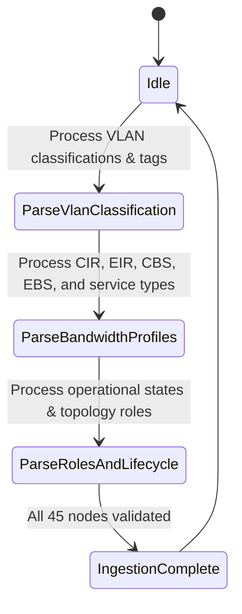

# Epic: Epic 26: Ethernet Transport Network Client Signals Common Types Model (Issue #210)

## 1. Context
This Epic covers the reverse-engineering of `ietf-eth-tran-types@2024-01-11.yang` as specified in `draft-ietf-ccamp-client-signal-yang`. The model defines common identities, typedefs, and groupings representing Ethernet client transport parameters, bandwidth profile types, service types, and operational/topology roles.

## 2. Requirements & Checklist
- [ ] #205 - [Feature 70: Ethernet Transport Client VLAN and Service Classification Types](https://github.com/gintatkinson/cogctl-ux-09/blob/main/docs/features/feat-70-eth-tran-types-vlan.md)
- [ ] #206 - [Feature 71: Ethernet Transport Bandwidth Profiles and Service Types](https://github.com/gintatkinson/cogctl-ux-09/blob/main/docs/features/feat-71-eth-tran-types-bwp.md)
- [ ] #207 - [Feature 72: Ethernet Transport Operational and Topology Roles](https://github.com/gintatkinson/cogctl-ux-09/blob/main/docs/features/feat-72-eth-tran-types-roles.md)

## Associated Use Cases & User Stories

### Associated Use Cases
- [ ] #209 - [Use Case 36: Ingest and Validate Ethernet Transport Client Signal Types (Issue #209)](https://github.com/gintatkinson/cogctl-ux-09/blob/main/docs/use-cases/uc-36-eth-tran-types-ingest.md)

### Associated User Stories
- [ ] #208 - [User Story 62: Manage Ethernet Transport Client Signal Types (Issue #208)](https://github.com/gintatkinson/cogctl-ux-09/blob/main/docs/user-stories/us-62-eth-tran-types.md)
## 3. Architecture and System Interaction Diagrams

## 4. Verification and Validation Plan
- Verify that overall project model coverage is at 100% via `./skills/spec-orchestrator/verify_model_coverage.py`.
- Synchronize all specifications to GitHub issues using `./skills/spec-orchestrator/reconcile_backlog.py`.

## 5. Specification Context
> This YANG module contains definitions of common Ethernet transport client signal attributes.

## 6. Source References
YANG Schema: [ietf-eth-tran-types.yang](https://github.com/gintatkinson/cogctl-ux-09/blob/main/yang/ietf-eth-tran-types.yang)
Normative Specification: [draft-ietf-ccamp-client-signal-yang](https://datatracker.ietf.org/doc/draft-ietf-ccamp-client-signal-yang/)
