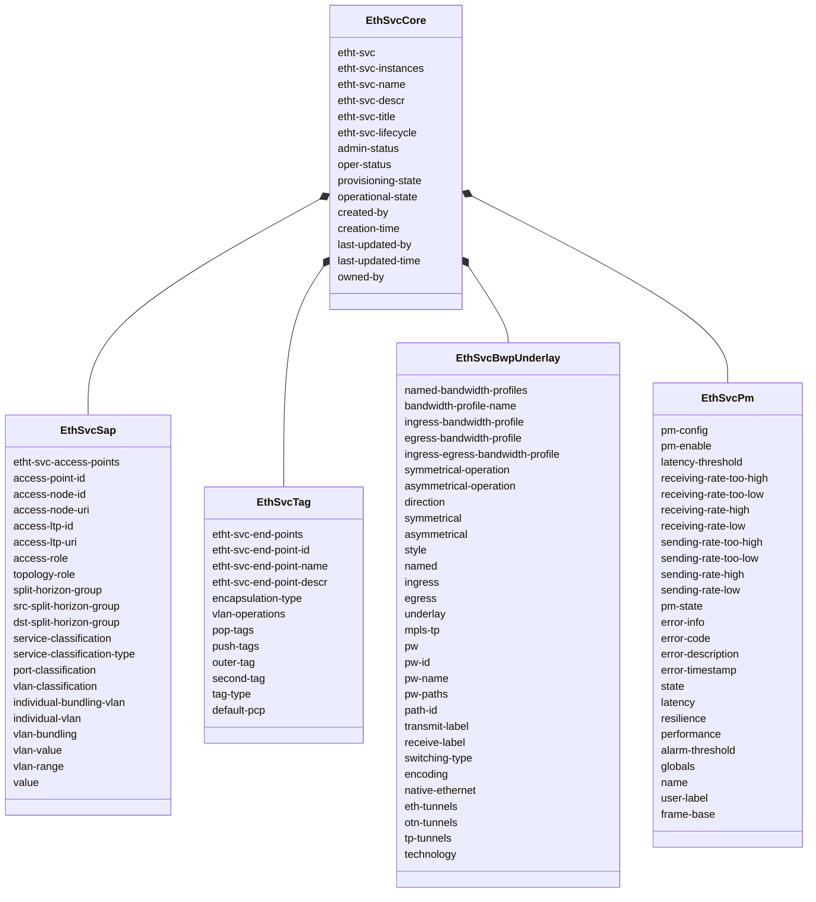
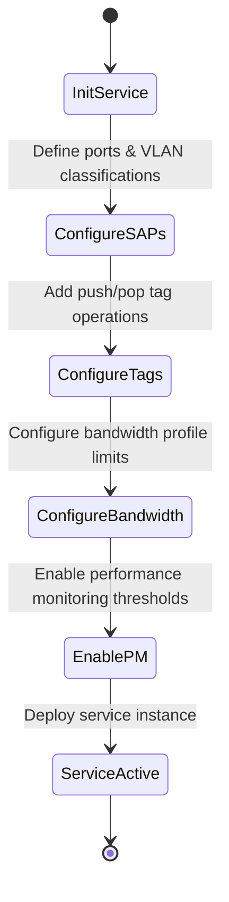

# Epic: Epic 27: Ethernet Transport Network Client Services Model (Issue #218)

## 1. Context
This Epic covers the reverse-engineering of `ietf-eth-tran-service@2024-01-11.yang` as specified in `draft-ietf-ccamp-client-signal-yang`. The model defines service configurations, topologies, endpoints, performance metrics, and service underlays for provisioning Ethernet customer connections over transport networks.

## 2. Requirements & Checklist
- [ ] #211 - [Feature 73: Ethernet Transport Service Instances and Endpoints Core](https://github.com/gintatkinson/cogctl-ux-09/blob/main/docs/features/feat-73-eth-tran-service-core.md)
- [ ] #212 - [Feature 74: Ethernet Transport Service Access Points and Classification](https://github.com/gintatkinson/cogctl-ux-09/blob/main/docs/features/feat-74-eth-tran-service-sap.md)
- [ ] #213 - [Feature 75: Ethernet Transport Service Endpoints and Tag Operations](https://github.com/gintatkinson/cogctl-ux-09/blob/main/docs/features/feat-75-eth-tran-service-tag.md)
- [ ] #214 - [Feature 76: Ethernet Transport Service Bandwidth Profiles and Underlays](https://github.com/gintatkinson/cogctl-ux-09/blob/main/docs/features/feat-76-eth-tran-service-bwp-underlay.md)
- [ ] #215 - [Feature 77: Ethernet Transport Service Performance Monitoring and Alerts](https://github.com/gintatkinson/cogctl-ux-09/blob/main/docs/features/feat-77-eth-tran-service-pm.md)

## Associated Use Cases & User Stories

### Associated Use Cases
- [ ] #217 - [Use Case 37: Ingest and Validate Ethernet Transport Client Services (Issue #217)](https://github.com/gintatkinson/cogctl-ux-09/blob/main/docs/use-cases/uc-37-eth-tran-service-ingest.md)

### Associated User Stories
- [ ] #216 - [User Story 63: Manage Ethernet Transport Client Services (Issue #216)](https://github.com/gintatkinson/cogctl-ux-09/blob/main/docs/user-stories/us-63-eth-tran-service.md)
## 3. Architecture and System Interaction Diagrams

## 4. Verification and Validation Plan
- Verify that overall project model coverage is at 100% via `./skills/spec-orchestrator/verify_model_coverage.py`.
- Synchronize all specifications to GitHub issues using `./skills/spec-orchestrator/reconcile_backlog.py`.

## 5. Specification Context
> This YANG module defines configurations and operational states for Ethernet client transport services.

## 6. Source References
YANG Schema: [ietf-eth-tran-service.yang](https://github.com/gintatkinson/cogctl-ux-09/blob/main/yang/ietf-eth-tran-service.yang)
Normative Specification: [draft-ietf-ccamp-client-signal-yang](https://datatracker.ietf.org/doc/draft-ietf-ccamp-client-signal-yang/)
