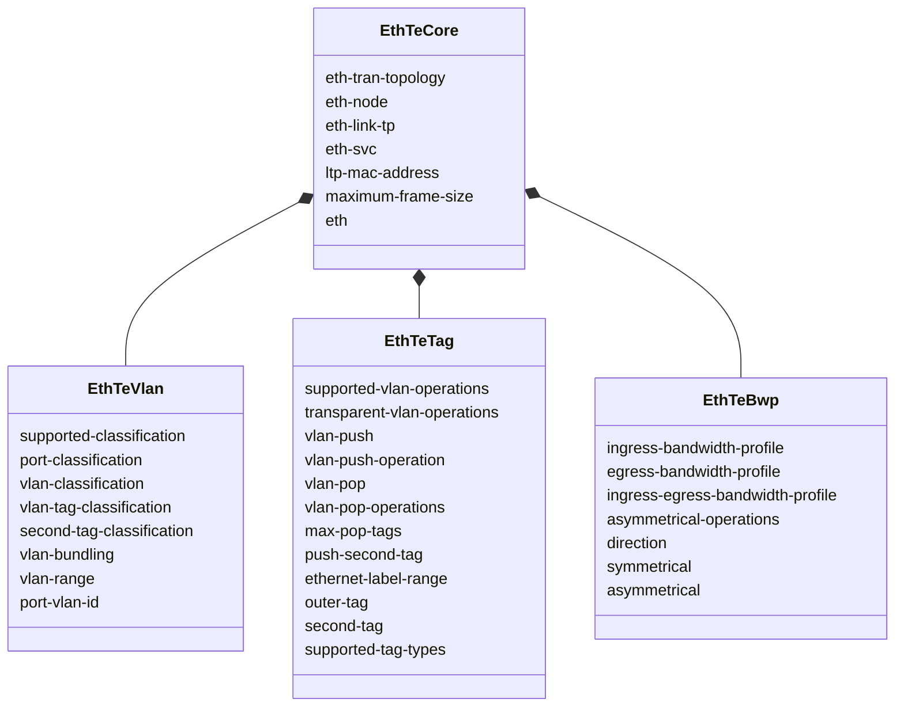
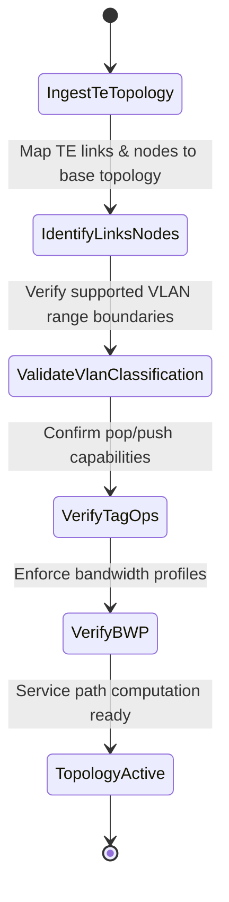

# Epic: Epic 28: Ethernet Client Traffic Engineering Topology Model (Issue #225)

## 1. Context
This Epic covers the reverse-engineering of `ietf-eth-te-topology@2023-09-28.yang` as specified in `draft-ietf-ccamp-eth-client-te-topo-yang`. The model augments the TE topology model with Ethernet client attributes, enabling discovery of VLAN classification capabilities, tag operation limits, and bandwidth profiles on links and terminations.

## 2. Requirements & Checklist
- [ ] #219 - [Feature 78: Ethernet TE Topology Core](https://github.com/gintatkinson/cogctl-ux-09/blob/main/docs/features/feat-78-eth-te-topology-core.md)
- [ ] #220 - [Feature 79: Ethernet TE Topology VLAN Classification](https://github.com/gintatkinson/cogctl-ux-09/blob/main/docs/features/feat-79-eth-te-topology-vlan.md)
- [ ] #221 - [Feature 80: Ethernet TE Topology VLAN Tag Operations](https://github.com/gintatkinson/cogctl-ux-09/blob/main/docs/features/feat-80-eth-te-topology-tag.md)
- [ ] #222 - [Feature 81: Ethernet TE Topology Bandwidth Profiles](https://github.com/gintatkinson/cogctl-ux-09/blob/main/docs/features/feat-81-eth-te-topology-bwp.md)

## Associated Use Cases & User Stories

### Associated Use Cases
- [ ] #224 - [Use Case 38: Ingest and Validate Ethernet TE Topologies (Issue #224)](https://github.com/gintatkinson/cogctl-ux-09/blob/main/docs/use-cases/uc-38-eth-te-topology-ingest.md)

### Associated User Stories
- [ ] #223 - [User Story 64: Discover and Manage Ethernet TE Topologies (Issue #223)](https://github.com/gintatkinson/cogctl-ux-09/blob/main/docs/user-stories/us-64-eth-te-topology.md)
## 3. Architecture and System Interaction Diagrams

## 4. Verification and Validation Plan
- Verify that overall project model coverage is at 100% via `./skills/spec-orchestrator/verify_model_coverage.py`.
- Synchronize all specifications to GitHub issues using `./skills/spec-orchestrator/reconcile_backlog.py`.

## 5. Specification Context
> This YANG module defines Ethernet client TE topology parameters including node, link, and termination point capabilities.

## 6. Source References
YANG Schema: [ietf-eth-te-topology.yang](https://github.com/gintatkinson/cogctl-ux-09/blob/main/yang/ietf-eth-te-topology.yang)
Normative Specification: [draft-ietf-ccamp-eth-client-te-topo-yang](https://datatracker.ietf.org/doc/draft-ietf-ccamp-eth-client-te-topo-yang/)
