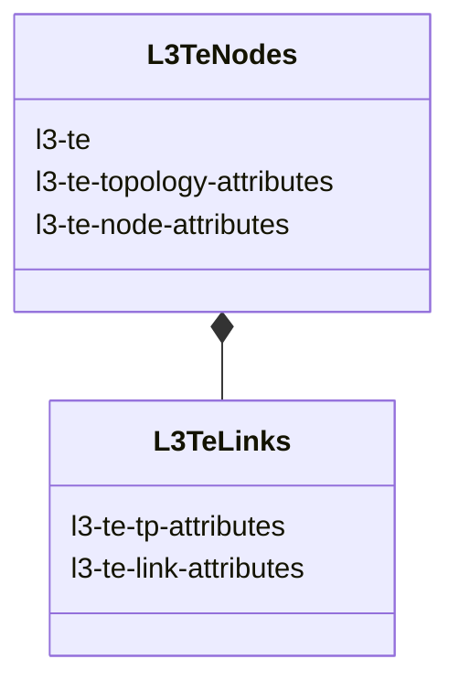
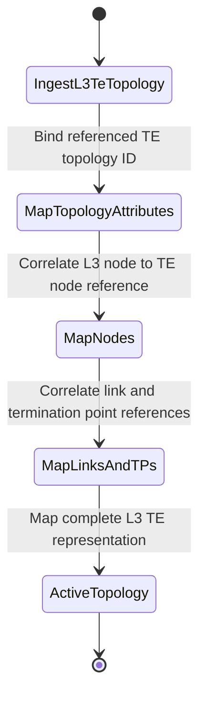

# Epic: Epic 29: Layer 3 TE Topologies Model (Issue #230)

## 1. Context
This Epic covers the reverse-engineering of `ietf-l3-te-topology.yang` as specified in `draft-ietf-teas-yang-l3-te-topo-18`. The model augments the Layer 3 Unicast network topology model with TE attributes, mapping L3 network elements (links, nodes, and termination points) to TE topologies.

## 2. Requirements & Checklist
- [ ] #226 - [Feature 82: Layer 3 TE Topology and Node Attributes](https://github.com/gintatkinson/cogctl-ux-09/blob/main/docs/features/feat-82-l3-te-topology-nodes.md)
- [ ] #227 - [Feature 83: Layer 3 TE Topology Links and Termination Points](https://github.com/gintatkinson/cogctl-ux-09/blob/main/docs/features/feat-83-l3-te-topology-links.md)

## Associated Use Cases & User Stories

### Associated Use Cases
- [ ] #229 - [Use Case 39: Ingest and Validate Layer 3 TE Topologies (Issue #229)](https://github.com/gintatkinson/cogctl-ux-09/blob/main/docs/use-cases/uc-39-l3-te-topology-ingest.md)

### Associated User Stories
- [ ] #228 - [User Story 65: Discover and Manage Layer 3 TE Topologies (Issue #228)](https://github.com/gintatkinson/cogctl-ux-09/blob/main/docs/user-stories/us-65-l3-te-topology.md)
## 3. Architecture and System Interaction Diagrams

## 4. Verification and Validation Plan
- Verify that overall project model coverage is at 100% via `./skills/spec-orchestrator/verify_model_coverage.py`.
- Synchronize all specifications to GitHub issues using `./skills/spec-orchestrator/reconcile_backlog.py`.

## 5. Specification Context
> This YANG module defines Layer 3 TE topology parameters including node, link, and termination point correlation rules.

## 6. Source References
YANG Schema: [ietf-l3-te-topology.yang](https://github.com/gintatkinson/cogctl-ux-09/blob/main/yang/ietf-l3-te-topology.yang)
Normative Specification: [draft-ietf-teas-yang-l3-te-topo-18](https://www.ietf.org/archive/id/draft-ietf-teas-yang-l3-te-topo-18.txt)
