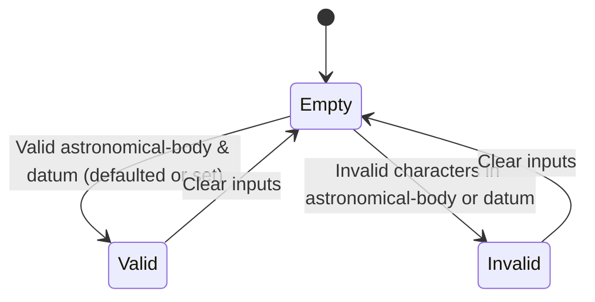

# Feature: Feature 1: Geographic Reference Frame (Issue #1)

This feature establishes the frame of reference for geographic coordinates, including the astronomical body, geodetic datum, and coordinate accuracy bounds.

## 1. Schema Definitions & Constraints

### Typedefs
No custom typedefs are defined for the reference frame fields.

### Nodes
- `geo-location` (container): Root container identifying a location on an astronomical object.
- `reference-frame` (container): The Frame of Reference for the location values.
- `alternate-system` (leaf): The system in which the astronomical body and geodetic-datum are defined.
  - **Type:** string
  - **Condition:** Enabled only if `alternate-systems` feature is supported.
- `astronomical-body` (leaf): The name of the astronomical body.
  - **Type:** string
  - **Pattern:** `[ -@\[-\^_-~]*` (ASCII characters 32 to 64, and 91 to 126; no control characters)
  - **Default:** "earth"
- `geodetic-system` (container): The geodetic system of the location data.
- `geodetic-datum` (leaf): The geodetic datum defining coordinates meaning.
  - **Type:** string
  - **Pattern:** `[ -@\[-\^_-~]*`
  - **Default:** "wgs-84" (when astronomical-body is "earth")
- `coord-accuracy` (leaf): The horizontal coordinate accuracy.
  - **Type:** decimal64
  - **Fraction-digits:** 6
- `height-accuracy` (leaf): The vertical height accuracy.
  - **Type:** decimal64
  - **Fraction-digits:** 6
  - **Units:** meters

## 2. Logical System Integration & UI Capabilities
- **Logical Data Model:** The reference frame attributes map directly to database fields of type string and decimal (numeric) respectively, storing astronomical body, geodetic datum, and coordinate/height accuracies.
- **Logical Processing Rules:**
  - Case-insensitivity: Names of astronomical bodies (e.g. "Earth") and datums (e.g. "WGS-84") are normalized to lowercase. Spaces are replaced with dashes.
  - Constraint Check: Coordinate and height accuracies must be non-negative decimals.
- **Logical UI Representation:**
  - A form interface allowing users to select or type the astronomical body (default "earth") and geodetic datum (default "wgs-84").
  - Precision input fields for coordinate accuracy and height accuracy.

## 3. State Machine and Validation Flow

## 4. BDD Given-When-Then Acceptance Criteria
- **Scenario 1: Default Reference Frame Initialization**
  - **Given** a new location entry is initialized
    **When** no reference frame details are explicitly set
    **Then** the astronomical body defaults to "earth" and the geodetic datum defaults to "wgs-84".
- **Scenario 2: Coordinate Accuracy Precision Bounds**
  - **Given** a reference frame configuration
    **When** coordinate accuracy is specified with more than 6 decimal digits (e.g., 0.1234567)
    **Then** the system rejects the coordinate accuracy value as invalid.

## 5. Specification Context (Verbatim)
> The frame of reference defines the astronomical body and the geodetic system.  The astronomical body defaults to "earth".  The geodetic system consists of a geodetic datum and coordinate/height accuracy bounds.

## 6. Source References
YANG Schema: [ietf-geo-location.yang](https://github.com/YangModels/yang/blob/main/standard/ietf/RFC/ietf-geo-location%402022-02-11.yang)
Normative Specification: [RFC 9179 Geographic Location](https://datatracker.ietf.org/doc/rfc9179/)
