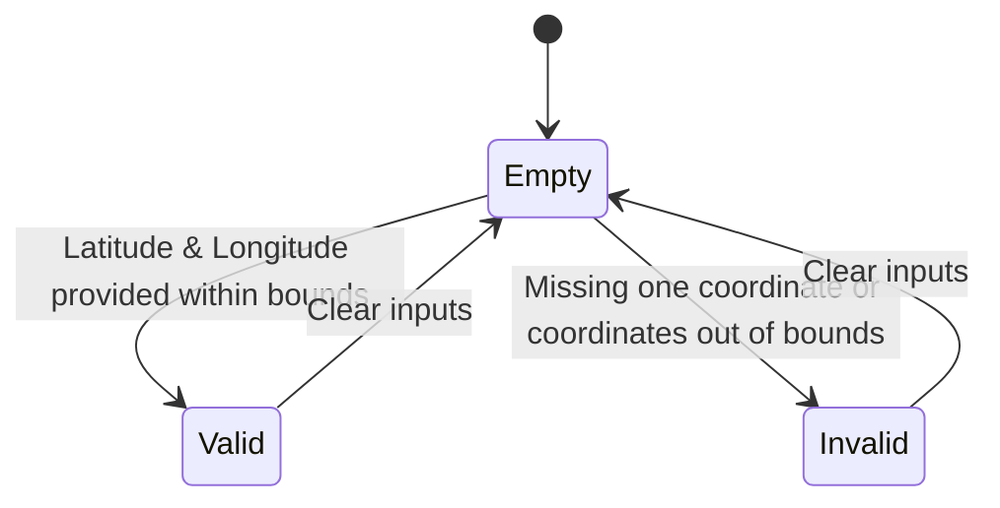

# Feature: Feature 2: Ellipsoidal Location Coordinates (Issue #2)

This feature covers the representation of geographic location coordinates modeled on an ellipsoid, utilizing latitude, longitude, and optional height.

## 1. Schema Definitions & Constraints

### Typedefs
No custom typedefs are defined for the ellipsoidal coordinate fields.

### Nodes
- `location` (choice): Choice to specify location coordinates as either ellipsoidal or cartesian.
- `ellipsoid` (case): Case representing ellipsoidal coordinates.
- `latitude` (leaf): The latitude value on the astronomical body.
  - **Type:** decimal64
  - **Fraction-digits:** 16
  - **Units:** decimal degrees
- `longitude` (leaf): The longitude value on the astronomical body.
  - **Type:** decimal64
  - **Fraction-digits:** 16
  - **Units:** decimal degrees
- `height` (leaf): Height from a reference zero value.
  - **Type:** decimal64
  - **Fraction-digits:** 6
  - **Units:** meters

## 2. Logical System Integration & UI Capabilities
- ****Logical Data Model:** The ellipsoidal location parameters map to double-precision columns (lat, long, height) in the database schema.
- **Logical Processing Rules:**
  - Co-dependency rule: Both latitude and longitude must be provided together. Omission of either results in a validation failure.
  - Value Bounds: Latitude must be between -90.0 and +90.0 decimal degrees. Longitude must be between -180.0 and +180.0 decimal degrees.
- **Logical UI Representation:**
  - Coordinate inputs with validation feedback indicating bounds (e.g. "Latitude must be between -90 and 90 degrees").
  - Clear formatting of coordinates, displaying up to 16 decimal places of precision.

## 3. State Machine and Validation Flow

## 4. BDD Given-When-Then Acceptance Criteria
- **Scenario 1: Valid Ellipsoidal Input**
  - **Given** the ellipsoid location case is selected
    **When** latitude is set to 37.7749 and longitude is set to -122.4194
    **Then** the ellipsoidal coordinates are successfully validated and saved.
- **Scenario 2: Out of Bounds Latitude**
  - **Given** the ellipsoid location case is selected
    **When** latitude is set to 95.0
    **Then** the validation fails and returns an error indicating latitude is out of bounds.

## 5. Specification Context (Verbatim)
> The location choice provides location data in either latitude/longitude/height (ellipsoid) or X/Y/Z (cartesian) values.  The latitude and longitude values are represented in decimal degrees.

## 6. Source References
YANG Schema: [ietf-geo-location.yang](https://github.com/YangModels/yang/blob/main/standard/ietf/RFC/ietf-geo-location%402022-02-11.yang)
Normative Specification: [RFC 9179 Geographic Location](https://datatracker.ietf.org/doc/rfc9179/)
