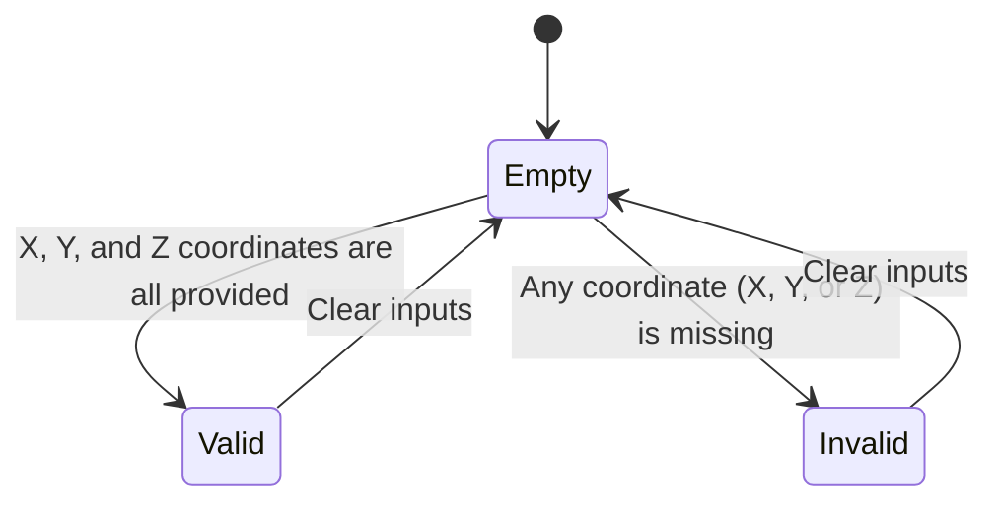

# Feature: Feature 3: Cartesian Location Coordinates (Issue #3)

This feature covers the representation of geographic coordinates in Cartesian space (X, Y, Z axes) relative to the center of mass of the astronomical body.

## 1. Schema Definitions & Constraints

### Typedefs
No custom typedefs are defined for the Cartesian coordinate fields.

### Nodes
- `cartesian` (case): Case representing Cartesian coordinates.
- `x` (leaf): The X coordinate value as defined by the reference-frame.
  - **Type:** decimal64
  - **Fraction-digits:** 6
  - **Units:** meters
- `y` (leaf): The Y coordinate value as defined by the reference-frame.
  - **Type:** decimal64
  - **Fraction-digits:** 6
  - **Units:** meters
- `z` (leaf): The Z coordinate value as defined by the reference-frame.
  - **Type:** decimal64
  - **Fraction-digits:** 6
  - **Units:** meters

## 2. Logical System Integration & UI Capabilities
- **Logical Data Model:** The Cartesian coordinate parameters map to database fields of type decimal (x, y, z) representing spatial offsets in meters.
- **Logical Processing Rules:**
  - Co-dependency rule: If Cartesian mode is chosen, all three coordinates (x, y, and z) must be supplied. Omission of any coordinate results in a validation error.
  - Mutually Exclusive choice: Choosing Cartesian coordinates prevents ellipsoidal coordinates (latitude/longitude/height) from being defined, in accordance with the choice schema constraint.
- **Logical UI Representation:**
  - Three coordinate input fields labeled X, Y, and Z.
  - Error messages if only one or two coordinates are provided when switching to Cartesian coordinates.

## 3. State Machine and Validation Flow

## 4. BDD Given-When-Then Acceptance Criteria
- **Scenario 1: Valid Cartesian Input**
  - **Given** the cartesian location case is selected
    **When** X is set to 6378137.0, Y is set to 0.0, and Z is set to 0.0
    **Then** the Cartesian coordinates are successfully validated and saved.
- **Scenario 2: Missing Cartesian Coordinate**
  - **Given** the cartesian location case is selected
    **When** X is set to 6378137.0 and Y is set to 0.0, but Z is omitted
    **Then** the validation fails and returns an error indicating that Z is required.

## 5. Specification Context (Verbatim)
> The cartesian choice represents locations using X, Y, and Z offsets from the center of mass in meters. All three coordinates must be specified when using Cartesian coordinates.

## 6. Source References
YANG Schema: [ietf-geo-location.yang](https://github.com/YangModels/yang/blob/main/standard/ietf/RFC/ietf-geo-location%402022-02-11.yang)
Normative Specification: [RFC 9179 Geographic Location](https://datatracker.ietf.org/doc/rfc9179/)
