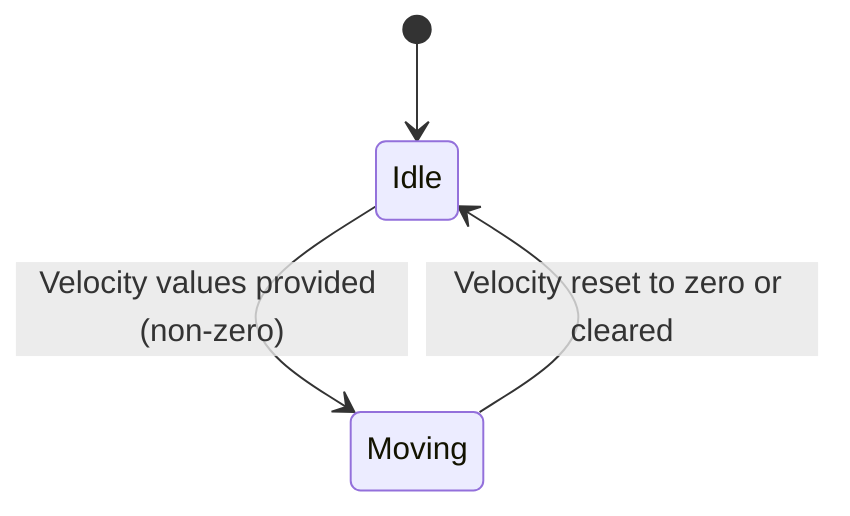

# Feature: Feature 4: Motion Velocity Vector (Issue #4)

This feature models the speed and direction of a moving object using a 3D velocity vector (northward, eastward, and upward components).

## 1. Schema Definitions & Constraints

### Typedefs
No custom typedefs are defined for the velocity fields.

### Nodes
- `velocity` (container): Container describing the 3D velocity vector of the moving object.
- `v-north` (leaf): Velocity component towards true north.
  - **Type:** decimal64
  - **Fraction-digits:** 12
  - **Units:** meters per second
- `v-east` (leaf): Velocity component perpendicular (to the right) of true north.
  - **Type:** decimal64
  - **Fraction-digits:** 12
  - **Units:** meters per second
- `v-up` (leaf): Velocity component directly away from the astronomical body's center of mass.
  - **Type:** decimal64
  - **Fraction-digits:** 12
  - **Units:** meters per second

## 2. Logical System Integration & UI Capabilities
- **Logical Data Model:** The velocity vector maps to decimal columns (v_north, v_east, v_up) in the database schema.
- **Logical Processing Rules:**
  - Computation of Speed and Heading: Speed can be calculated as the magnitude of the horizontal vector `sqrt(v-north^2 + v-east^2)`. Heading is computed as `atan2(v-east, v-north)`.
- **Logical UI Representation:**
  - Standard fields for entering northward, eastward, and upward velocities in m/s.
  - Graphical or text display summarizing computed overall speed (e.g. in km/h or knots) and directional heading (in degrees).

## 3. State Machine and Validation Flow

## 4. BDD Given-When-Then Acceptance Criteria
- **Scenario 1: Valid Velocity Inputs**
  - **Given** the velocity container is active
    **When** v-north is set to 10.0, v-east to 5.5, and v-up to 0.1
    **Then** the velocity values are validated and stored with 12 decimal places of precision.
- **Scenario 2: Velocity Bounds Constraint**
  - **Given** velocity values are being updated
    **When** a value exceeds the physical data limits of decimal64 (e.g., fractional overflow)
    **Then** the system rejects the input.

## 5. Specification Context (Verbatim)
> If the object is in motion, the velocity vector describes this motion at the time given by the timestamp.  For a formula to convert these values to speed and heading, see RFC 9179.

## 6. Source References
YANG Schema: [ietf-geo-location.yang](https://github.com/YangModels/yang/blob/main/standard/ietf/RFC/ietf-geo-location%402022-02-11.yang)
Normative Specification: [RFC 9179 Geographic Location](https://datatracker.ietf.org/doc/rfc9179/)
