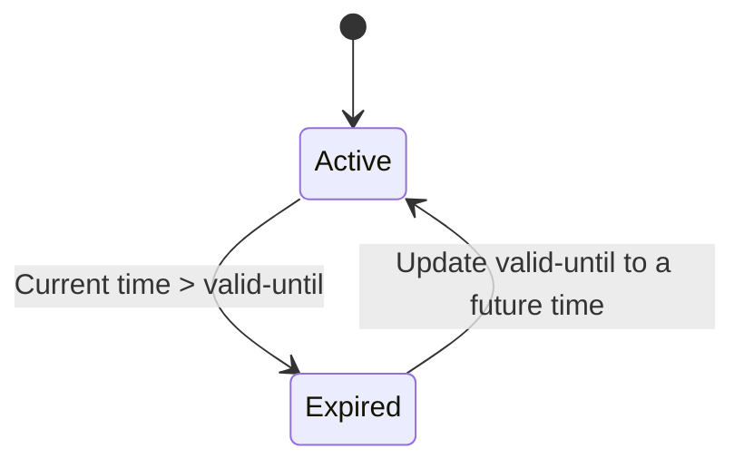

# Feature: Feature 5: Temporal Validity & Expiry (Issue #5)

This feature covers the recording timestamp and the expiration epoch (`valid-until`) of a geographic location coordinate entry.

## 1. Schema Definitions & Constraints

### Typedefs
- `date-and-time`: Imported from `ietf-yang-types` (RFC 6991).
  - **Type:** string
  - **Constraints:** Must follow the date-and-time format pattern (RFC 3339).

### Nodes
- `timestamp` (leaf): Reference time when location was recorded.
  - **Type:** yang:date-and-time
- `valid-until` (leaf): The timestamp for which this geo-location is valid until.
  - **Type:** yang:date-and-time

## 2. Logical System Integration & UI Capabilities
- **Logical Data Model:** The temporal fields map to datetime-with-timezone (timestamp) columns in the database.
- **Logical Processing Rules:**
  - Chronological Constraint: `valid-until` must be chronologically after `timestamp`. If `valid-until` is before `timestamp`, the validation must fail.
  - Expiry evaluation: The system evaluates whether the location record is expired by comparing the current system time to `valid-until`.
- **Logical UI Representation:**
  - DateTime pickers or ISO 8601 formatted text fields.
  - A visual "Expired" badge or alert if the current system time has passed `valid-until`.

## 3. State Machine and Validation Flow

## 4. BDD Given-When-Then Acceptance Criteria
- **Scenario 1: Valid Temporal Configuration**
  - **Given** a location entry
    **When** timestamp is set to "2026-06-01T12:00:00Z" and valid-until is set to "2026-06-02T12:00:00Z"
    **Then** the dates are validated successfully.
- **Scenario 2: Expiry Before Timestamp**
  - **Given** a location entry
    **When** timestamp is set to "2026-06-02T12:00:00Z" and valid-until is set to "2026-06-01T12:00:00Z"
    **Then** the validation fails and returns an error indicating that valid-until cannot be before the recording timestamp.

## 5. Specification Context (Verbatim)
> The timestamp represents the reference time when the location was recorded. The valid-until leaf is the timestamp for which this geo-location is valid until. If unspecified, it has no specific expiration time.

## 6. Source References
YANG Schema: [ietf-geo-location.yang](https://github.com/YangModels/yang/blob/main/standard/ietf/RFC/ietf-geo-location%402022-02-11.yang)
Normative Specification: [RFC 9179 Geographic Location](https://datatracker.ietf.org/doc/rfc9179/)
