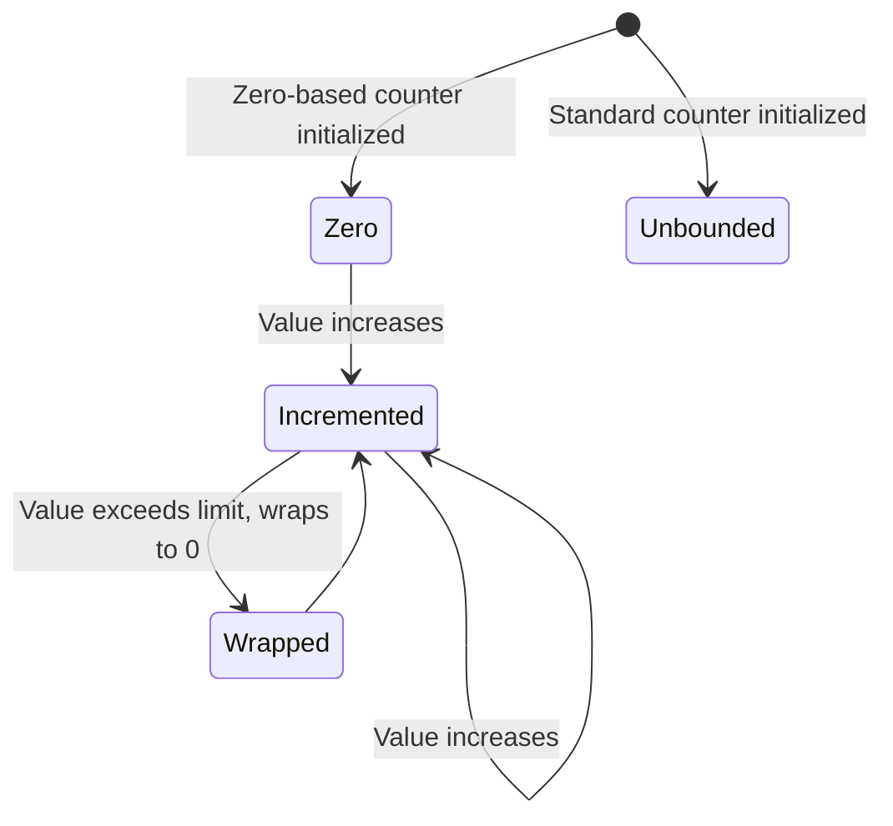

# Feature: Feature 6: Numeric Counters and Gauges (Issue #17)

**Parent Epic:** [Epic 2: Common YANG Data Types (Issue #22)](https://github.com/gintatkinson/cogctl-ux-09/blob/main/docs/epics/epic-02-common-types.md)

This feature implements the logical validation and modeling for the standard YANG numeric counters and gauges defined in RFC 9911.

## 1. Schema Definitions & Constraints

### Typedefs
- `counter32`: Monotonically increasing non-negative integer wrapping at 2^32-1.
  - **Type:** uint32 (0 to 4294967295)
- `zero-based-counter32`: A counter32 that initializes at zero.
  - **Type:** counter32
  - **Default:** 0
- `counter64`: Monotonically increasing non-negative integer wrapping at 2^64-1.
  - **Type:** uint64 (0 to 18446744073709551615)
- `zero-based-counter64`: A counter64 that initializes at zero.
  - **Type:** counter64
  - **Default:** 0
- `gauge32`: Non-negative integer that may increase or decrease, but never exceeds 2^32-1.
  - **Type:** uint32 (0 to 4294967295)
- `gauge64`: Non-negative integer that may increase or decrease, but never exceeds 2^64-1.
  - **Type:** uint64 (0 to 18446744073709551615)

### Nodes
No container or leaf nodes are defined in this YANG module since it contains only typedefs.

## 2. Logical System Integration & UI Capabilities
- **Logical Data Model:** Represents numeric counters and gauges as standard 32-bit and 64-bit unsigned integers. Zero-based counters have database defaults set to 0.
- **Logical Processing Rules:**
  - Counter Monotonicity: Counter values cannot decrease during updates unless a discontinuity/re-initialization occurs.
  - Gauge Bounds: Gauges must remain within their bounds [0, 2^32-1] or [0, 2^64-1].
- **Logical UI Representation:** Displays counters as read-only incremental values. Displays gauges with progress bars or dial indicators showing current utilization.

## 3. State Machine and Validation Flow

## 4. BDD Given-When-Then Acceptance Criteria
- **Scenario 1: Counter32 initialization and monotonicity validation**
  - **Given** a counter32 node is active
    **When** the new value is less than the current value (and no reset is signaled)
    **Then** the validation fails to prevent non-monotonic updates.
- **Scenario 2: Gauge64 boundary validation**
  - **Given** a gauge64 value input
    **When** the input exceeds 2^64-1 or is negative
    **Then** the system rejects the input as out of bounds.

## 5. Specification Context (Verbatim)
> The counter32 type represents a non-negative integer that monotonically increases until it reaches a maximum value of 2^32-1 (4294967295 decimal), when it wraps around and starts increasing again from zero.
> The gauge32 type represents a non-negative integer, which may increase or decrease, but shall never exceed a maximum value, nor fall below a minimum value.

## 6. Source References
YANG Schema: [ietf-yang-types.yang](https://github.com/YangModels/yang/blob/main/standard/ietf/RFC/ietf-yang-types%402025-12-22.yang)
Normative Specification: [RFC 9911 Common YANG Data Types](https://datatracker.ietf.org/doc/rfc9911/)
