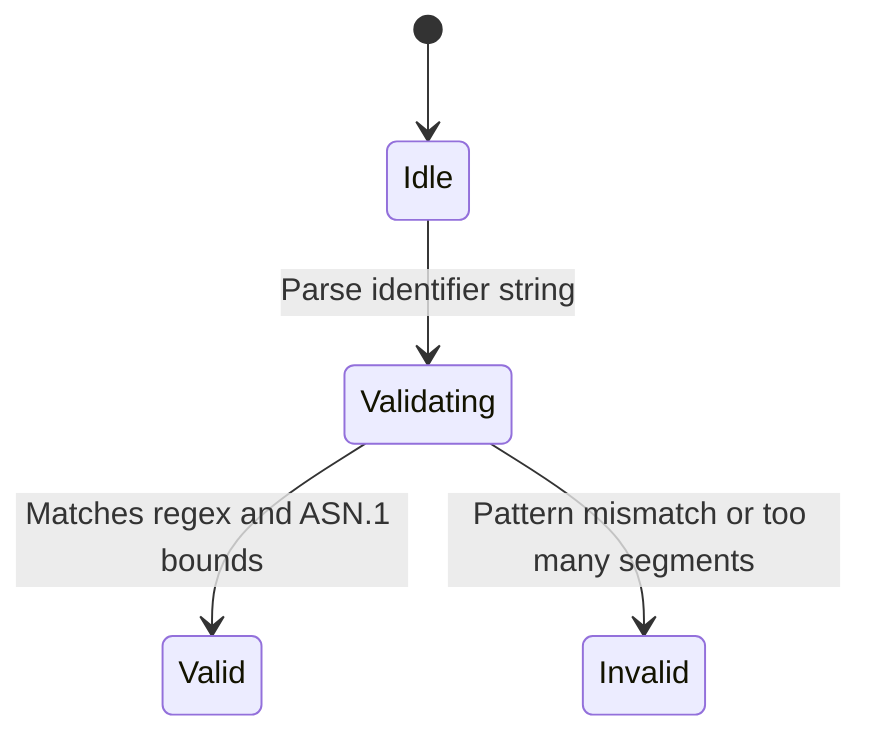

# Feature: Feature 7: Identifiers and Object References (Issue #18)

This feature implements the logical validation and modeling for the standard YANG object identifiers and YANG identifier string formats defined in RFC 9911.

## 1. Schema Definitions & Constraints

### Typedefs
- `object-identifier`: Represents administratively assigned names in a registration-hierarchical-name tree.
  - **Type:** string
  - **Pattern:** `'(([0-1](\.[1-3]?[0-9]))|(2\.(0|([1-9][0-9]*))))(\.(0|([1-9][0-9]*)))*'`
- `object-identifier-128`: Represents object-identifiers restricted to 128 sub-identifiers.
  - **Type:** object-identifier
  - **Pattern:** `'[0-9]*(\.[0-9]*){1,127}'`
- `yang-identifier`: A YANG identifier string aligned with YANG 1.1 (RFC 7950).
  - **Type:** string
  - **Constraints:** Length `1..max`
  - **Pattern:** `'[a-zA-Z_][a-zA-Z0-9\-_.]*'`

### Nodes
No container or leaf nodes are defined in this YANG module since it contains only typedefs.

## 2. Logical System Integration & UI Capabilities
- **Logical Data Model:** Maps object identifiers and YANG identifiers to database strings.
- **Logical Processing Rules:**
  - ASN.1 restrictions for the first sub-identifier (must be 0, 1, or 2) and second sub-identifier (0-39 if first is 0 or 1) are validated.
  - Length and characters are validated for YANG identifiers.
- **Logical UI Representation:** TextInput with syntax highlighting or validation warnings for OID paths and YANG identifier naming conventions.

## 3. State Machine and Validation Flow

## 4. BDD Given-When-Then Acceptance Criteria
- **Scenario 1: Object identifier ASN.1 structure validation**
  - **Given** an object-identifier input field
    **When** the user inputs `3.1.2.3` (first segment > 2)
    **Then** the validation fails indicating the root arc must be 0, 1, or 2.
- **Scenario 2: YANG identifier naming check**
  - **Given** a yang-identifier validation function
    **When** the input is `-invalid-start` or starts with `xml`
    **Then** the validation fails to conform to RFC 7950.

## 5. Specification Context (Verbatim)
> The object-identifier type represents administratively assigned names in a registration-hierarchical-name tree. The ASN.1 standard restricts the value space of the first sub-identifier to 0, 1, or 2.

## 6. Source References
YANG Schema: [ietf-yang-types.yang](https://github.com/YangModels/yang/blob/main/standard/ietf/RFC/ietf-yang-types%402025-12-22.yang)
Normative Specification: [RFC 9911 Common YANG Data Types](https://datatracker.ietf.org/doc/rfc9911/)
