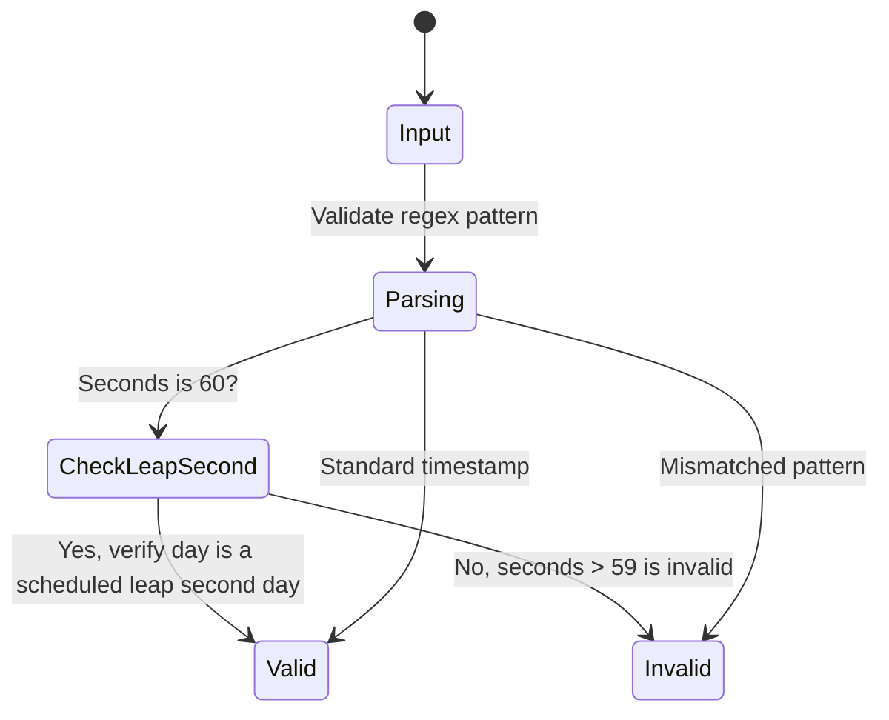

# Feature: Feature 8: Date and Time Types (Issue #19)

This feature implements the logical validation and modeling for the date and time representations defined in RFC 9911.

## 1. Schema Definitions & Constraints

### Typedefs
- `date-and-time`: Profile of ISO 8601 for dates and times using the Gregorian calendar.
  - **Type:** string
  - **Pattern:** `'[0-9]{4}-(1[0-2]|0[1-9])-(0[1-9]|[1-2][0-9]|3[0-1])T(0[0-9]|1[0-9]|2[0-3]):[0-5][0-9]:([0-5][0-9]|60)(\.[0-9]+)?(Z|[\+\-]((1[0-3]|0[0-9]):([0-5][0-9])|14:00))?'`
- `date`: A time-interval of the length of a day (24 hours).
  - **Type:** string
  - **Pattern:** `'[0-9]{4}-(1[0-2]|0[1-9])-(0[1-9]|[1-2][0-9]|3[0-1])(Z|[\+\-]((1[0-3]|0[0-9]):([0-5][0-9])|14:00))?'`
- `date-no-zone`: A date without the optional time zone offset.
  - **Type:** date
  - **Pattern:** `'[0-9]{4}-(1[0-2]|0[1-9])-(0[1-9]|[1-2][0-9]|3[0-1])'`
- `time`: An instance of time of zero duration recurring every day.
  - **Type:** string
  - **Pattern:** `'(0[0-9]|1[0-9]|2[0-3]):[0-5][0-9]:([0-5][0-9]|60)(\.[0-9]+)?(Z|[\+\-]((1[0-3]|0[0-9]):([0-5][0-9])|14:00))?'`
- `time-no-zone`: A time without the optional time zone offset.
  - **Type:** time
  - **Pattern:** `'(0[0-9]|1[0-9]|2[0-3]):[0-5][0-9]:([0-5][0-9]|60)(\.[0-9]+)?'`

### Nodes
No container or leaf nodes are defined in this YANG module since it contains only typedefs.

## 2. Logical System Integration & UI Capabilities
- **Logical Data Model:** Maps date/time strings to ISO 8601 timestamps in the database, with support for timezone tracking.
- **Logical Processing Rules:**
  - Leap Seconds: Value of 60 for seconds is allowed only in the case of leap seconds.
  - Offset alignment: Numeric offset must be validated against RFC 9557 bounds (-14:00 to +14:00).
- **Logical UI Representation:** Date and time pickers that format output strings according to RFC 9911 patterns, featuring a checkbox to toggle timezone offsets.

## 3. State Machine and Validation Flow

## 4. BDD Given-When-Then Acceptance Criteria
- **Scenario 1: Date-and-time timezone offset validation**
  - **Given** a date-and-time string input
    **When** the offset is outside range (e.g. `+15:00`)
    **Then** the validation fails to comply with RFC 9557 constraints.
- **Scenario 2: Leap second support**
  - **Given** a time validation utility
    **When** the input is `23:59:60Z`
    **Then** the validation succeeds to allow leap seconds.

## 5. Specification Context (Verbatim)
> The date-and-time type is a profile of the ISO 8601 standard for representation of dates and times using the Gregorian calendar. The value of 60 for seconds is allowed only in the case of leap seconds.

## 6. Source References
YANG Schema: [ietf-yang-types.yang](https://github.com/YangModels/yang/blob/main/standard/ietf/RFC/ietf-yang-types%402025-12-22.yang)
Normative Specification: [RFC 9911 Common YANG Data Types](https://datatracker.ietf.org/doc/rfc9911/)
