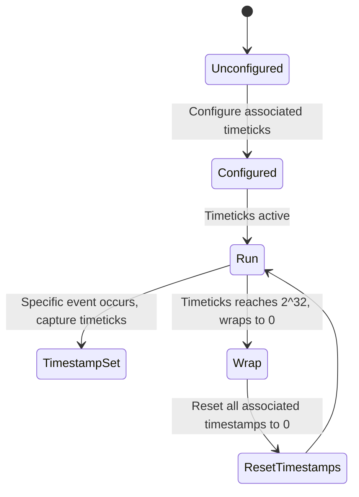

# Feature: Feature 9: Time Durations (Issue #20)

**Parent Epic:** [Epic 2: Common YANG Data Types (Issue #22)](https://github.com/gintatkinson/cogctl-ux-09/blob/main/docs/epics/epic-02-common-types.md)

This feature implements the logical validation and modeling for the standard YANG time durations and timestamp types defined in RFC 9911.

## 1. Schema Definitions & Constraints

### Typedefs
- `hours32`: Period of time measured in hours.
  - **Type:** int32
  - **Units:** hours
- `minutes32`: Period of time measured in minutes.
  - **Type:** int32
  - **Units:** minutes
- `seconds32`: Period of time measured in seconds.
  - **Type:** int32
  - **Units:** seconds
- `centiseconds32`: Period of time measured in units of 10^-2 seconds.
  - **Type:** int32
  - **Units:** centiseconds
- `milliseconds32`: Period of time measured in units of 10^-3 seconds.
  - **Type:** int32
  - **Units:** milliseconds
- `microseconds32`: Period of time measured in units of 10^-6 seconds.
  - **Type:** int32
  - **Units:** microseconds
- `microseconds64`: Period of time measured in units of 10^-6 seconds.
  - **Type:** int64
  - **Units:** microseconds
- `nanoseconds32`: Period of time measured in units of 10^-9 seconds.
  - **Type:** int32
  - **Units:** nanoseconds
- `nanoseconds64`: Period of time measured in units of 10^-9 seconds.
  - **Type:** int64
  - **Units:** nanoseconds
- `timeticks`: Non-negative integer representing time modulo 2^32 in hundredths of a second.
  - **Type:** uint32
- `timestamp`: Value of an associated timeticks node at which an occurrence happened.
  - **Type:** timeticks

### Nodes
No container or leaf nodes are defined in this YANG module since it contains only typedefs.

## 2. Logical System Integration & UI Capabilities
- **Logical Data Model:** Maps signed duration fields to standard int32 and int64 database columns. Timeticks are represented as uint32 fields.
- **Logical Processing Rules:**
  - Range restriction: Durations can be range-restricted (e.g. `0..max`) when only non-negative durations are valid.
  - Timestamp reset: Timestamps must reset to zero when the associated timeticks node wraps around.
- **Logical UI Representation:** Form inputs that restrict number ranges based on the specific duration type, showing human-readable equivalent text (e.g. converting `3600 seconds` to `1 hour`).

## 3. State Machine and Validation Flow

## 4. BDD Given-When-Then Acceptance Criteria
- **Scenario 1: Nanoseconds32 out-of-range bounds check**
  - **Given** a nanoseconds32 input validator
    **When** the value exceeds the int32 range (e.g., `2147483648`) or fits but is out of unit-specific duration capability bounds (e.g., more than 2 seconds)
    **Then** the validation rejects the input.
- **Scenario 2: Timestamp reset on timeticks wrap**
  - **Given** an active timeticks counter and an associated timestamp
    **When** the timeticks counter wraps around to 0
    **Then** the associated timestamp is automatically reset to 0.

## 5. Specification Context (Verbatim)
> A period of time measured in units of hours, minutes, seconds, centiseconds, milliseconds, microseconds, or nanoseconds. The timeticks type represents a non-negative integer that represents the time, modulo 2^32, in hundredths of a second between two epochs.

## 6. Source References
YANG Schema: [ietf-yang-types.yang](https://github.com/YangModels/yang/blob/main/standard/ietf/RFC/ietf-yang-types%402025-12-22.yang)
Normative Specification: [RFC 9911 Common YANG Data Types](https://datatracker.ietf.org/doc/rfc9911/)
