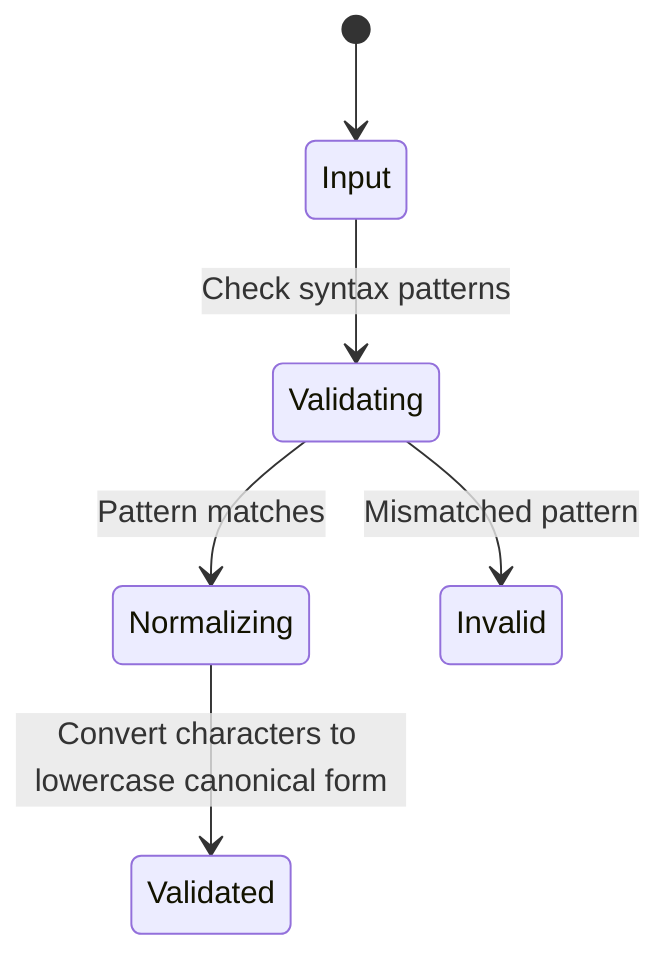

# Feature: Feature 10: General Address, Identity, and Language Tags (Issue #21)

**Parent Epic:** [Epic 2: Common YANG Data Types (Issue #22)](https://github.com/gintatkinson/cogctl-ux-09/blob/main/docs/epics/epic-02-common-types.md)

This feature implements logical validation and modeling for physical addresses, MAC addresses, UUIDs, XPath expressions, dotted-quads, hex-strings, and language tags defined in RFC 9911.

## 1. Schema Definitions & Constraints

### Typedefs
- `phys-address`: Media- or physical-level address as colon-separated hex octets.
  - **Type:** string
  - **Pattern:** `'([0-9a-fA-F]{2}(:[0-9a-fA-F]{2})*)?'`
- `mac-address`: 48-bit IEEE 802 Media Access Control address.
  - **Type:** string
  - **Pattern:** `'[0-9a-fA-F]{2}(:[0-9a-fA-F]{2}){5}'`
- `xpath1.0`: XPath 1.0 expression.
  - **Type:** string
- `hex-string`: Hexadecimal string with octets separated by colons.
  - **Type:** string
  - **Pattern:** `'([0-9a-fA-F]{2}(:[0-9a-fA-F]{2})*)?'`
- `uuid`: Universally Unique Identifier in the string representation (RFC 9562).
  - **Type:** string
  - **Pattern:** `'[0-9a-fA-F]{8}-[0-9a-fA-F]{4}-[0-9a-fA-F]{4}-[0-9a-fA-F]{4}-[0-9a-fA-F]{12}'`
- `dotted-quad`: Unsigned 32-bit number in dotted-quad notation.
  - **Type:** string
  - **Pattern:** `'(([0-9]|[1-9][0-9]|1[0-9][0-9]|2[0-4][0-9]|25[0-5])\.){3}([0-9]|[1-9][0-9]|1[0-9][0-9]|2[0-4][0-9]|25[0-5])'`
- `language-tag`: Language tag according to RFC 5646 (BCP 47).
  - **Type:** string

### Nodes
No container or leaf nodes are defined in this YANG module since it contains only typedefs.

## 2. Logical System Integration & UI Capabilities
- **Logical Data Model:** Maps all address, identifier, and tag structures to string fields in the location database system.
- **Logical Processing Rules:**
  - Case normalization: MAC address, physical address, hex-string, UUID, and language tag inputs are converted to lowercase for canonical representation.
  - Well-formed language tags: Language tags must follow the grammatical structure defined in BCP 47.
- **Logical UI Representation:** Validated TextFields showing inline validation error messages for incorrect MAC addresses, dotted-quads, UUID formats, or invalid language codes.

## 3. State Machine and Validation Flow

## 4. BDD Given-When-Then Acceptance Criteria
- **Scenario 1: MAC address format and normalization**
  - **Given** a mac-address input validator
    **When** the user inputs `00:1A:2B:3C:4D:5E`
    **Then** the validation succeeds and normalizes the output to lowercase `00:1a:2b:3c:4d:5e`.
- **Scenario 2: Dotted-quad boundary validation**
  - **Given** a dotted-quad input validator
    **When** the input has segments exceeding 255 (e.g. `192.168.1.300`)
    **Then** the validation rejects the input as out of bounds.

## 5. Specification Context (Verbatim)
> Represents media- or physical-level addresses, UUIDs, XPath expressions, dotted-quads, and language tags. The canonical representation uses lowercase characters.

## 6. Source References
YANG Schema: [ietf-yang-types.yang](https://github.com/YangModels/yang/blob/main/standard/ietf/RFC/ietf-yang-types%402025-12-22.yang)
Normative Specification: [RFC 9911 Common YANG Data Types](https://datatracker.ietf.org/doc/rfc9911/)
