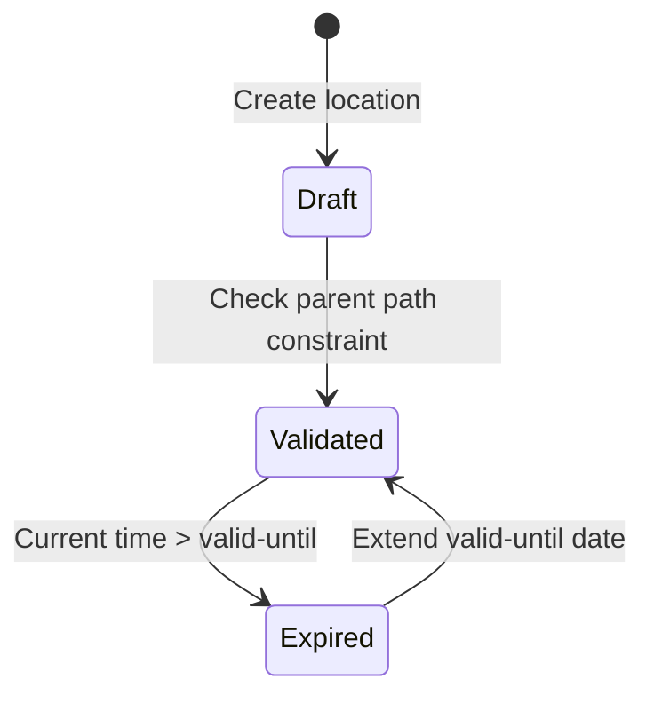

# Feature: Feature 11: Hierarchical Inventory Locations (Issue #29)

This feature implements the hierarchical inventory location schema, providing containment models for location hierarchies (sites, rooms, buildings, poles, etc.) and temporal validity validation.

## 1. Schema Definitions & Constraints

### Typedefs
- `ni-location-ref`: A typedef referencing a specific location identifier.
  - **Type:** leafref `/nwi:network-inventory/nil:locations/nil:location/nil:id`

### Nodes
- `locations`: Root-level read-only container holding all location attributes.
  - **Type:** container
  - **Config:** false
- `location`: List of location entries.
  - **Type:** list
  - **Key:** `id`
- `id`: Unique identifier for each location.
  - **Type:** string
- `type`: Flexible string defining custom location types (e.g. site, room, corridor).
  - **Type:** string
- `parent`: Hierarchical reference to another location containing this one.
  - **Type:** leafref `../../location/id`
- `timestamp`: Date and time when this location was recorded.
  - **Type:** yang:date-and-time
- `valid-until`: The expiration timestamp for the location validity.
  - **Type:** yang:date-and-time

## 2. Logical System Integration & UI Capabilities
- **Logical containment hierarchy validation rule**: The system validates that the `parent` reference must not introduce circular dependency loops in the location hierarchy tree.
- **Temporal validity validation rule**: The system validates if a location is currently valid based on `timestamp` and `valid-until` constraint parameters.
- **Logical UI Representation**: Renders the location inventory in a hierarchical tree view component based on parent-child containment.

## 3. State Machine and Validation Flow

## 4. BDD Given-When-Then Acceptance Criteria
- **Scenario 1: Detect circular parent-child dependency loop**
  - **Given** a location entry with id "loc-A" exists
    **When** we attempt to set the parent of "loc-A" to "loc-B", and the parent of "loc-B" is "loc-A"
    **Then** the validation rule rejects the edit as a circular containment loop constraint violation.
- **Scenario 2: Validate temporal expiry constraint**
  - **Given** a location entry with a valid-until date in the past
    **When** querying the active location status
    **Then** the system marks the location as expired.

## 5. Specification Context (Verbatim)
> This type is used by data models that need to reference network inventory location.
> The identifier of the location that physically contains this location.
> Timestamp when the location was recorded.
> The timestamp for which this location is valid until.

## 6. Source References
YANG Schema: [ietf-ni-location.yang](https://github.com/ietf-ivy-wg/network-inventory-location/blob/main/ietf-ni-location.yang)
Normative Specification: [draft-ietf-ivy-network-inventory-location](https://datatracker.ietf.org/doc/html/draft-ietf-ivy-network-inventory-location)
