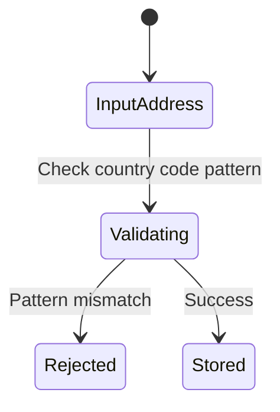

# Feature: Feature 12: Location Physical Addresses (Issue #30)

This feature implements physical mailing address attributes for inventory locations, supporting country codes, state regions, city details, and postal zip codes.

## 1. Schema Definitions & Constraints

### Typedefs
No new typedefs are declared in this feature.

### Nodes
- `physical-address`: Container holding geographic address details for a location.
  - **Type:** container
- `address`: Street number and name.
  - **Type:** string
- `postal-code`: ZIP or postal code.
  - **Type:** string
- `state`: State or region identifier.
  - **Type:** string
- `city`: City name.
  - **Type:** string
- `country-code`: ISO 3166-1 Alpha-2 uppercase two-letter country identifier.
  - **Type:** string
  - **Pattern:** `[A-Z]{2}`

## 2. Logical System Integration & UI Capabilities
- **Country Code Validation Rule**: The system validates that the `country-code` input matches the ISO Alpha-2 regex constraint pattern `[A-Z]{2}`.
- **Physical Address Parsing**: Address fields (`address`, `postal-code`, `state`, `city`, and `country-code`) are parsed to generate standardized postal labels or search queries on external maps.
- **Logical UI Representation**: Displays physical address information in a structured form panel component.

## 3. State Machine and Validation Flow

## 4. BDD Given-When-Then Acceptance Criteria
- **Scenario 1: Reject invalid country codes**
  - **Given** an address form is active
    **When** the user inputs "USA" or "us" in the `country-code` field
    **Then** the validation condition fails due to pattern mismatch constraint.
- **Scenario 2: Accept valid ISO 3166-1 Alpha-2 country code**
  - **Given** an address form is active
    **When** the user inputs "US" or "IT" in the `country-code` field
    **Then** the system passes the pattern check.

## 5. Specification Context (Verbatim)
> Grouping for physical address information.
> Top-level container for the physical address.
> Specifies an address (number and street).
> Specifies a postal code.
> Specifies a state. This leaf can also be used to describe a region for a country that does not have states.
> Specifies a city.
> Specifies a country. Expressed as ISO ALPHA-2 code.

## 6. Source References
YANG Schema: [ietf-ni-location.yang](https://github.com/ietf-ivy-wg/network-inventory-location/blob/main/ietf-ni-location.yang)
Normative Specification: [draft-ietf-ivy-network-inventory-location](https://datatracker.ietf.org/doc/html/draft-ietf-ivy-network-inventory-location)
