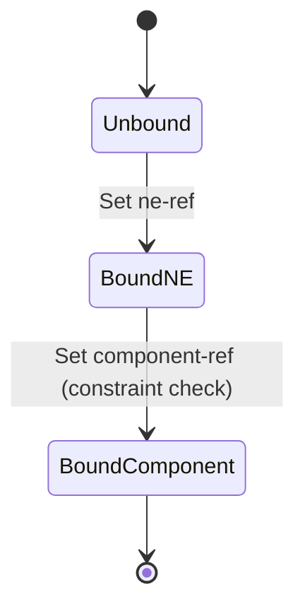

# Feature: Feature 13: Direct Location-contained Chassis (Issue #31)

**Parent Epic:** [Epic 3: Network Inventory Location (Issue #35)](https://github.com/gintatkinson/cogctl-ux-09/blob/main/docs/epics/epic-03-ni-location.md)

This feature implements the direct location-contained chassis association. It tracks chassis installed directly at an inventory location without a rack, as well as distributed chassis components.

## 1. Schema Definitions & Constraints

### Typedefs
No new typedefs are declared in this feature.

### Nodes
- `contained-chassis`: List of chassis directly deployed at this location without a rack.
  - **Type:** list
  - **Key:** `chassis-id`
- `chassis-id`: Unique identifier for each chassis instance.
  - **Type:** uint32
- `ne-ref`: Reference to the network element that this chassis belongs to.
  - **Type:** leafref `/nwi:network-inventory/nwi:network-elements/nwi:network-element/nwi:ne-id`
- `component-ref`: Reference to the specific component inside the network element.
  - **Type:** leafref `/nwi:network-inventory/nwi:network-elements/nwi:network-element[nwi:ne-id=current()/../ne-ref]/nwi:components/nwi:component/nwi:component-id`

## 2. Logical System Integration & UI Capabilities
- **Co-dependent Reference Validation Rule**: The leaf `component-ref` has a dynamic condition constraint that resolves only within the network element specified by the `ne-ref` sibling leaf.
- **Relational Integrity validation rule**: If a network element or component is deleted, the system propagates or flags the dangling pointer inside the `contained-chassis` association.
- **Logical UI Representation**: Lists all directly-contained chassis under a location details view component.

## 3. State Machine and Validation Flow

## 4. BDD Given-When-Then Acceptance Criteria
- **Scenario 1: Validate component reference within correct network element**
  - **Given** network element "ne-A" has component "comp-1", and network element "ne-B" has component "comp-2"
    **When** we set `ne-ref` to "ne-A" and attempt to set `component-ref` to "comp-2"
    **Then** the validation condition fails to satisfy the leafref path constraint.
- **Scenario 2: Accept component within correct network element**
  - **Given** network element "ne-A" has component "comp-1"
    **When** we set `ne-ref` to "ne-A" and `component-ref` to "comp-1"
    **Then** the system accepts the configuration.

## 5. Specification Context (Verbatim)
> Chassis directly deployed in this location without rack. Also used for distributed chassis components that are logically part of a network element but physically located.
> Unique identifier for this chassis instance in the location.
> Reference to the network element this chassis belongs to. Multiple chassis entries may reference the same ne-ref for distributed systems.
> Reference to the specific chassis within the network element.

## 6. Source References
YANG Schema: [ietf-ni-location.yang](https://github.com/ietf-ivy-wg/network-inventory-location/blob/main/ietf-ni-location.yang)
Normative Specification: [draft-ietf-ivy-network-inventory-location](https://datatracker.ietf.org/doc/html/draft-ietf-ivy-network-inventory-location)
