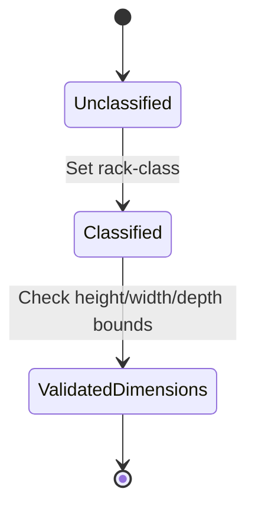

# Feature: Feature 14: Equipment Racks Classification & Physical Bounds (Issue #32)

This feature implements the configuration and classification of server racks, specifying physical dimensions (height, width, depth) and security classification identities.

## 1. Schema Definitions & Constraints

### Identities
- `rack-class-type`: Base identity for rack classification security characteristics.
- `rack-standard`: Standard general-purpose rack with no locking mechanism.
- `rack-secure-baseline`: Lockable rack with baseline physical security.
- `rack-secure-medium`: Lockable rack with medium security mechanisms.
- `rack-secure-high`: Lockable rack with high security mechanisms.

### Nodes
- `racks`: Top-level read-only container for racks.
  - **Type:** container
  - **Config:** false
- `rack`: List of racks in the inventory.
  - **Type:** list
  - **Key:** `id`
- `id`: Unique identifier for each rack.
  - **Type:** string
- `rack-class`: Classification identity reference.
  - **Type:** identityref base `rack-class-type`
- `height`: Physical height of the rack in millimeters.
  - **Type:** uint16
  - **Units:** millimeter
- `width`: Physical width of the rack in millimeters.
  - **Type:** uint16
  - **Units:** millimeter
- `depth`: Physical depth of the rack in millimeters.
  - **Type:** uint16
  - **Units:** millimeter
- `timestamp`: Timestamp when the rack was recorded.
  - **Type:** yang:date-and-time
- `valid-until`: Expiration timestamp of this rack data entry.
  - **Type:** yang:date-and-time

## 2. Logical System Integration & UI Capabilities
- **Physical security level constraint**: The field `rack-class` uses an identity reference check to validate that selected identities descend from the base `rack-class-type`.
- **Dimensional Bounds validation rule**: Height, width, and depth must be positive non-zero integers representing dimensions in millimeters.
- **Temporal validity validation rule**: The rack configuration is only valid between `timestamp` and `valid-until` constraint parameters.
- **Logical UI Representation**: Renders rack classification details and visual dimensions in a U-slot grid layout component.

## 3. State Machine and Validation Flow

## 4. BDD Given-When-Then Acceptance Criteria
- **Scenario 1: Validate rack classification identity hierarchy**
  - **Given** an identity reference is configured on a rack
    **When** the user assigns `rack-class` to a non-descendant of `rack-class-type`
    **Then** the validation condition fails to save the entry.
- **Scenario 2: Reject negative or zero dimensions**
  - **Given** a rack dimension form is open
    **When** the user inputs a height of 0
    **Then** the system rejects the input under physical size validation rule constraints.

## 5. Specification Context (Verbatim)
> Base identity for generic rack classification based on physical security characteristics.
> Standard general-purpose rack without physical locking mechanisms.
> Baseline secure lockable rack.
> Medium security lockable rack.
> High security lockable rack.
> Top-level container for the list of racks.
> List of racks within the inventory.
> An identifier that uniquely identifies the rack.
> Classification of the rack.
> Rack height.
> Rack width.
> Rack depth.
> Timestamp when the rack information was recorded.
> The timestamp for which this rack is valid until.

## 6. Source References
YANG Schema: [ietf-ni-location.yang](https://github.com/ietf-ivy-wg/network-inventory-location/blob/main/ietf-ni-location.yang)
Normative Specification: [draft-ietf-ivy-network-inventory-location](https://datatracker.ietf.org/doc/html/draft-ietf-ivy-network-inventory-location)
