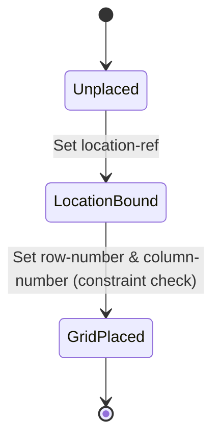

# Feature: Feature 15: Rack Locations & Grid Coordinates (Issue #33)

**Parent Epic:** [Epic 3: Network Inventory Location (Issue #35)](https://github.com/gintatkinson/cogctl-ux-09/blob/main/docs/epics/epic-03-ni-location.md)

This feature implements the positioning of equipment racks inside location facilities using grid coordinate row and column parameters.

## 1. Schema Definitions & Constraints

### Typedefs
No new typedefs are declared in this feature.

### Nodes
- `rack-location`: Container holding location and placement coordinates for the rack.
  - **Type:** container
- `location-ref`: Reference to the containing location.
  - **Type:** ni-location-ref
- `row-number`: The row coordinate within the location grid.
  - **Type:** uint32
- `column-number`: The column coordinate within the location grid.
  - **Type:** uint32

## 2. Logical System Integration & UI Capabilities
- **Location Reference Validation Rule**: The field `location-ref` is validated to ensure it references an existing location list entry `id` from the database.
- **Grid Placement constraint**: Row and column numbers (`row-number` and `column-number`) are positive integers representing coordinate slots on a layout grid map.
- **Logical UI Representation**: Renders racks dynamically on a grid/floor plan component using the row and column coordinates.

## 3. State Machine and Validation Flow

## 4. BDD Given-When-Then Acceptance Criteria
- **Scenario 1: Validate rack location reference constraint**
  - **Given** location "loc-1" exists, but "loc-2" does not exist
    **When** we configure `location-ref` to "loc-2"
    **Then** the validation condition rejects the configuration.
- **Scenario 2: Set coordinates on valid location grid**
  - **Given** a valid location reference is set
    **When** the user assigns row 5 and column 10 coordinates
    **Then** the system accepts the grid coordinates.

## 5. Specification Context (Verbatim)
> The location information of the rack, which comprises the location reference, row number, and column number.
> Reference to the location where this rack is placed.
> Identifies the row within the location where the rack is located.
> Identifies the column within the location where the rack is located.

## 6. Source References
YANG Schema: [ietf-ni-location.yang](https://github.com/ietf-ivy-wg/network-inventory-location/blob/main/ietf-ni-location.yang)
Normative Specification: [draft-ietf-ivy-network-inventory-location](https://datatracker.ietf.org/doc/html/draft-ietf-ivy-network-inventory-location)
