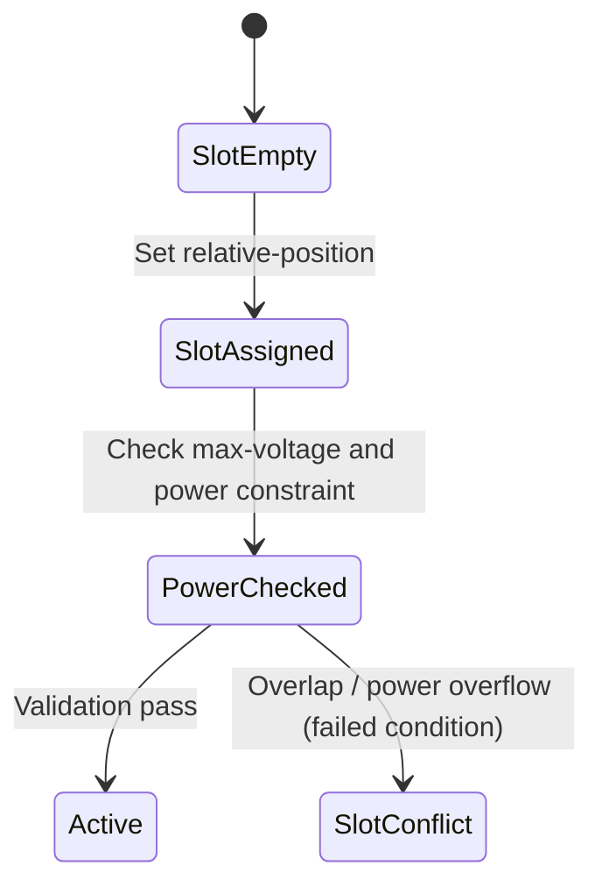

# Feature: Feature 16: Rack-contained Chassis & Electricity Attributes (Issue #34)

This feature implements the electrical power constraints and the slot-level mapping of chassis components mounted inside server racks.

## 1. Schema Definitions & Constraints

### Typedefs
No new typedefs are declared in this feature.

### Nodes
- `max-voltage`: Maximum voltage supported by the rack (in Volts).
  - **Type:** uint16
  - **Units:** volt
- `max-allocated-power`: Maximum allocated power for the rack (in Watts).
  - **Type:** uint16
  - **Units:** watts
- `contained-chassis`: List of chassis mounted within the rack.
  - **Type:** list
  - **Key:** `relative-position`
- `relative-position`: Relative U-slot slot coordinate of the chassis inside the rack.
  - **Type:** uint8
- `ne-ref`: Reference to the network element this chassis belongs to.
  - **Type:** leafref `/nwi:network-inventory/nwi:network-elements/nwi:network-element/nwi:ne-id`
- `component-ref`: Reference to the specific component inside the network element.
  - **Type:** leafref `/nwi:network-inventory/nwi:network-elements/nwi:network-element[nwi:ne-id=current()/../ne-ref]/nwi:components/nwi:component/nwi:component-id`

## 2. Logical System Integration & UI Capabilities
- **Power Budget validation rule**: The sum of power consumed by all `contained-chassis` must not exceed the `max-allocated-power` limit constraint of the rack.
- **Slot Contiguity and Overlap validation rule**: The system validates that two chassis do not share the same `relative-position` slot inside a rack.
- **Dynamic Reference Integrity**: The leaf `component-ref` has a dependency condition constraint that resolves only within the network element specified by `ne-ref`.
- **Logical UI Representation**: Displays a visual rack elevation component showing used and free U-slots alongside power/voltage utilization bars.

## 3. State Machine and Validation Flow

## 4. BDD Given-When-Then Acceptance Criteria
- **Scenario 1: Detect chassis slot conflict**
  - **Given** a rack has a chassis at relative-position 10
    **When** we attempt to mount another chassis at relative-position 10
    **Then** the validation condition fails to satisfy the slot uniqueness constraint.
- **Scenario 2: Validate max-allocated-power constraint**
  - **Given** a rack has a max-allocated-power of 2000 Watts
    **When** the total power of contained-chassis exceeds 2000 Watts
    **Then** the validation condition fails.

## 5. Specification Context (Verbatim)
> The maximum voltage supported by the rack.
> The maximum allocated power for the rack.
> The list of chassis within a rack.
> Relative position (e.g., U-slot) of chassis within the rack.
> Reference to the network element containing the chassis component.
> The reference to the chassis component within the network element and contained by the rack.

## 6. Source References
YANG Schema: [ietf-ni-location.yang](https://github.com/ietf-ivy-wg/network-inventory-location/blob/main/ietf-ni-location.yang)
Normative Specification: [draft-ietf-ivy-network-inventory-location](https://datatracker.ietf.org/doc/html/draft-ietf-ivy-network-inventory-location)
