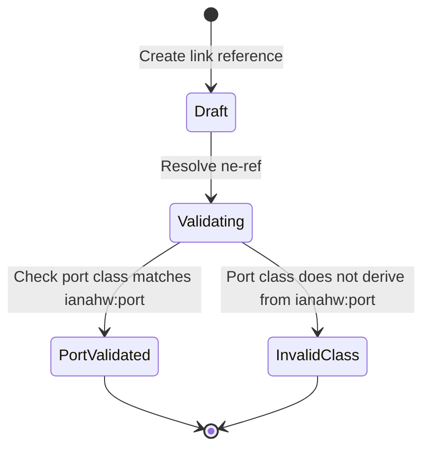

# Feature: Feature 17: Inventory Type Definitions & References (Issue #44)

This feature implements core identities, typedefs, and grouping references that allow data models to consistently reference network elements, components, and ports in the inventory.

## 1. Schema Definitions & Constraints

### Identities
- `non-hardware-component-class`: Base identity for virtual or software-based components.
  - **Type:** identity
- `ne-type`: Base identity for classifying network elements.
  - **Type:** identity
- `ne-physical`: Base identity representing physical network elements.
  - **Type:** identity (derived from `ne-type`)

### Typedefs
- `ne-ref`: A leafref pointing to the identifier of a network element.
  - **Type:** leafref `/nwi:network-inventory/nwi:network-elements/nwi:network-element/nwi:ne-id`
  - **Require-Instance:** false

### Groupings
- `component-ref`: Reference structure for a generic component inside a specific network element.
  - `ne-ref`: Pointer to the containing Network Element.
  - `component-ref`: Pointer to the component inside the referenced Network Element.
    - **Type:** leafref `/nwi:network-inventory/nwi:network-elements/nwi:network-element[nwi:ne-id=current()/../ne-ref]/nwi:components/nwi:component/nwi:component-id`
    - **Require-Instance:** false
- `port-ref`: Reference structure for a port component inside a specific network element.
  - `ne-ref`: Pointer to the containing Network Element.
  - `port-ref`: Pointer to the port inside the referenced Network Element.
    - **Type:** leafref `/nwi:network-inventory/nwi:network-elements/nwi:network-element[nwi:ne-id=current()/../ne-ref]/nwi:components/nwi:component/nwi:component-id`
    - **Require-Instance:** false
    - **Constraint:** The class of the referenced component MUST be `ianahw:port` or a derived identity.

## 2. Logical System Integration & UI Capabilities
- **Reference Resolution Integrity Rule**: References to network elements (`ne-ref`), components (`component-ref`), and ports (`port-ref`) must successfully evaluate or handle cases where `require-instance` is false.
- **Port Class Validation Rule**: The system validates that any referenced port has a class derived from `ianahw:port`.
- **Logical UI Representation**: In the topology or connection viewer UI, when selecting a port or component, the system displays the fully qualified reference path (Network Element -> Component).

## 3. State Machine and Validation Flow

## 4. BDD Given-When-Then Acceptance Criteria
- **Scenario 1: Reject invalid port reference class**
  - **Given** a network element "ne-1" exists with a component "comp-1" of class `ianahw:chassis`
    **When** we attempt to configure a `port-ref` pointing to "comp-1"
    **Then** the validation rule rejects the reference configuration due to invalid port class constraint.
- **Scenario 2: Resolve valid port reference**
  - **Given** a network element "ne-1" exists with a component "port-5" of class `ianahw:port`
    **When** we configure a `port-ref` pointing to "port-5"
    **Then** the validation rule succeeds.

## 5. Specification Context (Verbatim)
> This type is intended to be used by data models that need to reference Network Element.
> This grouping is intended to be used by data models that need to reference a component within a Network Element.
> Note: the class of the referenced port component MUST be 'ianahw:port' or a derived identity.

## 6. Source References
YANG Schema: [ietf-network-inventory.yang](https://github.com/ietf-ivy-wg/network-inventory-yang/blob/main/yang/ietf-network-inventory.yang)
Normative Specification: [draft-ietf-ivy-network-inventory-yang](https://datatracker.ietf.org/doc/html/draft-ietf-ivy-network-inventory-yang)
