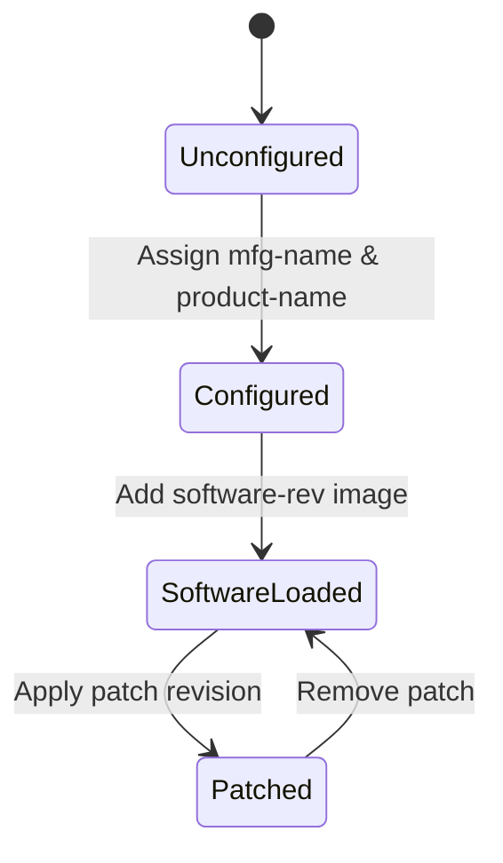

# Feature: Feature 18: Common Entity Software & Manufacturer Attributes (Issue #45)

This feature implements software revision tracking, software patching lists, manufacturer details, and product names common to both network elements and components.

## 1. Schema Definitions & Constraints

### Groupings
- `basic-common-entity-attributes`: Attributes shared by all inventory entities.
  - `uuid`: Universally Unique Identifier.
  - `name`: Textual handle for the entity.
  - `alias`: Textual operator-assigned alias.
  - `description`: Textual description.
- `ne-component-common-entity-attributes`: Common metadata for elements and components.
  - `mfg-name`: Manufacturer name string.
    - **Type:** string
  - `product-name`: Product model or name string.
    - **Type:** string
  - `software-rev`: List of software images running on the entity.
    - **Key:** `name`
    - `name`: Vendor-specific name of the software module.
      - **Type:** string
    - `revision`: Vendor-specific software revision.
      - **Type:** string
    - `patch`: Nested list of active patches.
      - **Key:** `revision`
      - `revision`: Vendor-specific patch revision identifier.
        - **Type:** string

## 2. Logical System Integration & UI Capabilities
- **Software Revision Validation Rule**: The system tracks active software revision states.
- **Nested Patch Validation Rule**: Multiple software patches can be linked to a parent software revision module.
- **Logical UI Representation**: In the Inventory details UI panel, software versions and patches are rendered in a nested table under the manufacturer and product name metadata.

## 3. State Machine and Validation Flow

## 4. BDD Given-When-Then Acceptance Criteria
- **Scenario 1: Configure software revision with multiple patches**
  - **Given** a network element is registered with manufacturer "Cisco" and product "NCS-5501"
    **When** we configure software revision "XR-Core" version "7.3.2" with patches "patch-1" and "patch-2"
    **Then** the configuration stores the hierarchical software and patch details.
- **Scenario 2: Reject patch without software revision key**
  - **Given** an inventory record
    **When** trying to configure a patch list without a software module name key
    **Then** the validation rule fails due to schema validation key constraint.

## 5. Specification Context (Verbatim)
> The list of the software modules representing the software images intended to be running within the entity.
> The list of software patches configured to be active for the software module.
> It is expected that vendors assign unique product names to different entity types within the scope of the vendor.

## 6. Source References
YANG Schema: [ietf-network-inventory.yang](https://github.com/ietf-ivy-wg/network-inventory-yang/blob/main/yang/ietf-network-inventory.yang)
Normative Specification: [draft-ietf-ivy-network-inventory-yang](https://datatracker.ietf.org/doc/html/draft-ietf-ivy-network-inventory-yang)
