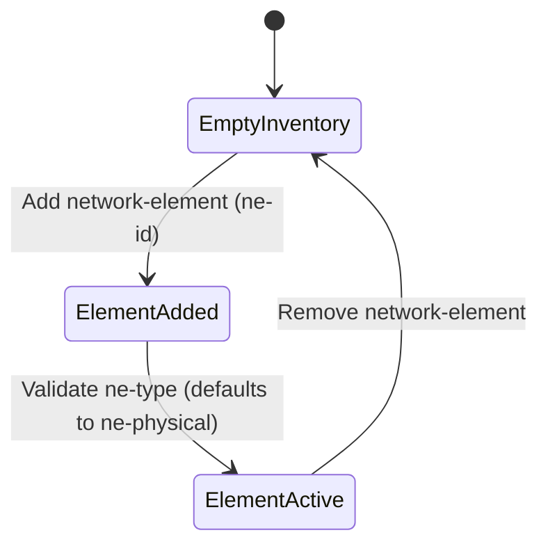

# Feature: Feature 19: Network Element Management (Issue #46)

This feature implements the top-level network inventory container, containing lists of network elements, unique identifiers, and element-level product revisions.

## 1. Schema Definitions & Constraints

### Nodes
- `network-inventory`: Top-level read-only container for all network inventory.
  - **Type:** container
  - **Config:** false
- `network-elements`: Top-level container hosting the list of network elements.
  - **Type:** container
- `network-element`: List of managed network elements.
  - **Type:** list
  - **Key:** `ne-id`
- `ne-id`: Unique identifier for each network element.
  - **Type:** string
- `ne-type`: The network element type classification (defaults to `nwi:ne-physical`).
  - **Type:** identityref
- `product-rev`: Vendor-specific product revision level string.
  - **Type:** string

## 2. Logical System Integration & UI Capabilities
- **Unique Network Element ID Rule**: The system validates that each network element has a unique `ne-id` in the network inventory datastore.
- **Physical Default Type Rule**: By default, network elements are instantiated with a type of `ne-physical`.
- **Logical UI Representation**: The main dashboard UI shows the count of registered Network Elements grouped by physical and virtual types.

## 3. State Machine and Validation Flow

## 4. BDD Given-When-Then Acceptance Criteria
- **Scenario 1: Add new physical network element**
  - **Given** the network inventory container exists
    **When** we add a network-element with ne-id "ne-001" and do not specify a type
    **Then** the element is registered successfully and ne-type defaults to `ne-physical`.
- **Scenario 2: Reject duplicate network element id**
  - **Given** a network element with ne-id "ne-001" already exists
    **When** we attempt to add another network-element with ne-id "ne-001"
    **Then** the validation rule rejects the creation due to duplicate key constraint violation.

## 5. Specification Context (Verbatim)
> Top-level container for network inventory.
> The list of network elements within the network.
> The vendor-specific product revision string for the network-element.

## 6. Source References
YANG Schema: [ietf-network-inventory.yang](https://github.com/ietf-ivy-wg/network-inventory-yang/blob/main/yang/ietf-network-inventory.yang)
Normative Specification: [draft-ietf-ivy-network-inventory-yang](https://datatracker.ietf.org/doc/html/draft-ietf-ivy-network-inventory-yang)
