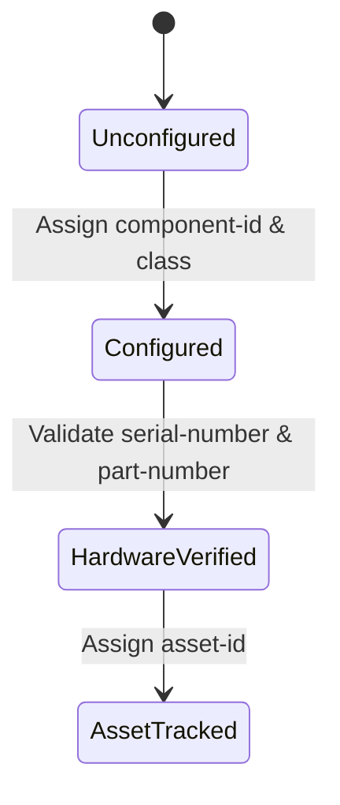

# Feature: Feature 20: Component Identification & Hardware Attributes (Issue #47)

**Parent Epic:** [Epic 4: Network Inventory (Issue #49)](https://github.com/gintatkinson/cogctl-ux-09/blob/main/docs/epics/epic-04-network-inventory.md)

This feature implements the components list, unique component identifiers, hardware classes (chassis, slot, port, virtual), manufacturing details, serial numbers, part numbers, asset tags, FRU flags, and URIs.

## 1. Schema Definitions & Constraints

### Groupings
- `component-attributes`: The set of common attributes defining any component.
  - `component-id`: Unique identifier for the component within the scope of the network element.
    - **Type:** string
  - `class`: The type of component (hardware class or non-hardware class).
    - **Type:** union (`identityref ianahw:hardware-class`, `identityref nwi:non-hardware-component-class`)
    - **Mandatory:** true
  - `hardware-rev`: Vendor hardware revision string.
    - **Type:** string
  - `mfg-date`: Manufacturing timestamp.
    - **Type:** yang:date-and-time
  - `part-number`: Vendor part number string.
    - **Type:** string
  - `serial-number`: Vendor serial number string.
    - **Type:** string
  - `asset-id`: Asset tracking identifier string.
    - **Type:** string
  - `is-fru`: Flag indicating whether the component is a field-replaceable unit.
    - **Type:** boolean
  - `uri`: URIs containing identification info.
    - **Type:** leaf-list of `inet:uri`

### Nodes
- `components`: Container for sub-components inside a network element.
  - **Type:** container
- `component`: List of components.
  - **Type:** list
  - **Key:** `component-id`

## 2. Logical System Integration & UI Capabilities
- **Mandatory Class Rule**: The system validates that every component has an explicit `class` assigned.
- **Component ID Uniqueness Rule**: Component IDs must be unique within a single network element.
- **Logical UI Representation**: Displays component detail cards showing serials, parts, manufacturing dates, and whether they are field replaceable (FRU status highlighted).

## 3. State Machine and Validation Flow

## 4. BDD Given-When-Then Acceptance Criteria
- **Scenario 1: Add component with hardware class**
  - **Given** a network element exists
    **When** we add a component with id "card-1" and class `ianahw:module`
    **Then** the component is registered successfully.
- **Scenario 2: Reject component creation without mandatory class**
  - **Given** a network element exists
    **When** we attempt to add a component with id "card-2" without specifying a class
    **Then** the validation rule rejects the edit.

## 5. Specification Context (Verbatim)
> The type of the component.
> This node indicates whether or not this component is considered a 'field-replaceable unit' by the vendor.
> An identifier that uniquely identifies the component in a node.

## 6. Source References
YANG Schema: [ietf-network-inventory.yang](https://github.com/ietf-ivy-wg/network-inventory-yang/blob/main/yang/ietf-network-inventory.yang)
Normative Specification: [draft-ietf-ivy-network-inventory-yang](https://datatracker.ietf.org/doc/html/draft-ietf-ivy-network-inventory-yang)
