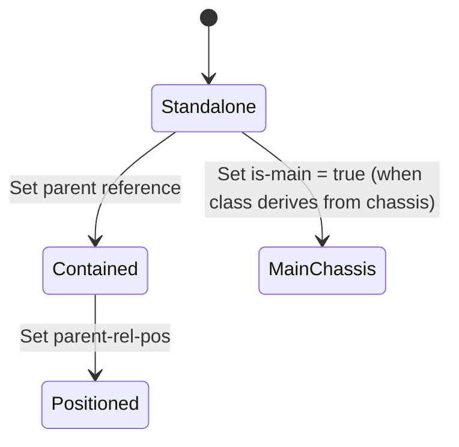

# Feature: Feature 21: Component Containment & Roles (Issue #48)

This feature implements hierarchical containment reference trees (referencing parent component IDs), relative containment positions, and main role flags for chassis components.

## 1. Schema Definitions & Constraints

### Nodes
- `parent`: List of parent components physically containing this component.
  - **Type:** leaf-list of `leafref ../../component/component-id`
  - **Require-Instance:** false
- `parent-rel-pos`: The relative position with respect to the parent component among siblings.
  - **Type:** string
  - **When:** `count(../parent) < 2` (applicable only when component is contained in 0 or 1 parent components)
- `is-main`: Flag indicating whether a chassis component is taking the main role.
  - **Type:** boolean
  - **When:** `derived-from-or-self(../class, 'ianahw:chassis')` (applicable only to chassis components)

## 2. Logical System Integration & UI Capabilities
- **Chassis Main Role Rule**: Only components of class `ianahw:chassis` (or derived) can have the `is-main` attribute configured.
- **Parent Relative Position Rule**: The `parent-rel-pos` leaf is evaluated/configured only when the component has at most 1 parent.
- **Logical UI Representation**: In the rack or device structure visualizer UI, nested cards are displayed inside parent components. A chassis with `is-main` set to true is highlighted with a crown/primary badge.

## 3. State Machine and Validation Flow

## 4. BDD Given-When-Then Acceptance Criteria
- **Scenario 1: Configure relative position inside parent module**
  - **Given** a network element contains a component "chassis-1" and a component "subcard-1"
    **When** we set the parent of "subcard-1" to "chassis-1" and set parent-rel-pos to "3"
    **Then** the configuration stores the relative containment.
- **Scenario 2: Reject is-main attribute for non-chassis component**
  - **Given** a component "fan-1" has class `ianahw:fan`
    **When** we attempt to set `is-main` to true
    **Then** the validation rule rejects the edit.

## 5. Specification Context (Verbatim)
> The identifiers of all the components that physically contain this component.
> The relative position with respect to the parent component among all the sibling components.
> This node indicates whether the chassis is taking or not the 'main' role.

## 6. Source References
YANG Schema: [ietf-network-inventory.yang](https://github.com/ietf-ivy-wg/network-inventory-yang/blob/main/yang/ietf-network-inventory.yang)
Normative Specification: [draft-ietf-ivy-network-inventory-yang](https://datatracker.ietf.org/doc/html/draft-ietf-ivy-network-inventory-yang)
